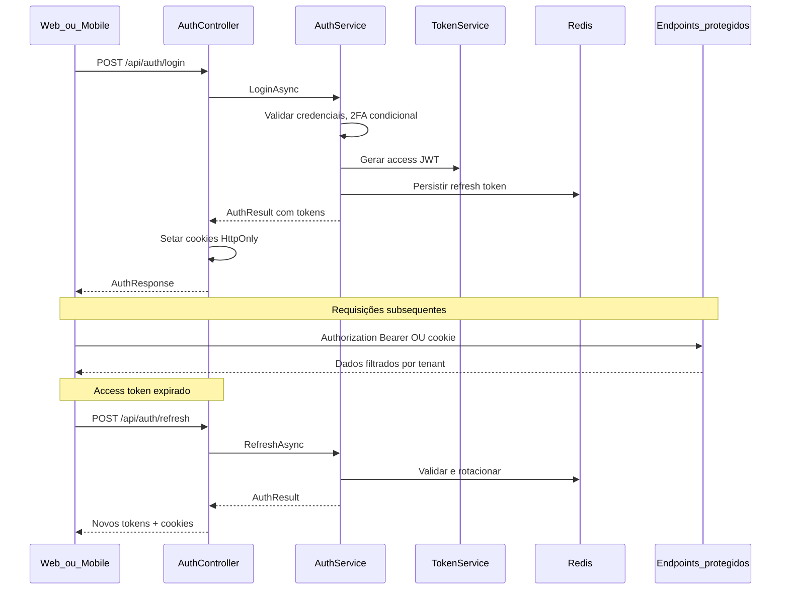
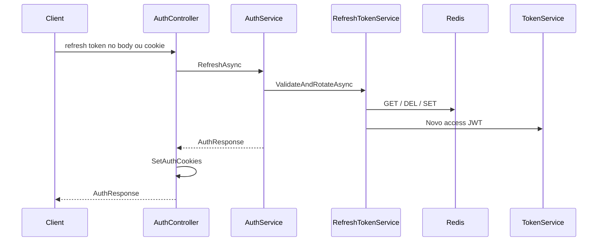
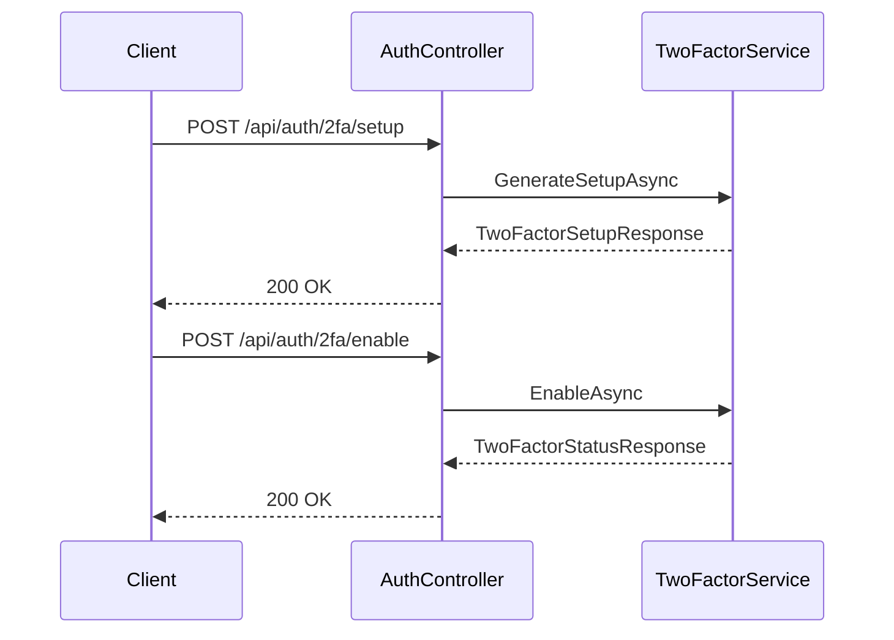
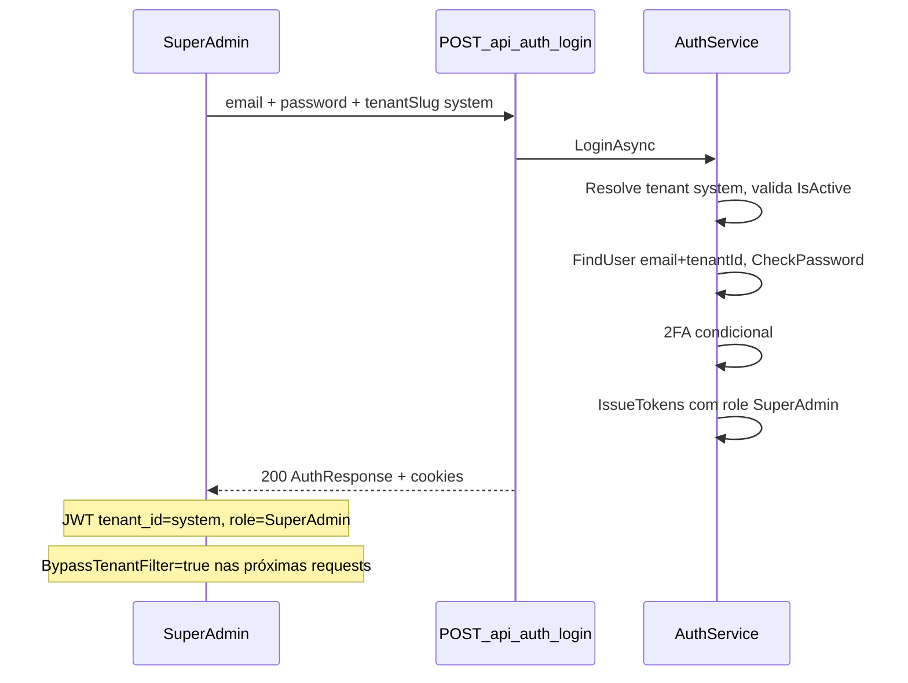
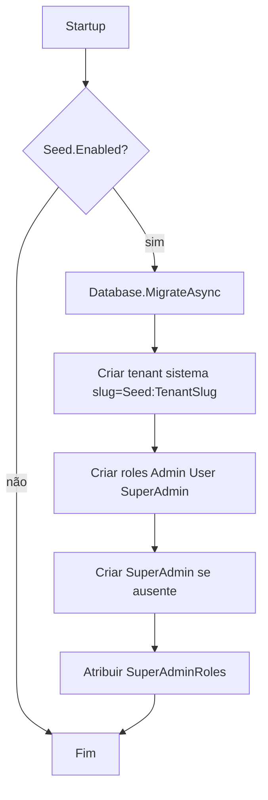
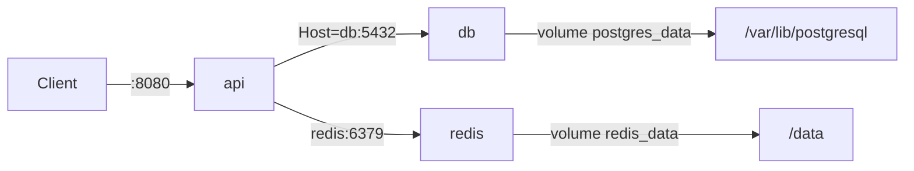

# JWT, Cookie e Multitenancy no JAdmin

## Índice

| # | Seção | Conteúdo |
|---|-------|----------|
| — | Contexto atual | Ponto de partida (template WeatherForecast) |
| — | Arquitetura proposta | Fluxo auth, decisões de stack |
| — | Pacotes NuGet | Dependências do `JAdmin.csproj` |
| — | Estrutura de pastas | Árvore de controllers, services, DTOs |
| — | Modelo de dados | `Tenant`, `ApplicationUser`, DTOs auth |
| — | Autenticação dual | JWT Bearer + cookies HttpOnly |
| — | Refresh token | Redis, rotação, logout |
| — | 2FA (TOTP) | Setup, enable/disable, login condicional |
| — | Segurança | Tenant sistema, senha, CSRF, roles JWT |
| — | Multitenancy e SuperAdmin | Middleware, filtros EF, matriz de acesso |
| — | Endpoints | Tabela `Auth`, `Users`, `Tenants` |
| — | Listagem paginada | `PagedResult`, `IUserService` |
| — | Gestão de roles | `IUserRoleService`, move-to-system |
| — | CRUD Tenancies | SuperAdmin, tenant `system` protegido |
| — | Seed inicial | `DbInitializer`, `SeedSettings` |
| — | Configuração | `appsettings`, JWT, CORS |
| — | Swagger / OpenAPI | Dev only, Bearer scheme |
| — | Program.cs | Pipeline middleware |
| — | Docker Compose | Postgres 18, Redis, API |
| — | Migrations e seed | EF Core |
| — | Fluxo de teste manual | Cenários Swagger/HTTP |
| — | Lacunas conhecidas | I1–I20, fora de escopo F1–F15 |
| — | Estado entregue | Inventário do repositório atual |

**Planos relacionados:** [02 Frontend React](02_frontend_react_jadmin_72bcb6f8.plan.md) · [03 Expo Mobile](03_expo_mobile_jadmin_5ae39932.plan.md) · [04 Testes e CI](04_testes_e_ci_monorepo_f2c649e7.plan.md)

> **Navegação no Cursor:** links `#âncora` no preview costumam falhar. Use o painel **Outline** ou `Ctrl+F` pelo título da seção.

## Contexto atual

Projeto em estado de template: ASP.NET Core 10, sem banco, sem auth. Arquivos a remover:

- [`JAdmin/WeatherForecast.cs`](JAdmin/WeatherForecast.cs)
- [`JAdmin/Controllers/WeatherForecastController.cs`](JAdmin/Controllers/WeatherForecastController.cs)
- Referência em [`JAdmin/JAdmin.http`](JAdmin/JAdmin.http)

## Arquitetura proposta



**Decisões adotadas (com base nas suas respostas):**
- Banco relacional: **PostgreSQL** via `Npgsql.EntityFrameworkCore.PostgreSQL` (Identity, tenants, usuários)
- Refresh tokens: **Redis** via `StackExchange.Redis` — persistência efêmera com TTL, sem tabela no PostgreSQL
- Tenant: **claim `tenant_id` no JWT** — tenant fixo após login; **SuperAdmin** ignora filtro de tenant e acessa dados de todas as tenancies nos endpoints autorizados
- **Tenant sistema:** identificado pelo slug em **`Seed:TenantSlug`** (padrão `system`) — única fonte de config; hospeda SuperAdmins; slug reservado; não pode ser desativado
- **SuperAdmin:** role global — Admin cross-tenant + CRUD exclusivo de tenancies (`TenantsController`)
- 2FA: **TOTP opcional** via ASP.NET Core Identity — código exigido no login **somente** se `TwoFactorEnabled`; usuários sem 2FA não são barrados
- **Validação:** FluentValidation nos DTOs; erros HTTP via **ProblemDetails RFC**
- **Documentação:** Swagger/OpenAPI via **Swashbuckle** — UI em `/swagger` somente em **Development**; esquema Bearer JWT para testar endpoints protegidos
- **Senha:** mínimo 6 caracteres, alfanumérica (letra + dígito), pelo menos 1 caractere especial
- **Camadas:** toda lógica de negócio em `Services/`; `Controllers/` apenas orquestram HTTP (requests, responses, cookies, status codes)

## Pacotes NuGet a adicionar

Em [`JAdmin/JAdmin.csproj`](JAdmin/JAdmin.csproj):

| Pacote | Finalidade |
|--------|------------|
| `Microsoft.AspNetCore.Authentication.JwtBearer` | Validação JWT |
| `Microsoft.AspNetCore.Identity.EntityFrameworkCore` | Identity + EF |
| `Npgsql.EntityFrameworkCore.PostgreSQL` | Provider PostgreSQL |
| `Microsoft.EntityFrameworkCore.Design` | Migrations (PrivateAssets) |
| `StackExchange.Redis` | Persistência de refresh tokens no Redis |
| `QRCoder` | Geração de QR code PNG (Base64) para setup TOTP |
| `FluentValidation.AspNetCore` | Validação declarativa de DTOs com resposta 400 uniforme |
| `Swashbuckle.AspNetCore` | Swagger UI + geração OpenAPI 3.0 com esquema de segurança Bearer |

## Estrutura de pastas

```
JAdmin/
├── Common/
│   ├── ServiceResult.cs
│   ├── PagedResult.cs
│   └── Roles.cs                    # Constantes Admin, User, SuperAdmin
├── Config/
│   ├── JwtSettings.cs              # Seção "Jwt" — ExpirationMinutes, RefreshExpirationDays
│   ├── SeedSettings.cs             # Inclui TenantSlug — também identifica o tenant sistema
│   ├── TwoFactorSettings.cs
│   └── CorsSettings.cs             # AllowedOrigins para web + cookies
├── Controllers/
│   ├── AuthController.cs
│   ├── UsersController.cs          # [Authorize(Roles = Admin,SuperAdmin)]
│   └── TenantsController.cs        # [Authorize(Roles = SuperAdmin)] — CRUD de tenancies
├── Data/
│   ├── AppDbContext.cs             # IdentityDbContext + global filters
│   ├── DesignTimeDbContextFactory.cs  # dotnet ef migrations (sem ITenantContext)
│   └── DbInitializer.cs            # Migrations + seed idempotente (tenant sistema, roles, SuperAdmin)
├── Validators/                     # FluentValidation — um validator por request DTO
│   ├── LoginRequestValidator.cs
│   ├── RegisterRequestValidator.cs
│   ├── CreateTenantRequestValidator.cs  # slug único + slug reservado (Seed:TenantSlug)
│   └── PaginationQueryValidator.cs
├── Middleware/
│   └── GlobalExceptionHandler.cs   # ProblemDetails RFC para exceções não tratadas
├── Dtos/
│   ├── Auth/
│   │   ├── LoginRequest.cs
│   │   ├── RegisterRequest.cs      # Email, Password, Roles, TenantId? (SuperAdmin)
│   │   ├── RefreshTokenRequest.cs
│   │   ├── EnableTwoFactorRequest.cs
│   │   ├── DisableTwoFactorRequest.cs
│   │   ├── TwoFactorSetupResponse.cs
│   │   ├── TwoFactorStatusResponse.cs
│   │   ├── AuthResponse.cs
│   │   └── UserInfoDto.cs
│   ├── Common/
│   │   └── PaginationQuery.cs      # Page, PageSize — reutilizado por Users e Tenants
│   ├── Users/
│   │   ├── UserListItemDto.cs
│   │   ├── UserRolesResponse.cs
│   │   └── AddRoleRequest.cs
│   └── Tenants/
│       ├── CreateTenantRequest.cs  # Name, Slug
│       ├── UpdateTenantRequest.cs  # Name, IsActive
│       └── TenantDto.cs            # Id, Name, Slug, IsActive, IsSystemTenant (calculado), CreatedAt
├── Entities/
│   ├── Tenant.cs                   # Entidades de persistência (EF Core / PostgreSQL)
│   └── ApplicationUser.cs          # IdentityUser + TenantId
├── Multitenancy/
│   └── MultitenancyMiddleware.cs   # UseMultitenancy — extrai tenant da claim JWT
├── Services/
│   ├── Interfaces/
│   │   ├── IAuthService.cs         # Login, register, refresh, logout, me
│   │   ├── ITokenService.cs        # Geração de access JWT
│   │   ├── IRefreshTokenService.cs # Ciclo de vida do refresh token
│   │   ├── ITwoFactorService.cs    # Setup, enable/disable e validação TOTP
│   │   ├── IUserService.cs
│   │   ├── IUserRoleService.cs     # Consultar/adicionar/remover roles; mover para tenant sistema
│   │   ├── ITenantManagementService.cs  # CRUD de tenancies (SuperAdmin)
│   │   └── ITenantContext.cs       # TenantId, IsSuperAdmin, BypassTenantFilter
│   └── Impl/
│       ├── AuthService.cs
│       ├── TokenService.cs
│       ├── RefreshTokenService.cs
│       ├── TwoFactorService.cs
│       ├── UserService.cs
│       ├── UserRoleService.cs
│       ├── TenantManagementService.cs
│       └── TenantContext.cs
└── Extensions/
    ├── ServiceCollectionExtensions.cs  # AddAppAuthentication, AddAppMultitenancy, AddAppSwagger
    └── WebApplicationExtensions.cs     # UseAppSwagger — Swagger UI condicional (Development)
```

**Convenção de camadas (Controller x Service):**

| Camada | Responsabilidade | O que **não** faz |
|--------|------------------|-------------------|
| **Controller** | Receber request HTTP, chamar service, mapear resultado para `IActionResult`, setar/remover cookies, retornar DTOs | Validação de negócio, acesso a `UserManager`/`DbContext`/Redis, geração de tokens |
| **Service** | Toda lógica de negócio, validações, orquestração de dependências (`UserManager`, Redis, Identity) | Conhecer `HttpContext`, cookies, status HTTP |

`AuthController` injeta apenas `IAuthService` e `ITwoFactorService` — nunca `UserManager`, `AppDbContext` ou `IConnectionMultiplexer` diretamente.

**`IAuthService`** — métodos principais:

| Método | Descrição |
|--------|-----------|
| `LoginAsync(LoginRequest)` | Valida credenciais, tenant ativo, 2FA condicional, emite tokens |
| `RegisterAsync(RegisterRequest)` | Cria usuário — Admin no tenant do JWT; SuperAdmin pode informar `TenantId` |
| `RefreshAsync(string refreshToken)` | Rotaciona tokens (valida tenant ativo) |
| `LogoutAsync(string? refreshToken)` | Revoga refresh token |
| `GetCurrentUserAsync(string userId)` | Monta `UserInfoDto` |

Retorno via `ServiceResult<T>` (ou record equivalente) com `Success`, `Data`, `Error`, flags como `RequiresTwoFactor` — o controller apenas traduz para HTTP:

```csharp
// Controller — sem lógica de negócio
[HttpPost("login")]
public async Task<IActionResult> Login(LoginRequest request)
{
    var result = await _authService.LoginAsync(request);
    if (!result.Success)
        return result.RequiresTwoFactor
            ? Unauthorized(new { message = result.Error, requiresTwoFactor = true })
            : Unauthorized(new { message = result.Error });

    SetAuthCookies(result.Data!);
    return Ok(result.Data);
}
```

```csharp
// AuthService — toda a lógica de negócio
public async Task<ServiceResult<AuthResponse>> LoginAsync(LoginRequest request)
{
    var tenant = await ResolveTenantAsync(request.TenantSlug);
    var user = await FindUserAsync(request.Email, tenant.Id);
    if (!await _userManager.CheckPasswordAsync(user, request.Password))
        return ServiceResult<AuthResponse>.Fail("Invalid credentials");

    if (await _userManager.GetTwoFactorEnabledAsync(user))
    {
        if (string.IsNullOrWhiteSpace(request.TwoFactorCode))
            return ServiceResult<AuthResponse>.Fail("Two-factor code required", requiresTwoFactor: true);
        if (!await _twoFactorService.ValidateCodeAsync(user, request.TwoFactorCode))
            return ServiceResult<AuthResponse>.Fail("Invalid two-factor code");
    }

    return ServiceResult<AuthResponse>.Ok(await IssueTokensAsync(user));
}
```

`IssueTokensAsync` (privado em `AuthService`) monta `UserInfoDto` com `TenantName` carregado da entidade `Tenant` vinculada ao usuário.

**Convenção de Services:** toda abstração injetável fica em `Services/Interfaces/`; implementações concretas em `Services/Impl/`. Services podem depender de outras interfaces de service, mas nunca de controllers.

**Convenção de modelos:** entidades de persistência (mapeadas pelo EF Core) ficam em `Entities/`; objetos de transferência de dados (requests, responses) ficam em `Dtos/`, organizados por domínio em subpastas (ex.: `Dtos/Auth/`). Controllers recebem e retornam apenas DTOs — nunca expõem entidades diretamente.

## Modelo de dados

**Tenant**
- `Id` (Guid), `Name`, `Slug` (único), `IsActive`, `CreatedAt`
- **Tenant sistema:** não possui coluna `IsSystem` — identificado em runtime por `SeedSettings.TenantSlug` (padrão: `system`). Hospeda contas SuperAdmin; slug **reservado**; **não pode ser desativado** nem ter `IsActive` alterado via API

**ApplicationUser** (herda `IdentityUser`)
- `TenantId` (FK obrigatória) — usuário pertence a um único tenant
- `TwoFactorEnabled` (herdado do `IdentityUser`) — indica se 2FA TOTP está ativo
- Chave autenticadora TOTP armazenada pelo Identity em `AspNetUserTokens` (provider `Authenticator`)
- Índice único composto: `(TenantId, NormalizedEmail)` — mesmo e-mail pode existir em tenants diferentes

**Global query filter** no `AppDbContext` para entidades com `TenantId` (`ApplicationUser`):

```csharp
builder.Entity<ApplicationUser>()
    .HasQueryFilter(u => _tenantContext.BypassTenantFilter
        || u.TenantId == _tenantContext.TenantId);
```

- **Admin / User:** `BypassTenantFilter == false` → vê apenas o tenant do JWT
- **SuperAdmin:** `BypassTenantFilter == true` → vê usuários de **todas** as tenancies
- Durante migrations/design-time o filtro é ignorado (`ITenantContext` sem tenant)

A entidade `Tenant` **não** possui query filter de tenant (é a raiz do multitenancy).

> Refresh tokens **não** são entidades EF — ficam no Redis (ver seção Refresh token).

### DTOs de autenticação (`Dtos/Auth/`)

| DTO | Tipo | Campos principais |
|-----|------|-------------------|
| `LoginRequest` | Request | `Email`, `Password`, `TenantSlug`, `TwoFactorCode` (opcional) |
| `RegisterRequest` | Request | `Email`, `Password`, `Roles`, `TenantId` (opcional — só SuperAdmin) |
| `RefreshTokenRequest` | Request | `RefreshToken` (opcional — mobile envia no body; web usa cookie) |
| `EnableTwoFactorRequest` | Request | `Code` (código TOTP de 6 dígitos para confirmar setup) |
| `DisableTwoFactorRequest` | Request | `Password`, `Code` |
| `TwoFactorSetupResponse` | Response | `SharedKey`, `QrCodeBase64`, `AuthenticatorUri` |
| `TwoFactorStatusResponse` | Response | `TwoFactorEnabled` |
| `AuthResponse` | Response | `Token`, `RefreshToken`, `ExpiresAt`, `RefreshExpiresAt`, `User` (`UserInfoDto`) |
| `UserInfoDto` | Response | `Id`, `Email`, `TenantId`, `TenantName`, `Roles`, `TwoFactorEnabled` |

## Autenticação dual: corpo + cookie

**Login** — lógica em `AuthService`; controller apenas delega:

1. `AuthService.LoginAsync` valida credenciais, **tenant ativo** (`IsActive`) e bloqueia se inativo (401)
2. **2FA condicional** (dentro de `AuthService`, após senha válida):
   ```csharp
   // AuthService.LoginAsync
   if (await _userManager.GetTwoFactorEnabledAsync(user))
   {
       if (string.IsNullOrWhiteSpace(request.TwoFactorCode))
           return ServiceResult<AuthResponse>.Fail("Two-factor code required", requiresTwoFactor: true);

       if (!await _twoFactorService.ValidateCodeAsync(user, request.TwoFactorCode))
           return ServiceResult<AuthResponse>.Fail("Invalid two-factor code");
   }
   // Se TwoFactorEnabled == false: TwoFactorCode é ignorado
   ```
3. `AuthService.IssueTokensAsync` chama `ITokenService` + `IRefreshTokenService` internamente
4. Retorna `AuthResponse` ao controller, que repassa no body:
   ```json
   {
     "token": "...",
     "refreshToken": "...",
     "expiresAt": "...",
     "refreshExpiresAt": "...",
     "user": { "id", "email", "tenantId", "tenantName", "roles", "twoFactorEnabled" }
   }
   ```
5. Controller seta cookies HttpOnly via método privado `SetAuthCookies(AuthResponse)`:
   - `access_token` — expira com o access JWT
   - `refresh_token` — expira com o refresh token (`Jwt:RefreshExpirationDays`)

| Cookie | HttpOnly | Secure (prod) | SameSite |
|--------|----------|---------------|----------|
| `access_token` | sim | sim | Lax |
| `refresh_token` | sim | sim | Lax |

**JwtBearer** configurado para ler access token de **ambas** as fontes:

```csharp
options.Events = new JwtBearerEvents
{
    OnMessageReceived = context =>
    {
        if (string.IsNullOrEmpty(context.Token))
            context.Token = context.Request.Cookies["access_token"];
        return Task.CompletedTask;
    }
};
```

- **Mobile**: usa `Authorization: Bearer {token}` e armazena `refreshToken` do body
- **Web**: browser envia cookies automaticamente; SPA pode usar tokens do body se preferir

## Refresh token

**Endpoint** `POST /api/auth/refresh` (anônimo):



### Persistência no Redis

| Item | Valor |
|------|-------|
| Chave | `jadmin:refresh:{sha256(token)}` |
| Valor | JSON `{ "userId": "...", "tenantId": "..." }` |
| TTL | `Jwt:RefreshExpirationDays` (expiração automática via `SET` + `EX`) |
| Revogação | `DEL` na chave (logout ou rotação) |

Rotação **atômica** via script Lua no Redis: valida chave, deleta antiga e grava nova numa única operação — evita dois refresh tokens válidos em requisições concorrentes.

Revogação em massa (`IRefreshTokenService.RevokeAllForUserAsync(userId)`): chamada ao desativar tenant, trocar senha ou desabilitar 2FA.

### `IRefreshTokenService` (`Services/Interfaces/`)

| Método | Descrição |
|--------|-----------|
| `CreateAsync(ApplicationUser)` | Gera token opaco, grava no Redis com TTL, retorna valor em claro + `RefreshExpiresAt` |
| `ValidateAndRotateAsync(string plainToken)` | Valida no Redis, remove token antigo, cria novo par access+refresh, retorna `AuthResponse` |
| `RevokeAsync(string plainToken)` | `DEL` da chave — logout |
| `RevokeAllForUserAsync(string userId)` | Remove todas as chaves `jadmin:refresh:*` do usuário |

Implementação em `RefreshTokenService` (`Services/Impl/`):
- Injeta `IConnectionMultiplexer` (StackExchange.Redis)
- Busca payload por hash do token recebido
- **Recarrega usuário do banco** via `UserManager.FindByIdAsync(payload.UserId)` — não confia no `tenantId` cacheado no Redis (usuário pode ter sido movido de tenant)
- Valida que o usuário existe e que o tenant **atual** do usuário está ativo
- Emite novo access JWT com `tenant_id` e **roles atuais** lidos do banco (não do payload Redis)
- Ao gravar o novo refresh no Redis, persiste o `tenantId` **atual** do usuário
- **Rotação obrigatória**: cada refresh remove o token anterior e emite um novo

`AuthService.RefreshAsync` delega a `ValidateAndRotateAsync` e valida tenant ativo após o reload do usuário.

> O `tenantId` no Redis é usado apenas como hint de validação inicial; a fonte de verdade para claims do JWT é sempre o estado atual do `ApplicationUser` no PostgreSQL.

### Leitura do refresh token — responsabilidade do controller

O controller extrai o token da request (body ou cookie) e repassa string ao service:

```csharp
var refreshToken = request.RefreshToken ?? Request.Cookies["refresh_token"];
var result = await _authService.RefreshAsync(refreshToken);
```

### Logout — controller orquestra, service revoga

`AuthController`:
1. Extrai refresh token (body ou cookie)
2. Chama `_authService.LogoutAsync(refreshToken)`
3. Remove cookies `access_token` e `refresh_token`
4. Retorna 204

## Autenticação em dois fatores (2FA) — opcional

2FA baseado em **TOTP** (RFC 6238) usando o suporte nativo do ASP.NET Core Identity. A habilitação é **opt-in** por usuário.

### Fluxo de habilitação



Endpoints 2FA no `AuthController` delegam diretamente para `ITwoFactorService` (sem lógica no controller). O usuário autenticado é resolvido no controller via `User` claims e passado ao service.

### `ITwoFactorService` (`Services/Interfaces/`)

| Método | Descrição |
|--------|-----------|
| `GenerateSetupAsync(ApplicationUser)` | Reseta chave TOTP, gera URI `otpauth://` e QR code PNG em Base64 |
| `EnableAsync(ApplicationUser, string code)` | Valida código TOTP e ativa `TwoFactorEnabled` |
| `DisableAsync(ApplicationUser, string password, string code)` | Valida senha + código TOTP e desativa 2FA |
| `ValidateCodeAsync(ApplicationUser, string code)` | Valida código TOTP no login (via `VerifyTwoFactorTokenAsync`) |
| `GetStatusAsync(ApplicationUser)` | Retorna se 2FA está habilitado |

Implementação em `TwoFactorService` (`Services/Impl/`):
- Usa `UserManager<ApplicationUser>` para chave e validação TOTP (`TokenOptions.DefaultAuthenticatorProvider`)
- Gera QR code com **QRCoder** a partir da URI:
  ```
  otpauth://totp/{Issuer}:{email}?secret={sharedKey}&issuer={Issuer}&digits=6
  ```
- `Issuer` configurável em `TwoFactor:Issuer` (padrão: `JAdmin`)

### Geração do QR code

`TwoFactorSetupResponse`:
```json
{
  "sharedKey": "JBSWY3DPEHPK3PXP",
  "qrCodeBase64": "data:image/png;base64,iVBOR...",
  "authenticatorUri": "otpauth://totp/JAdmin:superadmin@localhost?secret=..."
}
```

- `qrCodeBase64` — imagem PNG pronta para exibir em web/mobile
- `sharedKey` — entrada manual alternativa no app autenticador

### Regra de login (2FA opcional)

| `TwoFactorEnabled` | `TwoFactorCode` enviado | Resultado |
|--------------------|-------------------------|-----------|
| `false` | ausente | Login OK |
| `false` | presente | Login OK (código ignorado) |
| `true` | ausente | 401 + `{ requiresTwoFactor: true }` |
| `true` | inválido | 401 |
| `true` | válido | Login OK → tokens emitidos |

Register **não** emite tokens nem cookies — apenas cria o usuário e retorna `UserInfoDto` (`201 Created`). O novo usuário deve fazer login manualmente via `POST /api/auth/login`.

## Segurança — pontos críticos (decisões do MVP)

### 1. Tenant sistema e tenant inativo

O **tenant sistema** é identificado exclusivamente por `SeedSettings.TenantSlug` (padrão `"system"`). Não há coluna `IsSystem` no banco nem variável `SYSTEM_TENANT_SLUG` separada.

| Regra | Comportamento |
|-------|---------------|
| Contas SuperAdmin | Devem residir no tenant sistema (`Slug == Seed:TenantSlug`) |
| Criar role SuperAdmin | **Somente** no tenant sistema — no `register` e em `AddRoleAsync` |
| **Slug reservado** | `CreateTenantRequestValidator` + `CreateAsync` rejeitam slug igual a `Seed:TenantSlug` com `409` |
| **SuperAdmin imutável no tenant** | Usuário com role `SuperAdmin` **não pode mudar de tenant**; `move-to-system-tenant` só para usuários **sem** role `SuperAdmin` |
| Login SuperAdmin | Mesmo fluxo dos demais — `tenantSlug` deve ser `Seed:TenantSlug` |
| Desativar tenant sistema | **Bloqueado** — `DeactivateAsync` retorna `409` se `tenant.Slug == Seed:TenantSlug` |
| Atualizar tenant sistema | `UpdateAsync` **ignora/rejeita** `IsActive` no body — permite alterar apenas `Name` |
| Tenant comum inativo | `LoginAsync` e `RefreshAsync` retornam `401` com `"Tenant is inactive"` |
| Desativar tenant comum | `IsActive = false` + `RevokeAllForUserAsync` para todos os usuários do tenant |

`ITenantManagementService` expõe:
- `GetSystemTenantAsync()` — resolve tenant por `Slug == SeedSettings.TenantSlug`
- `IsSystemTenant(Tenant tenant)` — helper `tenant.Slug == SeedSettings.TenantSlug`

### 2. Política de senha (Identity)

Configurar `IdentityOptions.Password` no `Program.cs` / extensão de DI:

```csharp
options.Password.RequiredLength = 6;
options.Password.RequireDigit = true;           // pelo menos 1 dígito
options.Password.RequireLowercase = true;       // pelo menos 1 letra (alfanumérica)
options.Password.RequireUppercase = false;
options.Password.RequireNonAlphanumeric = true; // pelo menos 1 caractere especial
```

`RegisterRequestValidator` e validação no Identity reforçam a mesma regra. Senhas que não atendem retornam `400` ProblemDetails com detalhes dos erros.

### 3. Registro restrito a Admin/SuperAdmin

**Decisão:** `POST /api/auth/register` existe, mas **não é anônimo** — exige `[Authorize(Roles = "Admin,SuperAdmin")]`.

- **Admin:** cria usuário no **tenant do JWT** (`TenantId` no body ignorado); roles permitidas no register: **apenas `User`**
- **SuperAdmin:** pode informar `TenantId` opcional; roles permitidas: **`User` ou `Admin`** em qualquer tenant; role **`SuperAdmin` somente se o tenant alvo for o tenant sistema** (`Slug == Seed:TenantSlug`)
- `AuthService.RegisterAsync` valida tenant ativo, regras de roles acima e regra SuperAdmin→tenant sistema
- Resposta: `201 Created` com `UserInfoDto` — **sem tokens, sem cookies**; usuário criado deve logar manualmente
- Alterações posteriores de roles: endpoints dedicados em `UsersController` (ver seção Gestão de roles)

```csharp
[HttpPost("register")]
[Authorize(Roles = "Admin,SuperAdmin")]
public async Task<IActionResult> Register(RegisterRequest request)
{
    var result = await _authService.RegisterAsync(request);
    if (!result.Success)
        return Problem(statusCode: StatusCodes.Status400BadRequest, detail: result.Error);
    return CreatedAtAction(nameof(Me), new { id = result.Data!.Id }, result.Data);
}
```

### 4. CSRF e cookies (web)

| Camada | Medida |
|--------|--------|
| Cookies | `HttpOnly`, `Secure` (prod), `SameSite=Strict` em produção / `Lax` em dev |
| CORS | `AllowCredentials = true` + origens explícitas via `Cors:AllowedOrigins` (env) |
| API stateless | Endpoints mutáveis aceitam **Bearer OU cookie**; SPA cross-origin deve preferir Bearer no header |
| Logout/refresh | Aceitos via POST com Bearer (mobile) ou cookie (same-site web) |

`CorsSettings` em `Config/` com origens parametrizáveis no Docker (`Cors__AllowedOrigins`).

### 5. Mapeamento de roles no JWT

Em `AddAppAuthentication`:

```csharp
options.TokenValidationParameters = new TokenValidationParameters
{
    RoleClaimType = ClaimTypes.Role,
    NameClaimType = ClaimTypes.NameIdentifier,
    // ...
};
```

`TokenService` emite claims com `ClaimTypes.Role` para cada role do Identity. Constantes em `Common/Roles.cs` (`Admin`, `User`, `SuperAdmin`) usadas em `[Authorize]` e services.

### 6. Rotação atômica de refresh token (Redis)

`RefreshTokenService` usa **Lua script** (ou `MULTI`/`EXEC`) para: ler → validar → deletar antigo → inserir novo. Replay do token antigo após rotação → 401.

Índice auxiliar opcional: `jadmin:user-refresh:{userId}` (SET) para `RevokeAllForUserAsync`.

### 7. Revogação de sessões

| Evento | Ação |
|--------|------|
| Logout | `RevokeAsync` do token atual |
| Desativar tenant | `RevokeAllForUserAsync` para cada usuário do tenant |
| Desabilitar 2FA | `RevokeAllForUserAsync` do usuário |
| Adicionar/remover role | `RevokeAllForUserAsync` do usuário afetado (força re-login com claims atualizadas) |
| Mover para tenant sistema | `RevokeAllForUserAsync` do usuário afetado |
| Troca de senha (futuro) | `RevokeAllForUserAsync` do usuário |

### 8. Validação de DTOs (FluentValidation)

- Pacote `FluentValidation.AspNetCore` registrado em `Program.cs` com `AddFluentValidationAutoValidation()`
- Um validator por request DTO em `Validators/` (ex.: `RegisterRequestValidator`, `CreateTenantRequestValidator`, `PaginationQueryValidator`, `AddRoleRequestValidator`)
- Falhas de validação retornam `400` **ProblemDetails** com `errors` extension mapeando campo → mensagens (padrão FluentValidation + ASP.NET)

### 9. Tratamento de erros (ProblemDetails RFC)

- `builder.Services.AddProblemDetails()` + `app.UseExceptionHandler()` com `GlobalExceptionHandler` em `Middleware/`
- Respostas incluem `type`, `title`, `status`, `detail` e `extensions` quando aplicável
- Controllers mapeiam `ServiceResult` para status HTTP via helper ou extensão:
  - `400` — validação de negócio / senha fraca
  - `401` — credenciais inválidas (login/refresh) — pode incluir `requiresTwoFactor` em extension
  - `403` — role insuficiente ou escopo de tenant
  - `404` — usuário/tenant não encontrado
  - `409` — slug duplicado, desativar tenant sistema, remover última role Admin, etc.
- Exceções não tratadas → `500` ProblemDetails genérico (sem vazar stack em produção)

## Multitenancy e SuperAdmin

### `ITenantContext` (`Services/Interfaces/`)

| Propriedade | Descrição |
|-------------|-----------|
| `TenantId` | Guid extraído da claim `tenant_id` do JWT (tenant de origem do login) |
| `IsSuperAdmin` | `true` se o usuário possui role `SuperAdmin` na claim `role` |
| `BypassTenantFilter` | `true` quando `IsSuperAdmin` — desativa filtro de tenant nas queries |

`TenantContext` popula essas propriedades no middleware `UseMultitenancy()` após `UseAuthentication()`.

### Matriz de acesso por role

| Endpoint / recurso | User | Admin | SuperAdmin |
|--------------------|------|-------|------------|
| `/api/auth/login`, `refresh`, `logout` | sim | sim | sim |
| `/api/auth/me`, `2fa/*` | sim | sim | sim |
| `POST /api/auth/register` | — | tenant atual (só User) | tenant opcional; User/Admin em qualquer tenant; **SuperAdmin só no tenant sistema** |
| `GET/POST/DELETE /api/users/{id}/roles` | — | usuários do tenant (sem SuperAdmin) | qualquer usuário |
| `POST /api/users/{id}/move-to-system-tenant` | — | — | **exclusivo**; usuário alvo **não** pode ter role `SuperAdmin` |
| `GET /api/users` | — | tenant atual | **todas** as tenancies |
| `/api/tenants` CRUD | — | — | **exclusivo** |
| Demais endpoints futuros tenant-scoped | tenant atual | tenant atual | todas (quando `[Authorize(Roles = "...,SuperAdmin")]`) |

SuperAdmin é **Admin global**: herda capacidades administrativas, mas sem restrição de tenant nos endpoints que incluem a role na autorização.

### Middleware

1. Extrai `tenant_id` e roles do JWT
2. Define `ITenantContext.TenantId` e `IsSuperAdmin`
3. Em rotas `[Authorize]`, rejeita se `tenant_id` ausente (403) — inclusive SuperAdmin (faz login em um tenant como os demais)

### Login e registro

- **Login** (`POST /api/auth/login`, anônimo): recebe `tenantSlug` no body — **igual para todos os perfis**, inclusive SuperAdmin
- **Registro** (`POST /api/auth/register`, Admin/SuperAdmin): tenant resolvido pelo JWT; SuperAdmin pode sobrescrever com `TenantId`

### Login do SuperAdmin — request, response e erros

O SuperAdmin **não tem fluxo de login especial**. Usa o mesmo `POST /api/auth/login` que Admin e User, mas deve informar **`tenantSlug: "system"`** (`Seed:TenantSlug`).

**Request** (`POST /api/auth/login`):

```json
{
  "email": "superadmin@localhost",
  "password": "SuperAdmin@123!",
  "tenantSlug": "system",
  "twoFactorCode": "123456"
}
```

`twoFactorCode` só é necessário se `TwoFactorEnabled == true` para esse usuário.

**Sucesso — `200 OK`** (mesmo contrato de qualquer login):

Corpo + cookies `access_token` e `refresh_token`:

```json
{
  "token": "eyJhbGciOiJIUzI1NiIs...",
  "refreshToken": "kR8mN2pQ7x...",
  "expiresAt": "2026-06-15T13:00:00Z",
  "refreshExpiresAt": "2026-06-22T12:00:00Z",
  "user": {
    "id": "a1b2c3d4-...",
    "email": "superadmin@localhost",
    "tenantId": "f0e1d2c3-...",
    "tenantName": "System",
    "roles": ["SuperAdmin"],
    "twoFactorEnabled": false
  }
}
```

**Claims no JWT emitido:**

| Claim | Valor (exemplo) | Uso |
|-------|-----------------|-----|
| `sub` | id do usuário | Identidade |
| `email` | `superadmin@localhost` | — |
| `tenant_id` | Guid do tenant `system` | Tenant de **origem** do login |
| `role` | `SuperAdmin` | Autorização + `IsSuperAdmin` no middleware |

Após o login, `ITenantContext` fica com `TenantId` = tenant `system` e `BypassTenantFilter = true`. Endpoints cross-tenant (`GET /api/users`, `/api/tenants`, etc.) ignoram o filtro de tenant; `GET /api/auth/me` continua refletindo o tenant de origem (`System` / `system`).

**Erros possíveis:**

| Situação | HTTP | Corpo (exemplo) |
|----------|------|-----------------|
| `tenantSlug` inexistente | 401 | `{ "message": "Invalid credentials" }` |
| Tenant inativo (`IsActive = false`, não sistema) | 401 | ProblemDetails `"Tenant is inactive"` |
| Tentativa de desativar tenant sistema | 409 | ProblemDetails `"System tenant cannot be deactivated"` |
| Tentativa de definir `IsActive: false` no tenant sistema via PUT | 409 ou campo ignorado | `UpdateAsync` não altera `IsActive` do tenant sistema |
| E-mail/senha incorretos no tenant informado | 401 | `{ "message": "Invalid credentials" }` |
| SuperAdmin tenta login em tenant onde **não tem conta** (ex.: `acme`) | 401 | `{ "message": "Invalid credentials" }` |
| 2FA habilitado e código ausente | 401 | `{ "message": "Two-factor code required", "requiresTwoFactor": true }` |
| 2FA habilitado e código inválido | 401 | `{ "message": "Invalid two-factor code" }` |

**Importante:** o `tenantSlug` no login **não seleciona** o escopo operacional do SuperAdmin — apenas localiza a conta. O privilégio cross-tenant vem da role `SuperAdmin` no JWT, não do slug informado.



## Endpoints

| Método | Rota | Auth | Descrição |
|--------|------|------|-----------|
| POST | `/api/auth/login` | Anônimo | Autentica; exige tenant ativo e `TwoFactorCode` se 2FA habilitado |
| POST | `/api/auth/register` | `[Authorize(Roles = "Admin,SuperAdmin")]` | Cria usuário no tenant (Admin: JWT; SuperAdmin: `TenantId` opcional) |
| POST | `/api/auth/refresh` | Anônimo | Renova access + refresh token com rotação |
| POST | `/api/auth/logout` | Anônimo | Revoga refresh token e remove cookies |
| GET | `/api/auth/me` | `[Authorize]` | Dados do usuário autenticado |
| POST | `/api/auth/2fa/setup` | `[Authorize]` | Gera chave TOTP e QR code |
| POST | `/api/auth/2fa/enable` | `[Authorize]` | Confirma código e habilita 2FA |
| POST | `/api/auth/2fa/disable` | `[Authorize]` | Desabilita 2FA (senha + código) |
| GET | `/api/auth/2fa/status` | `[Authorize]` | Retorna se 2FA está ativo |
| GET | `/api/users` | `[Authorize(Roles = "Admin,SuperAdmin")]` | Lista usuários paginados |
| GET | `/api/users/{id}/roles` | `[Authorize(Roles = "Admin,SuperAdmin")]` | Lista roles do usuário |
| POST | `/api/users/{id}/roles` | `[Authorize(Roles = "Admin,SuperAdmin")]` | Adiciona role (`AddRoleRequest`) |
| DELETE | `/api/users/{id}/roles/{roleName}` | `[Authorize(Roles = "Admin,SuperAdmin")]` | Remove role |
| POST | `/api/users/{id}/move-to-system-tenant` | `[Authorize(Roles = "SuperAdmin")]` | Move usuário para o tenant sistema |
| GET | `/api/tenants` | `[Authorize(Roles = "SuperAdmin")]` | Lista tenancies paginadas |
| GET | `/api/tenants/{id}` | `[Authorize(Roles = "SuperAdmin")]` | Detalhe de uma tenancy |
| POST | `/api/tenants` | `[Authorize(Roles = "SuperAdmin")]` | Cria tenancy |
| PUT | `/api/tenants/{id}` | `[Authorize(Roles = "SuperAdmin")]` | Atualiza tenancy (`Name`, `IsActive`) |
| DELETE | `/api/tenants/{id}` | `[Authorize(Roles = "SuperAdmin")]` | Desativa tenancy (`IsActive = false`) |

## Listagem paginada de usuários (Admin / SuperAdmin)

Acesso restrito às roles **Admin** ou **SuperAdmin**.

- **Admin:** lista apenas usuários do tenant do JWT
- **SuperAdmin:** lista usuários de **todas** as tenancies (`BypassTenantFilter`); `UserListItemDto` inclui `TenantName` para identificação

### `PagedResult<T>` (`Common/PagedResult.cs`)

Classe genérica reutilizável para qualquer endpoint paginado.

| Propriedade | Tipo | Descrição |
|-------------|------|-----------|
| `Items` | `IReadOnlyList<T>` | Registros da página atual |
| `Page` | `int` | Número da página (1-based) |
| `PageSize` | `int` | Quantidade de itens por página |
| `TotalCount` | `int` | Total de registros em todas as páginas |
| `TotalPages` | `int` | Total de páginas calculado |
| `HasPrevious` | `bool` | `true` se existe página anterior (`Page > 1`) |
| `HasNext` | `bool` | `true` se existe página posterior (`Page < TotalPages`) |

```csharp
namespace JAdmin.Common;

public class PagedResult<T>
{
    public IReadOnlyList<T> Items { get; init; } = [];
    public int Page { get; init; }
    public int PageSize { get; init; }
    public int TotalCount { get; init; }
    public int TotalPages => PageSize > 0
        ? (int)Math.Ceiling(TotalCount / (double)PageSize) : 0;
    public bool HasPrevious => Page > 1;
    public bool HasNext => Page < TotalPages;
}
```

### DTOs (`Dtos/Users/`)

| DTO | Campos |
|-----|--------|
| `PaginationQuery` | em `Dtos/Common/` — `Page` (padrão 1), `PageSize` (padrão 20, máx. 100) |
| `UserListItemDto` | `Id`, `Email`, `TenantId`, `TenantName`, `Roles`, `TwoFactorEnabled` |

### `IUserService` / `UserService`

| Método | Descrição |
|--------|-----------|
| `GetAllAsync(PaginationQuery)` | `PagedResult<UserListItemDto>` |

Lógica em `UserService`:
- Normaliza paginação
- Consulta `UserManager.Users` — filtro de tenant aplicado automaticamente, exceto para SuperAdmin
- `CountAsync` + `Skip/Take` ordenado por `Email`
- Mapeia para `UserListItemDto` com `TenantName`

### `UsersController`

```csharp
[Authorize(Roles = "Admin,SuperAdmin")]
public class UsersController(IUserService userService, IUserRoleService userRoleService) : ControllerBase
{
    [HttpGet]                              // lista paginada
    [HttpGet("{id}/roles")]                // consultar roles
    [HttpPost("{id}/roles")]               // adicionar role
    [HttpDelete("{id}/roles/{roleName}")]  // remover role

    [HttpPost("{id}/move-to-system-tenant")]
    [Authorize(Roles = "SuperAdmin")]      // apenas neste action
}
```

## Gestão de roles e tenant sistema (Admin / SuperAdmin)

Lógica em `IUserRoleService` / `UserRoleService`; `UsersController` fino.

### DTOs adicionais (`Dtos/Users/`)

| DTO | Campos |
|-----|--------|
| `UserRolesResponse` | `UserId`, `Email`, `TenantId`, `Roles` (`IReadOnlyList<string>`) |
| `AddRoleRequest` | `Role` (string — uma role por request) |

### Regras de autorização

| Ação | Admin | SuperAdmin |
|------|-------|------------|
| Consultar roles | usuários do **tenant do JWT** | qualquer usuário |
| Adicionar role | `User`, `Admin` apenas | `User`, `Admin` em qualquer tenant; **`SuperAdmin` somente se usuário está no tenant sistema** |
| Remover role | `User`, `Admin` apenas (não remove SuperAdmin) | qualquer role; `SuperAdmin` só removível se usuário no tenant sistema |
| Mover para tenant sistema | — | usuários **sem** role `SuperAdmin` | usuários **sem** role `SuperAdmin` |

Validações de negócio em `UserRoleService`:
- Usuário alvo deve existir e estar acessível ao caller (filtro de tenant para Admin)
- Não adicionar role duplicada → `409 Conflict`
- Não remover role inexistente → `404 Not Found`
- Não remover a **última** role `Admin` de um tenant se for o único Admin ativo → `409 Conflict`
- Admin **nunca** adiciona/remove role `SuperAdmin`
- Role `SuperAdmin` só pode ser adicionada se `user.TenantId` == tenant sistema (`IsSystemTenant`)
- Tentativa de adicionar `SuperAdmin` fora do tenant sistema → `403 Forbidden`
- **`move-to-system-tenant`:** rejeita com `409` se usuário já possui role `SuperAdmin` (SuperAdmin não muda de tenant)
- Usuário com role `SuperAdmin` tem `TenantId` **imutável** — qualquer tentativa futura de alterar tenant → `409`
- Após add/remove role: `RevokeAllForUserAsync` — usuário deve logar novamente

### `IUserRoleService`

| Método | Descrição |
|--------|-----------|
| `GetRolesAsync(Guid userId)` | `ServiceResult<UserRolesResponse>` |
| `AddRoleAsync(Guid userId, string role)` | Valida permissões do caller, adiciona via `UserManager.AddToRoleAsync` |
| `RemoveRoleAsync(Guid userId, string role)` | Valida permissões, remove via `UserManager.RemoveFromRoleAsync` |
| `MoveToSystemTenantAsync(Guid userId)` | **SuperAdmin only** — move para tenant `Seed:TenantSlug`; rejeita se usuário tem role `SuperAdmin`; revoga sessões |

`MoveToSystemTenantAsync`:
1. Resolve tenant sistema via `GetSystemTenantAsync()` (`Slug == Seed:TenantSlug`)
2. Se usuário possui role `SuperAdmin` → `409 Conflict` (SuperAdmin não muda de tenant)
3. Se usuário já está no tenant sistema → `409 Conflict`
4. Atualiza `TenantId`, persiste, chama `RevokeAllForUserAsync`
5. Retorna `200 OK` com `UserInfoDto` atualizado

Resposta exemplo (`GET /api/users/{id}/roles`):

```json
{
  "userId": "...",
  "email": "user@acme.com",
  "tenantId": "...",
  "roles": ["User", "Admin"]
}
```

## CRUD de Tenancies (SuperAdmin)

Acesso **exclusivo** à role **SuperAdmin**. Lógica em `ITenantManagementService` / `TenantManagementService`; `TenantsController` fino.

### DTOs (`Dtos/Tenants/`)

| DTO | Campos |
|-----|--------|
| `CreateTenantRequest` | `Name`, `Slug` |
| `UpdateTenantRequest` | `Name`, `IsActive` |
| `TenantDto` | `Id`, `Name`, `Slug`, `IsActive`, `IsSystemTenant` (bool calculado: `Slug == Seed:TenantSlug`), `CreatedAt` |

### `ITenantManagementService`

| Método | Descrição |
|--------|-----------|
| `GetAllAsync(PaginationQuery)` | `PagedResult<TenantDto>` |
| `GetByIdAsync(Guid id)` | `ServiceResult<TenantDto>` |
| `CreateAsync(CreateTenantRequest)` | Valida slug único; rejeita slug reservado (`== Seed:TenantSlug`) em validator **e** service → `409` |
| `UpdateAsync(Guid id, UpdateTenantRequest)` | Atualiza `Name`; se tenant sistema, **ignora `IsActive`** no body (só `Name` efetivo) |
| `DeactivateAsync(Guid id)` | `IsActive = false` + revoga refresh tokens — **rejeita se slug == Seed:TenantSlug** |
| `GetSystemTenantAsync()` | Retorna tenant cujo `Slug == SeedSettings.TenantSlug` |
| `IsSystemTenant(Tenant tenant)` | `tenant.Slug == SeedSettings.TenantSlug` |

### `TenantsController`

```csharp
[ApiController]
[Route("api/tenants")]
[Authorize(Roles = "SuperAdmin")]
public class TenantsController(ITenantManagementService tenantService) : ControllerBase
{
    [HttpGet]           // lista paginada
    [HttpGet("{id}")]   // detalhe
    [HttpPost]          // criar
    [HttpPut("{id}")]   // atualizar
    [HttpDelete("{id}")] // desativar
}
```

Resposta de exemplo (`POST /api/tenants`):

```json
{
  "id": "...",
  "name": "Acme Corp",
  "slug": "acme",
  "isActive": true,
  "createdAt": "2026-06-15T12:00:00Z"
}
```

Admin ou User tentando acessar `/api/tenants` recebe **403 Forbidden**.

## Seed inicial (tenant, roles e SuperAdmin)

Seed idempotente executado no startup via `DbInitializer`, controlado pela seção `Seed` do appsettings e sobrescrito por variáveis de ambiente.

**Decisão:** o seed cria **apenas o usuário SuperAdmin** no tenant sistema. A role `Admin` (e `User`) continua sendo criada no banco para atribuição posterior via `register` ou gestão de roles, mas **não há usuário Admin provisionado automaticamente**.

### `SeedSettings` (`Config/SeedSettings.cs`)

```json
{
  "Seed": {
    "Enabled": true,
    "TenantName": "System",
    "TenantSlug": "system",
    "SuperAdminEmail": "superadmin@localhost",
    "SuperAdminPassword": "SuperAdmin@123!",
    "Roles": ["Admin", "User", "SuperAdmin"],
    "SuperAdminRoles": ["SuperAdmin"]
  }
}
```

| Propriedade | Descrição |
|-------------|-----------|
| `Enabled` | Liga/desliga o seed |
| `TenantName` / `TenantSlug` | Tenant inicial criado se não existir |
| `SuperAdminEmail` / `SuperAdminPassword` | Único usuário criado pelo seed (role SuperAdmin, tenant sistema) |
| `Roles` | Roles criadas via `RoleManager` — inclui `Admin`, `User` e `SuperAdmin` (sem usuário Admin no seed) |
| `SuperAdminRoles` | Roles atribuídas ao usuário SuperAdmin — `["SuperAdmin"]` |

### Mapeamento para variáveis de ambiente

| Variável de ambiente | Propriedade |
|----------------------|-------------|
| `Seed__Enabled` | `Enabled` |
| `Seed__TenantName` | `TenantName` |
| `Seed__TenantSlug` | `TenantSlug` |
| `Seed__SuperAdminEmail` | `SuperAdminEmail` |
| `Seed__SuperAdminPassword` | `SuperAdminPassword` |
| `Seed__Roles` | `Roles` — `Admin,User,SuperAdmin` |
| `Seed__SuperAdminRoles` | `SuperAdminRoles` — `SuperAdmin` |

### Lógica do `DbInitializer`



1. Aplicar migrations
2. Se `Seed.Enabled == false`, encerrar
3. Criar tenant **sistema** se ausente (`Slug = Seed:TenantSlug`, `IsActive = true`)
4. Criar roles (`Admin`, `User`, `SuperAdmin`) se ausentes
5. Criar usuário **SuperAdmin** no tenant sistema e atribuir `SuperAdminRoles`

Operação **idempotente** — seguro executar a cada startup sem duplicar dados.

## Configuração

[`appsettings.json`](JAdmin/appsettings.json) e [`appsettings.Development.json`](JAdmin/appsettings.Development.json):

```json
{
  "ConnectionStrings": {
    "DefaultConnection": "Host=localhost;Port=5432;Database=jadmin;Username=postgres;Password=changeme",
    "Redis": "localhost:6379"
  },
  "Jwt": {
    "Secret": "<via User Secrets em dev local ou variável JWT_SECRET no Docker>",
    "Issuer": "JAdmin",
    "Audience": "JAdmin",
    "ExpirationMinutes": 60,
    "RefreshExpirationDays": 7
  },
  "TwoFactor": {
    "Issuer": "JAdmin"
  },
  "Cors": {
    "AllowedOrigins": ["http://localhost:5173", "http://localhost:3000"]
  },
  "Seed": {
    "Enabled": true,
    "TenantName": "System",
    "TenantSlug": "system",
    "SuperAdminEmail": "superadmin@localhost",
    "SuperAdminPassword": "SuperAdmin@123!",
    "Roles": ["Admin", "User", "SuperAdmin"],
    "SuperAdminRoles": ["SuperAdmin"]
  }
}
```

- **Dev local** (`dotnet run` + `docker compose up db redis`): `Host=localhost` e `Redis: localhost:6379` em `appsettings.Development.json`
- **Docker Compose completo**: connection strings sobrescritas no serviço `api` (`ConnectionStrings__DefaultConnection`, `ConnectionStrings__Redis`)

## Swagger / OpenAPI

Documentação interativa da API para desenvolvimento e testes manuais. **Swagger UI habilitado apenas em `Development`** — não expor em produção.

### Decisões

| Item | Decisão |
|------|---------|
| Biblioteca | `Swashbuckle.AspNetCore` (OpenAPI 3.0 + Swagger UI) |
| Ambiente | `UseSwagger` / `UseSwaggerUI` somente quando `IsDevelopment()` |
| Autenticação na UI | Esquema **HTTP Bearer** (`Authorization: Bearer {token}`) — alinhado ao fluxo mobile/SPA com header |
| Cookies | Não documentados como security scheme (Swagger UI não envia cookies HttpOnly automaticamente); fluxo web continua via browser |
| Título / versão | `JAdmin API` v1 — constantes em `AddAppSwagger` |
| Anotações | `[ProducesResponseType]` opcional nos controllers; Swashbuckle infere schemas dos DTOs |

### `AddAppSwagger` (`Extensions/ServiceCollectionExtensions.cs`)

```csharp
public static IServiceCollection AddAppSwagger(this IServiceCollection services)
{
    services.AddEndpointsApiExplorer();
    services.AddSwaggerGen(options =>
    {
        options.SwaggerDoc("v1", new OpenApiInfo
        {
            Title = "JAdmin API",
            Version = "v1",
            Description = "API multitenancy com JWT, refresh token e 2FA TOTP"
        });

        options.AddSecurityDefinition("Bearer", new OpenApiSecurityScheme
        {
            Name = "Authorization",
            Type = SecuritySchemeType.Http,
            Scheme = "bearer",
            BearerFormat = "JWT",
            In = ParameterLocation.Header,
            Description = "Access token JWT. Ex.: Bearer eyJhbGciOiJIUzI1NiIs..."
        });

        options.AddSecurityRequirement(new OpenApiSecurityRequirement
        {
            {
                new OpenApiSecurityScheme
                {
                    Reference = new OpenApiReference
                    {
                        Type = ReferenceType.SecurityScheme,
                        Id = "Bearer"
                    }
                },
                Array.Empty<string>()
            }
        });
    });

    return services;
}
```

Endpoints anônimos (`[AllowAnonymous]` — login, refresh, register) permanecem acessíveis sem Bearer; endpoints `[Authorize]` exibem o cadeado na UI e exigem token após **Authorize**.

### `UseAppSwagger` (`Extensions/WebApplicationExtensions.cs`)

```csharp
public static WebApplication UseAppSwagger(this WebApplication app)
{
    if (!app.Environment.IsDevelopment())
        return app;

    app.UseSwagger();
    app.UseSwaggerUI(options =>
    {
        options.SwaggerEndpoint("/swagger/v1/swagger.json", "JAdmin API v1");
        options.RoutePrefix = "swagger"; // http://localhost:8080/swagger
    });

    return app;
}
```

### URLs

| Ambiente | Swagger UI | OpenAPI JSON |
|----------|------------|--------------|
| Development (`dotnet run` ou Docker com `ASPNETCORE_ENVIRONMENT=Development`) | `/swagger` | `/swagger/v1/swagger.json` |
| Production / Staging | desabilitado | desabilitado |

### Fluxo de teste via Swagger UI

1. Abrir `http://localhost:{porta}/swagger`
2. `POST /api/auth/login` com body `{ "email", "password", "tenantSlug": "system" }` — copiar `token` da resposta
3. Clicar **Authorize**, informar `Bearer {token}` (prefixo `Bearer` + espaço + JWT)
4. Executar endpoints protegidos (`GET /api/auth/me`, `GET /api/users`, `GET /api/tenants`, etc.)

Para 2FA: primeiro login retorna 401 com `requiresTwoFactor`; repetir login incluindo `twoFactorCode`.

## Program.cs — pipeline

Ordem do middleware:

```
UseExceptionHandler
UseAppSwagger              // somente Development — antes de UseHttpsRedirection
UseHttpsRedirection
UseCors                    // política configurável para web
UseAuthentication
UseMultitenancy            // extrai tenant da claim
UseAuthorization
MapControllers
```

Registros principais: `AddDbContext`, `AddIdentity`, `AddAuthentication(JwtBearer)`, `AddAuthorization`, `AddAppSwagger`, `Configure<SeedSettings>`, `Configure<TwoFactorSettings>`, `Configure<CorsSettings>`, Redis e serviços scoped.

```csharp
builder.Services.AddControllers();
builder.Services.AddAppSwagger();
builder.Services.AddAppServices(builder.Configuration);

builder.Services.AddSingleton<IConnectionMultiplexer>(
    sp => ConnectionMultiplexer.Connect(
        builder.Configuration.GetConnectionString("Redis")!));

builder.Services.AddScoped<IAuthService, AuthService>();
builder.Services.AddScoped<ITokenService, TokenService>();
builder.Services.AddScoped<IRefreshTokenService, RefreshTokenService>();
builder.Services.AddScoped<ITwoFactorService, TwoFactorService>();
builder.Services.AddScoped<IUserService, UserService>();
builder.Services.AddScoped<ITenantManagementService, TenantManagementService>();
builder.Services.AddScoped<ITenantContext, TenantContext>();
```

## Docker Compose (raiz do repositório)

Arquivos em [`D:/Projetos/JAdmin/`](D:/Projetos/JAdmin/):

```
D:/Projetos/JAdmin/
├── docker-compose.yml          # Orquestra api + db + redis
├── .env.example                # Template de variáveis (copiar para .env)
└── JAdmin/
    └── Dockerfile              # Build do backend (contexto: ./JAdmin)
```

### Serviços



| Serviço | Imagem / Build | Porta | Descrição |
|---------|----------------|-------|-----------|
| `db` | `postgres:18` | `5432:5432` | PostgreSQL 18 — dados relacionais (Identity, tenants) |
| `redis` | `redis:8` (latest oficial) | `6379:6379` | Redis 8 — refresh tokens com TTL |
| `api` | `build: ./JAdmin` | `8080:8080` | Backend ASP.NET Core 10 |

### `docker-compose.yml` (estrutura)

```yaml
services:
  db:
    image: postgres:18
    restart: unless-stopped
    environment:
      POSTGRES_USER: ${POSTGRES_USER:-postgres}
      POSTGRES_PASSWORD: ${POSTGRES_PASSWORD}
      POSTGRES_DB: ${POSTGRES_DB:-jadmin}
    ports:
      - "${POSTGRES_PORT:-5432}:5432"
    volumes:
      - postgres_data:/var/lib/postgresql   # PG 18+: montar no diretório pai
    healthcheck:
      test: ["CMD-SHELL", "pg_isready -U ${POSTGRES_USER:-postgres} -d ${POSTGRES_DB:-jadmin}"]
      interval: 5s
      timeout: 5s
      retries: 5

  redis:
    image: redis:8
    restart: unless-stopped
    ports:
      - "${REDIS_PORT:-6379}:6379"
    volumes:
      - redis_data:/data
    healthcheck:
      test: ["CMD", "redis-cli", "ping"]
      interval: 5s
      timeout: 5s
      retries: 5

  api:
    build:
      context: ./JAdmin
      dockerfile: Dockerfile
    restart: unless-stopped
    ports:
      - "${API_PORT:-8080}:8080"
    environment:
      ASPNETCORE_URLS: http://+:8080
      ASPNETCORE_ENVIRONMENT: ${ASPNETCORE_ENVIRONMENT:-Development}
      ConnectionStrings__DefaultConnection: >-
        Host=db;Port=5432;Database=${POSTGRES_DB:-jadmin};
        Username=${POSTGRES_USER:-postgres};Password=${POSTGRES_PASSWORD}
      ConnectionStrings__Redis: redis:6379
      Jwt__Secret: ${JWT_SECRET}
      Jwt__Issuer: JAdmin
      Jwt__Audience: JAdmin
      Jwt__ExpirationMinutes: 60
      Jwt__RefreshExpirationDays: ${JWT_REFRESH_EXPIRATION_DAYS:-7}
      TwoFactor__Issuer: ${TWO_FACTOR_ISSUER:-JAdmin}
      Cors__AllowedOrigins: ${CORS_ALLOWED_ORIGINS:-http://localhost:5173,http://localhost:3000}
      Seed__Enabled: ${SEED_ENABLED:-true}
      Seed__TenantName: ${SEED_TENANT_NAME:-System}
      Seed__TenantSlug: ${SEED_TENANT_SLUG:-system}
      Seed__SuperAdminEmail: ${SEED_SUPERADMIN_EMAIL:-superadmin@localhost}
      Seed__SuperAdminPassword: ${SEED_SUPERADMIN_PASSWORD}
      Seed__Roles: ${SEED_ROLES:-Admin,User,SuperAdmin}
      Seed__SuperAdminRoles: ${SEED_SUPERADMIN_ROLES:-SuperAdmin}
    depends_on:
      db:
        condition: service_healthy
      redis:
        condition: service_healthy

volumes:
  postgres_data:
  redis_data:
```

**Nota PostgreSQL 18:** a partir da v18, o volume de dados deve ser montado em `/var/lib/postgresql` (não em `/var/lib/postgresql/data` como nas versões anteriores).

### `.env.example`

```env
POSTGRES_USER=postgres
POSTGRES_PASSWORD=changeme
POSTGRES_DB=jadmin
POSTGRES_PORT=5432
REDIS_PORT=6379
API_PORT=8080
JWT_SECRET=super-secret-key-min-32-chars-for-hs256
JWT_REFRESH_EXPIRATION_DAYS=7
TWO_FACTOR_ISSUER=JAdmin
CORS_ALLOWED_ORIGINS=http://localhost:5173,http://localhost:3000
ASPNETCORE_ENVIRONMENT=Development

# Seed inicial
SEED_ENABLED=true
SEED_TENANT_NAME=System
SEED_TENANT_SLUG=system
SEED_SUPERADMIN_EMAIL=superadmin@localhost
SEED_SUPERADMIN_PASSWORD=SuperAdmin@123!
SEED_ROLES=Admin,User,SuperAdmin
SEED_SUPERADMIN_ROLES=SuperAdmin
```

Adicionar `.env` ao `.gitignore` (se ainda não existir).

### Migrations automáticas no startup

Em `Program.cs`, após `app.Build()`, aplicar migrations e seed antes de `app.Run()`:

```csharp
using (var scope = app.Services.CreateScope())
{
    var db = scope.ServiceProvider.GetRequiredService<AppDbContext>();
    await db.Database.MigrateAsync();
    await DbInitializer.SeedAsync(db);
}
```

Isso garante que `docker compose up` suba o banco, aplique o schema, crie tenant/roles/SuperAdmin conforme as variáveis de ambiente.

`DbInitializer` recebe `IOptions<SeedSettings>`, `UserManager`, `RoleManager` e `AppDbContext` via DI.

### Modos de execução

| Comando | Uso |
|---------|-----|
| `docker compose up -d` | Sobe **api + db + redis** — stack completa |
| `docker compose up db redis -d` | Sobe apenas banco e Redis; API roda local com `dotnet run` |
| `docker compose down` | Para os containers |
| `docker compose down -v` | Para e remove volume (apaga dados) |

### Ajustes no backend para Docker

- Connection string lida via variáveis de ambiente (`ConnectionStrings__DefaultConnection`) — padrão ASP.NET Core
- [`appsettings.Development.json`](JAdmin/appsettings.Development.json): `Host=localhost` e `Redis: localhost:6379` para dev local com containers `db` + `redis`
- Dockerfile existente em [`JAdmin/Dockerfile`](JAdmin/Dockerfile) permanece; o `context` do Compose aponta para `./JAdmin`

## Migrations e seed (referência)

1. `dotnet ef migrations add InitialCreate` (gerar migration localmente — apenas tabelas Identity/Tenant, sem refresh tokens)
2. Migrations + seed aplicados automaticamente no startup da API (Docker ou `dotnet run`)
3. `DbInitializer` cria tenant, roles e usuário SuperAdmin conforme `SeedSettings` / variáveis de ambiente

## Arquivos auxiliares

- Atualizar [`JAdmin/JAdmin.http`](JAdmin/JAdmin.http) com exemplos de login, 2FA, refresh, register, users, roles, move-to-system, tenants CRUD e logout
- Remover referências ao WeatherForecast
- Criar [`docker-compose.yml`](docker-compose.yml) e [`.env.example`](.env.example) na raiz
- Garantir `.env` no `.gitignore`
- Swagger UI em Development: [`/swagger`](http://localhost:8080/swagger) — alternativa visual ao `JAdmin.http` para testes manuais

## Fluxo de teste manual

**Stack completa (Docker):**
1. Copiar `.env.example` → `.env` e ajustar credenciais (incluindo `SEED_SUPERADMIN_PASSWORD`)
2. `docker compose up -d --build`
3. API disponível em `http://localhost:8080`; Swagger UI em `http://localhost:8080/swagger` (com `ASPNETCORE_ENVIRONMENT=Development`)
4. `POST /api/auth/login` como `superadmin@localhost` + `tenantSlug: "system"` → 200 com `roles: ["SuperAdmin"]`, `tenantName: "System"` (via Swagger ou `JAdmin.http`)
5. `POST /api/auth/login` como superadmin com `tenantSlug` errado (tenant sem conta) → 401
6. `POST /api/auth/2fa/setup` → QR code Base64 + sharedKey
7. `POST /api/auth/2fa/enable` com código do app autenticador → 2FA ativo
8. `POST /api/auth/login` sem `twoFactorCode` → 401 com `requiresTwoFactor: true`
9. `POST /api/auth/login` com `twoFactorCode` válido → tokens emitidos
10. `GET /api/auth/me` → `twoFactorEnabled: true`
11. `POST /api/auth/2fa/disable` → 2FA desativado; login volta a exigir só senha
12. `POST /api/auth/refresh` → novos tokens; token antigo rejeitado se reutilizado
13. `POST /api/auth/register` como SuperAdmin → cria usuário com role `Admin`; `201`, **sem cookies**
14. Login como o Admin criado no passo 13
15. `POST /api/users/{id}/roles` como Admin → adiciona `Admin`; como SuperAdmin → pode adicionar `SuperAdmin`
16. `DELETE /api/users/{id}/roles/Admin` → remove role; sessões do usuário revogadas
17. `POST /api/users/{id}/move-to-system-tenant` como SuperAdmin → usuário migra para tenant `system`
18. `DELETE /api/tenants/{system-id}` como SuperAdmin → `409` (tenant sistema protegido)
19. `GET /api/users` com token superadmin → usuários de todas as tenancies
20. `GET /api/auth/me` → `tenantId`/`tenantName` do tenant de login (`system`), `roles` inclui `SuperAdmin`
21. `POST /api/tenants` como SuperAdmin → cria nova tenancy
22. `GET /api/tenants` como Admin (token do passo 14) → `403`
23. `POST /api/auth/logout` → refresh revogado e cookies removidos

**Dev híbrido (db + redis no Docker, API local):**
1. `docker compose up db redis -d`
2. `dotnet run --project JAdmin`
3. Mesmos passos de teste nos endpoints

## Lacunas conhecidas

Registro de lacunas identificadas na especificação. **Nenhuma lacuna crítica bloqueia a implementação do MVP** — itens resolvidos estão documentados para histórico; itens pendentes devem ser tratados na implementação ou aceitos como dívida consciente.

### Críticas — resolvidas

| Lacuna | Decisão adotada |
|--------|-----------------|
| Tenant sistema vs SuperAdmin desativado | Tenant sistema (`Slug = Seed:TenantSlug`, padrão `system`); não pode ser desativado |
| Refresh com `tenantId` desatualizado no Redis | `RefreshAsync` recarrega `ApplicationUser` do banco; claims e Redis usam estado atual |
| SuperAdmin fora do tenant sistema | Role `SuperAdmin` só no tenant sistema; usuário com `SuperAdmin` não muda de tenant |
| `SEED_TENANT_SLUG` vs slug de sistema divergentes | Chave única: `Seed:TenantSlug` identifica o tenant sistema (sem `SYSTEM_TENANT_SLUG`) |
| Slug reservado `system` duplicado | `CreateTenantRequestValidator` + `CreateAsync` rejeitam slug `== Seed:TenantSlug` → `409` |
| Desativar tenant sistema via PUT | `UpdateAsync` ignora `IsActive` no tenant sistema; só `Name` editável |
| `TenantDto` / `IsSystemTenant` inconsistente | `IsSystemTenant` calculado (`Slug == Seed:TenantSlug`); documentado na árvore e DTOs |
| Registro público / cookies no register | Register restrito a Admin/SuperAdmin; sem tokens nem cookies; login manual |
| Revogação de sessões em eventos críticos | Logout, desativar tenant, 2FA, roles, move-to-system |
| CORS + cookies + multitenancy JWT | Especificado na seção Segurança |

### Importantes — pendentes (reforço do MVP)

Tratar na implementação ou aceitar conscientemente como limitação do MVP.

| # | Lacuna | Impacto | Ação sugerida na implementação |
|---|--------|---------|--------------------------------|
| I1 | **Lockout do Identity** no login (tentativas falhas) | Brute force parcialmente mitigado só pela senha | Configurar `LockoutOptions` (`MaxFailedAccessAttempts`, `DefaultLockoutTimeSpan`) |
| I2 | **Rate limiting** na API (`/login`, `/refresh`) | Abuso de endpoints anônimos | `AddRateLimiter` no ASP.NET Core ou gateway reverso |
| I3 | **CSRF** em endpoints autenticados via cookie (`register`, `users/*`, `tenants/*`) | SPA same-site vulnerável a CSRF | Preferir Bearer no painel admin ou antiforgery token |
| I4 | **`RegisterRequest.Roles`** — array vazio, múltiplas roles, default | Comportamento implícito | Documentar no validator: vazio → `["User"]`; validar roles permitidas por caller |
| I5 | **Formato do slug** (regex, lowercase, min/max) | Slugs inválidos ou inconsistentes | `CreateTenantRequestValidator`: `^[a-z0-9-]{2,50}$` (exemplo) |
| I6 | **`RevokeAllForUserAsync`** — índice Redis `jadmin:user-refresh:{userId}` | Sem índice, revogação em massa incompleta ou O(n) | **Implementar índice SET** (não deixar opcional na prática) |
| I7 | **`GET /api/users?tenantId=`** para SuperAdmin | Listagem sempre global; escala mal | Query param opcional `tenantId` em `PaginationQuery` / `UserService` |
| I8 | **Login 401 + `requiresTwoFactor`** | Formato de resposta misto nos exemplos | ProblemDetails com extension `requiresTwoFactor: true` em todos os fluxos 401 de login |
| I9 | **Helper `ServiceResult` → `IActionResult`** | Controllers repetem mapeamento HTTP | Classe `ResultExtensions` ou `ApiResults` em `Common/` |
| I10 | **Slug do tenant sistema imutável** após criação | Slug `system` poderia ser alterado via PUT futuro | `UpdateAsync` não altera `Slug` de tenant sistema (só `Name`) |
| I11 | **Confirmação de e-mail** obrigatória ou não | Comportamento default do Identity | Definir `options.SignIn.RequireConfirmedEmail` explicitamente |
| I12 | **JWT secret** — tamanho mínimo e algoritmo | Secret fraco em dev | Validar `Jwt:Secret` ≥ 32 chars no startup; HS256 |
| I13 | **Clock skew** do JWT | Tokens rejeitados em ambientes com drift | `ClockSkew = TimeSpan.FromMinutes(1)` em `TokenValidationParameters` |
| I14 | **`CreatedAtAction` no register** | URL de localização incorreta | `CreatedAtAction(nameof(Me), new { id }, result.Data)` ou `Created` com URI manual |
| I15 | **Lista de validators incompleta** na árvore | Faltam validators de alguns DTOs | Incluir `AddRoleRequestValidator`, `UpdateTenantRequestValidator`, `DisableTwoFactorRequestValidator`, etc. |
| I16 | **SuperAdmin em tenant inativo** — listagem/roles | Comportamento não especificado | SuperAdmin ignora filtro; operações permitidas mesmo em tenant `IsActive = false` |
| I17 | **Reativar tenant** (`IsActive: true` via PUT) | Fluxo não documentado | `UpdateAsync` permite reativar tenants comuns; revogação não se aplica retroativamente |
| I18 | **Migrations automáticas no startup** | Risco em produção | Aceitar em dev/Docker; em prod rodar migration no pipeline de deploy |
| I19 | **Fluxo de teste manual** — cenários negativos de roles | Cobertura parcial | Adicionar casos: Admin tenta `SuperAdmin` → 403; slug reservado → 409 |
| I20 | **Swagger em produção** | Exposição de superfície da API | `UseAppSwagger` condicional a `IsDevelopment()`; sem UI em Staging/Production |

### Fora do escopo — fase 2+ (dívida aceita)

Não fazem parte deste MVP. Registrar para evolução futura.

| # | Área | Ausente |
|---|------|---------|
| F1 | Autenticação | Reset / esqueci senha, troca de senha |
| F2 | Autenticação | Fluxo de confirmação de e-mail |
| F3 | Usuários | `GET /api/users/{id}` (detalhe) |
| F4 | Usuários | Editar e-mail, desativar conta, soft delete |
| F5 | Usuários | CRUD completo além de register + listagem + roles + move |
| F6 | Tenants | Hard delete, histórico |
| F7 | Observabilidade | ~~Health check da API (`/health`)~~ — **entregue**; logging/métricas pendentes |
| F8 | Observabilidade | Logging estruturado, correlation ID, métricas |
| F9 | Infra | Redis com senha em produção |
| F10 | Qualidade | ~~Testes automatizados~~ — scaffold + CI web/mobile entregues ([plano 04](04_testes_e_ci_monorepo_f2c649e7.plan.md)); casos xUnit/k6 pendentes |
| F11 | Documentação | README do projeto |
| F12 | Segurança | Rotação de JWT secret |
| F13 | Segurança | Refresh token binding (device/IP) |
| F14 | Segurança | Política de sessões simultâneas |
| F15 | Auditoria | Quem criou/alterou tenant ou usuário |

### Status geral

| Categoria | Quantidade | Bloqueia implementação? |
|-----------|------------|-------------------------|
| Críticas resolvidas | 10 | Não |
| Importantes pendentes | 20 | Não |
| Fora do escopo (fase 2+) | 15 | Não |

**Veredicto:** especificação implementada no repositório. Swagger/OpenAPI em Development. Lacunas importantes (I1–I20) podem ser endereçadas incrementalmente.

## Estado entregue (referência ao repositório)

| Área | Entregue |
|------|----------|
| Auth | JWT + cookies HttpOnly, refresh Redis, login/register/logout/me, 2FA TOTP |
| Multitenancy | Middleware, query filters, SuperAdmin bypass, tenant slug no login |
| Users | `GET /api/users` (paginado), `POST /api/auth/register`, roles CRUD, move-to-system |
| Tenants | CRUD SuperAdmin, proteção tenant `system` |
| Infra | `docker-compose.yml`, migration + seed, `GET /health`, Dockerfile com `curl` |
| Testes | Scaffold em `JAdmin/Tests/*.csproj` + `public partial class Program` — **0** casos xUnit (extensão: [plano 04 §1](04_testes_e_ci_monorepo_f2c649e7.plan.md)) |

Itens **fora do escopo** abaixo (F1–F6, F8+) permanecem corretos; **F7** e **F10** foram parcialmente endereçados (health + scaffold/CI nos planos 04).
