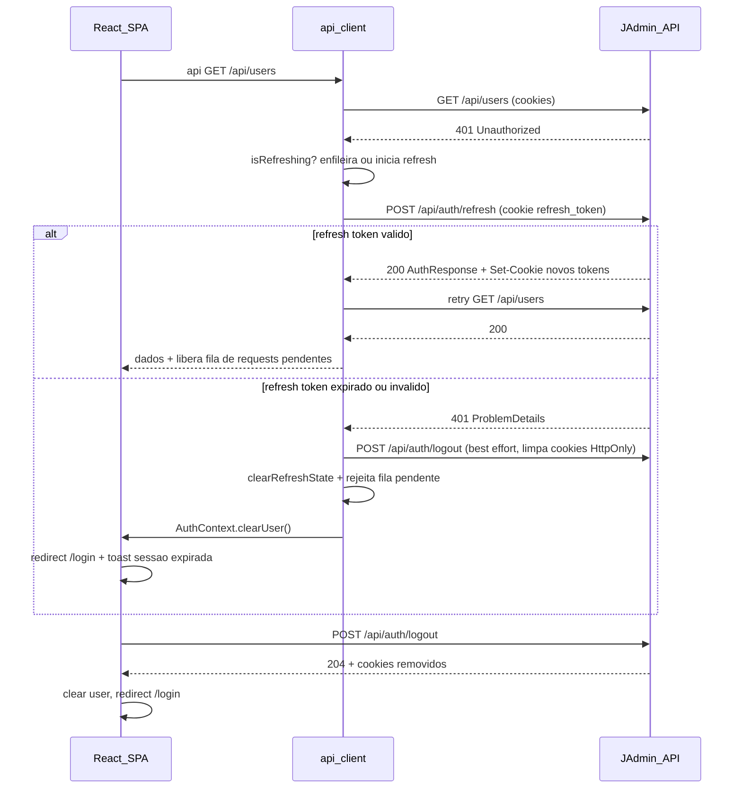
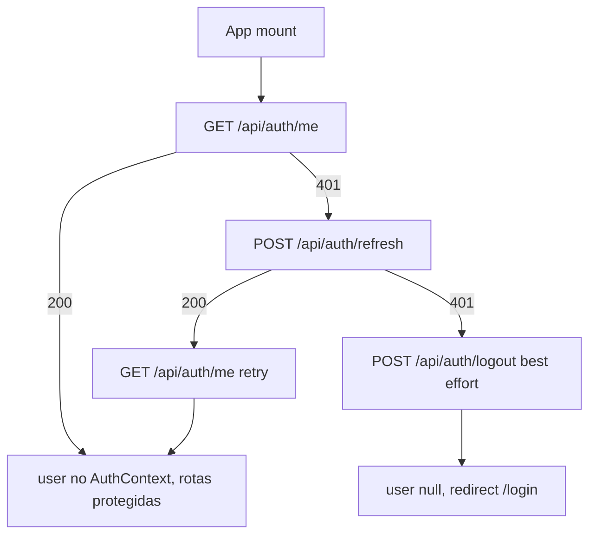
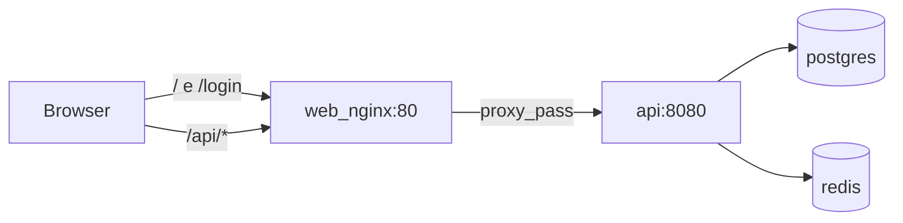
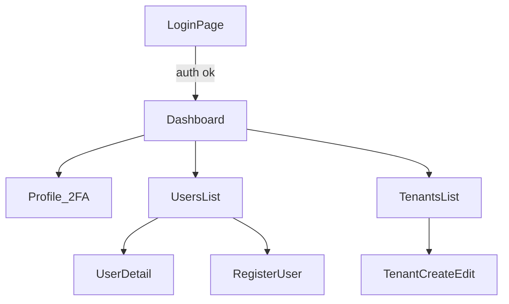

# Frontend React + TypeScript para JAdmin

## Índice

| # | Seção | Conteúdo |
|---|-------|----------|
| — | Contexto | Endpoints consumidos, decisões |
| — | Stack | Vite, shadcn, Query, RHF, Vitest |
| — | Scaffolding | CLI npm + código manual |
| — | Estratégia de autenticação | Cookies, refresh, boot, sessão expirada |
| — | Decisões de implementação | Lacunas resolvidas (tabela) |
| — | Estrutura de pastas | Árvore `web-client/src` |
| — | Tipos TypeScript | DTOs espelho backend |
| — | Rotas e autorização | `ProtectedRoute`, `RoleRoute` |
| — | Páginas | Login, Dashboard, Profile, Users, Tenants |
| — | API client | Interceptor, erros, TanStack Query |
| — | Componentes shadcn | Lista CLI |
| — | Validação (zod) | Alinhada ao FluentValidation |
| — | Integração Docker / deploy | nginx same-origin, Dockerfile |
| — | Internacionalização | react-i18next PT-BR |
| — | Tema | Dark/light shadcn |
| — | Testes | Vitest (11) + Playwright (4 specs) |
| — | Fluxo de teste manual | Docker e dev local |
| — | Diagrama de navegação | Mermaid |
| — | Backend — alterações mínimas | CORS, cookies |
| — | Riscos e mitigações | |

**Planos relacionados:** [01 JWT/Multitenancy](01_jwt_auth_multitenancy_99307074.plan.md) · [04 Testes e CI §2](04_testes_e_ci_monorepo_f2c649e7.plan.md)

> **Navegação no Cursor:** links `#âncora` no preview costumam falhar. Use o painel **Outline** ou `Ctrl+F` pelo título da seção.

## Contexto

O backend em [`JAdmin/`](JAdmin/) expõe **19** endpoints em 3 controllers; o frontend consome **18** (`GET /api/auth/2fa/status` não é usado — status 2FA vem de `UserInfoDto.twoFactorEnabled` em `/me`). CORS já permite `http://localhost:5173` com `credentials: true` ([`ServiceCollectionExtensions.cs`](JAdmin/Extensions/ServiceCollectionExtensions.cs)). Não existe frontend no repositório — o projeto será criado em **`web-client/`** na raiz do monorepo.

**Decisões confirmadas:** Tailwind + shadcn/ui, escopo completo (auth, 2FA, usuários, roles, tenants, register), react-i18next (PT-BR), Vitest (unit), deploy Docker same-origin.

---

## Stack

| Camada | Escolha | Motivo |
|--------|---------|--------|
| Build | Vite 6 + React 19 + TypeScript | Porta 5173 já prevista no CORS |
| UI | Tailwind CSS 4 + shadcn/ui | Escolha do usuário; bom para admin |
| Roteamento | React Router 7 | Rotas protegidas por role |
| Server state | TanStack Query v5 | Cache, refetch, mutations |
| Forms | react-hook-form + zod | Alinhado às regras do FluentValidation |
| i18n | react-i18next | PT-BR desde o início; chaves em `locales/pt/` |
| Testes | Vitest | Unit: api client, validators, auth helpers |
| HTTP | fetch wrapper customizado | `credentials: 'include'` para cookies HttpOnly |
| Auth state | React Context (`AuthProvider`) | Usuário em memória; tokens ficam nos cookies |

---

## Scaffolding (npm)

O projeto **não** será criado arquivo a arquivo manualmente. O bootstrap usa os scaffolds oficiais do ecossistema; o código específico do JAdmin é escrito em cima dessa base.

### Gerado via CLI (npm/npx)

| Passo | Comando | Resultado |
|-------|---------|-----------|
| 1. Vite + React + TS | `npm create vite@latest web-client -- --template react-ts` | `package.json`, `vite.config.ts`, `tsconfig`, `index.html`, `src/main.tsx` |
| 2. Dependências base | `cd web-client && npm install` | `package-lock.json` (usado pelo `npm ci` no Dockerfile) |
| 3. Tailwind CSS 4 | Guia oficial + CLI Tailwind para Vite | `tailwind.config.ts`, estilos globais |
| 4. shadcn/ui | `npx shadcn@latest init` | `components.json`, aliases, tema base |
| 5. Componentes shadcn | `npx shadcn@latest add button card input ...` | `src/components/ui/*` sob demanda |
| 6. Libs da aplicação | `npm install react-router-dom @tanstack/react-query react-hook-form zod @hookform/resolvers react-i18next i18next next-themes` | Roteamento, estado, forms, i18n, tema |
| 7. Vitest | `npm install -D vitest @testing-library/react jsdom` | Testes unitários |
| 8. ESLint | `npm install -D eslint @eslint/js typescript-eslint eslint-plugin-react-hooks eslint-plugin-react-refresh globals` | [`eslint.config.js`](web-client/eslint.config.js) — flat config; override em `src/components/ui/**` desliga `react-refresh/only-export-components` (shadcn exporta `*Variants` junto com componentes) |

### Escrito manualmente (código JAdmin)

- `src/api/` — client HTTP, refresh interceptor, módulos auth/users/tenants
- `src/types/` — DTOs espelhando o backend C#
- `src/contexts/`, `src/hooks/`, `src/routes/` — auth, guards, boot com `/me`
- `src/lib/auth-session.ts` — resolução assíncrona da sessão (`getMe` → refresh → logout) usada no mount e em `boot()`
- `src/layouts/`, `src/pages/` — painel admin completo
- `vite.config.ts` — ajuste do proxy `/api` (sobre o gerado pelo Vite)
- `Dockerfile`, `nginx.conf`, `.dockerignore` — deploy containerizado

**Motivo:** scaffolds oficiais garantem versões e configs atualizadas, `package-lock.json` reproduzível no Docker, e concentra o esforço na integração com a API e nas telas do admin.

---

## Estratégia de autenticação (web)

O backend define cookies `access_token` e `refresh_token` no login/refresh ([`AuthController.cs`](JAdmin/Controllers/AuthController.cs)). O frontend **não** persiste JWT em `localStorage`.



### Sessão expirada (access token + refresh token)

Cenários em que **ambos** deixam de ser válidos (backend retorna 401 no refresh — ver [`RefreshTokenService.cs`](JAdmin/Services/Impl/RefreshTokenService.cs)):

| Causa | Backend |
|-------|---------|
| Refresh token expirou (TTL Redis) | `401` — `"Invalid refresh token"` |
| Refresh ausente / vazio | `401` — `"Refresh token required"` |
| Token já usado (rotação) ou revogado | `401` — `"Invalid refresh token"` |
| Usuário inexistente após revogação | `401` — `"Invalid refresh token"` |

Revogação em massa ocorre em mudança de roles, enable/disable 2FA, move-to-system, etc. (via `RevokeAllForUserAsync`).

#### Fluxo no `api/client.ts`

1. Qualquer request autenticado recebe **401** (exceto `POST /api/auth/login` e `POST /api/auth/refresh`).
2. O interceptor tenta **uma** renovação: `POST /api/auth/refresh` com `credentials: 'include'` (cookie `refresh_token` enviado automaticamente).
3. **Se 200:** backend chama `SetAuthCookies` com novos `access_token` e `refresh_token`; o client **repete** o request original e libera a fila de requests que aguardavam o refresh.
4. **Se 401 no refresh** (access + refresh inválidos):
   - Marcar `refreshFailed = true` para evitar novas tentativas em loop.
   - Rejeitar todos os requests enfileirados com erro de sessão expirada.
   - Chamar `POST /api/auth/logout` (best effort) — endpoint `[AllowAnonymous]`; mesmo com refresh inválido, o backend executa `RemoveAuthCookies()` e remove os cookies HttpOnly stale do browser.
   - Invocar callback global `onSessionExpired()` (registrado pelo `AuthProvider`).
   - **Não** repetir o request original nem tentar refresh novamente.

```typescript
// web-client/src/api/client.ts — esboço do interceptor
let isRefreshing = false;
let refreshQueue: Array<{ resolve, reject }> = [];
let sessionExpired = false;

async function handleUnauthorized(original: RequestInit & { url: string }) {
  if (original.url.endsWith('/api/auth/refresh') || original.url.endsWith('/api/auth/login')) {
    throw new ApiError(401); // sem retry
  }
  if (sessionExpired) throw new ApiError(401, 'SESSION_EXPIRED');

  if (isRefreshing) {
    return new Promise((resolve, reject) => refreshQueue.push({ resolve, reject }));
  }

  isRefreshing = true;
  try {
    const refreshed = await fetch('/api/auth/refresh', { method: 'POST', credentials: 'include' });
    if (refreshed.ok) {
      refreshQueue.forEach(({ resolve }) => resolve());
      refreshQueue = [];
      return api(original.url, original); // retry once
    }
    // refresh falhou — sessão encerrada
    sessionExpired = true;
    refreshQueue.forEach(({ reject }) => reject(new ApiError(401, 'SESSION_EXPIRED')));
    refreshQueue = [];
    await fetch('/api/auth/logout', { method: 'POST', credentials: 'include' }); // limpa cookies
    onSessionExpired?.();
    throw new ApiError(401, 'SESSION_EXPIRED');
  } finally {
    isRefreshing = false;
  }
}
```

#### Fluxo no `AuthContext` e rotas

`AuthProvider` ([`contexts/AuthContext.tsx`](web-client/src/contexts/AuthContext.tsx)) exporta só o provider; tipos/context em [`auth-context.ts`](web-client/src/contexts/auth-context.ts); hook em [`hooks/useAuth.ts`](web-client/src/hooks/useAuth.ts). No mount, `resolveAuthSession` ([`lib/auth-session.ts`](web-client/src/lib/auth-session.ts)) roda em `useEffect` sem `setState` síncrono no corpo do effect. `subscribeAuthLogout` retorna cleanup no `useEffect` (fecha `BroadcastChannel` ao desmontar).

| Momento | Comportamento |
|---------|---------------|
| **Boot** | `status = 'loading'` → spinner; `GET /me` → se 401, refresh → sucesso `authenticated` ou falha `unauthenticated` |
| **Request em rota protegida** | Interceptor trata; `onSessionExpired` → `status = 'unauthenticated'` + `clearUser()` |
| **`ProtectedRoute`** | `loading` → spinner; `unauthenticated` → `<Navigate to="/login" state={{ from }} />` |
| **`RoleRoute`** | Sem role exigida → `<Navigate to="/" replace />` + toast acesso negado (i18n) |
| **Feedback sessão** | Toast: sessão expirada (distinto de credenciais inválidas no login) |
| **Pós-login** | Resetar `sessionExpired`; `status = 'authenticated'`; `setUser` da resposta |

#### Boot da app (diagrama)



**Interceptor de refresh:** fila de requisições enquanto um refresh está em andamento (evita múltiplos `POST /refresh` concorrentes). Após falha de refresh, a fila é **rejeitada** (não retentada).

**Boot da app:** ao carregar, chamar `GET /api/auth/me`; se 401, tentar refresh uma vez; se refresh também retornar 401 → logout best effort, limpar usuário, redirecionar para `/login`.

**2FA no login:** se `POST /login` retornar 401 com extension `requiresTwoFactor: true` (ProblemDetails), exibir campo TOTP de 6 dígitos e reenviar login com `twoFactorCode`. Este 401 **não** dispara o interceptor de refresh.

### Boot de autenticação e estados

`AuthContext` expõe `status: 'loading' | 'authenticated' | 'unauthenticated'`:

| Status | UI |
|--------|-----|
| `loading` | Spinner fullscreen (evita flash de `/login` antes de `/me` + refresh) |
| `authenticated` | Router com rotas protegidas; usuário em `/login` → redirect para `sanitizeRedirect(from) ?? '/'` |
| `unauthenticated` | Apenas rotas públicas; `ProtectedRoute` → `/login` com `state: { from: location }` |

**Redirect pós-login:** `navigate(sanitizeRedirect(location.state?.from) ?? '/', { replace: true })`. `sanitizeRedirect` aceita só paths internos (`/users`, `/tenants/...`); rejeita URLs externas e `/login`.

**Sincronização multi-aba:** ao `onSessionExpired` ou logout explícito, publicar `{ type: 'logout' }` em `BroadcastChannel('jadmin-auth')`. Outras abas recebem, chamam `clearUser()` e redirecionam para `/login` sem esperar próximo request.

---

## Decisões de implementação (lacunas resolvidas)

| Tópico | Decisão |
|--------|---------|
| Status 2FA | Somente `GET /me` (`twoFactorEnabled`); **não** chamar `GET /2fa/status` |
| Detalhe usuário | Híbrido: `location.state` da lista/registro + cache TanStack Query no F5; `GET /roles` sempre; se sem state/cache → toast + redirect `/users` |
| Pós-registro | Toast sucesso + `toUserListItem` + `upsertUserInCache` + `navigate(/users/:id, { state: { user } })`; invalidar `['users']` **sem await** (não esvaziar state/cache antes da montagem do detalhe) |
| `VITE_API_URL` Docker | **Default vazio** (`${VITE_API_URL:-}`) → paths `/api` relativos via nginx same-origin |
| Erros 403 | Toast com `detail`; `navigate(-1)` se histórico interno, senão permanece |
| Erros 409 | Toast com `detail` (último Admin, role duplicada, etc.) |
| TanStack Query | Invalidar chaves amplas após mutations: `['users']`, `['tenants']`, `['me']` conforme domínio |
| Filtro tenant (SuperAdmin) | `useQuery(['tenants'], ...)` **somente** quando `hasRole('SuperAdmin')` |
| Role SuperAdmin na UI | Ocultar/desabilitar opção se `user.tenantId !== systemTenantId` |
| Enable 2FA | `ConfirmDialog` antes de enable (mesmo aviso de revoke de sessões que no disable) |
| `.gitignore` | Entradas no [`.gitignore`](.gitignore) raiz: `web-client/node_modules`, `web-client/dist`, `web-client/.env` |
| Testes | Vitest — **11 arquivos** (auth, routes, LoginPage, libs, componentes); Playwright **4 specs** — ver [plano 04](.cursor/plans/04_testes_e_ci_monorepo_f2c649e7.plan.md) |
| i18n | react-i18next; locale inicial `pt`; strings em `web-client/src/locales/pt/common.json` |
| Multi-aba | `BroadcastChannel` para logout/sessão expirada sincronizado |
| F5 `/users/:id` | Varrer queries `['users', *]` no cache; se não achar usuário → toast + redirect `/users` |
| `systemTenantId` | `useQuery(['tenants'])` → `tenants.find(t => t.isSystemTenant)?.id` |
| Query keys | `['users', { page, pageSize, tenantId? }]`; invalidar com `queryKey: ['users']` (prefixo) |
| `RoleRoute` negado | `<Navigate to="/" replace />` + toast acesso negado |
| Erros 400 validação | `parseApiError`: `detail` ou 1º erro de `errors` RFC 9110 → form/toast |
| Logout UI | Dropdown header: Perfil + Sair → `POST /logout`, BroadcastChannel, `clearUser`, `/login` |
| Tema | Dark mode com toggle (shadcn `ThemeProvider`) |
| Email register | `emailSchema` (`zod.email` + `@localhost` para dev/seed) |
| Compose `web` | `depends_on: api` com `condition: service_healthy` (healthcheck `/health`) |
| Vitest CI | [`npm run test:coverage`](web-client/package.json) no `unit.yml`; config em `vite.config.ts` — ver [plano 04](.cursor/plans/04_testes_e_ci_monorepo_f2c649e7.plan.md) |
| `web-client/.env.example` | Apenas `VITE_API_URL=` (proxy dev); vars Docker no `.env` raiz |
| Boot auth | Uma única seção com `status: loading \| authenticated \| unauthenticated` |

---

## Estrutura de pastas

```
web-client/
├── index.html
├── package.json
├── Dockerfile              # multi-stage: node build → nginx
├── nginx.conf              # SPA + reverse proxy /api → api:8080
├── .dockerignore
├── vite.config.ts          # proxy /api → backend em dev
├── eslint.config.js        # flat config; ui/shadcn com override de react-refresh
├── tailwind.config.ts
├── components.json         # shadcn
├── .env.example            # só VITE_API_URL= (dev com proxy Vite)
└── src/
    ├── main.tsx              # I18nextProvider > QueryClientProvider > AuthProvider > Router
    ├── i18n.ts
    ├── locales/pt/common.json
    ├── App.tsx
    ├── api/
    │   ├── client.ts       # fetch wrapper + refresh interceptor
    │   ├── auth.ts
    │   ├── users.ts
    │   └── tenants.ts
    ├── types/
    │   ├── auth.ts         # espelha DTOs C#
    │   ├── users.ts
    │   ├── tenants.ts
    │   └── api.ts          # ProblemDetails, PagedResult
    ├── contexts/
    │   ├── auth-context.ts   # createContext + tipos AuthStatus / AuthContextValue
    │   └── AuthContext.tsx   # AuthProvider (exporta só o provider)
    ├── hooks/
    │   ├── useAuth.ts        # useAuthContext + useAuth
    │   └── useRole.ts      # hasRole('SuperAdmin'), etc.
    ├── routes/
    │   ├── index.tsx
    │   ├── ProtectedRoute.tsx
    │   └── RoleRoute.tsx
    ├── layouts/
    │   └── AppLayout.tsx   # sidebar + header (dropdown perfil/sair) + outlet
    ├── pages/
    │   ├── LoginPage.tsx
    │   ├── DashboardPage.tsx
    │   ├── profile/
    │   │   └── ProfilePage.tsx      # /me + 2FA
    │   ├── users/
    │   │   ├── UsersListPage.tsx
    │   │   ├── UserDetailPage.tsx   # roles + move-to-system
    │   │   └── RegisterUserPage.tsx
    │   └── tenants/
    │       ├── TenantsListPage.tsx
    │       ├── TenantCreatePage.tsx
    │       └── TenantEditPage.tsx
    ├── components/
    │   ├── ui/             # shadcn (Button, Input, Table, Dialog…)
    │   ├── DataTable.tsx   # tabela paginada reutilizável
    │   ├── Pagination.tsx
    │   ├── RoleBadge.tsx
    │   ├── TwoFactorSetup.tsx
    │   └── ConfirmDialog.tsx
    ├── providers/
    │   └── ThemeProvider.tsx # shadcn dark/light toggle
    └── lib/
        ├── utils.ts
        ├── validators.ts   # schemas zod
        ├── auth.ts         # sanitizeRedirect, BroadcastChannel helpers
        ├── auth-session.ts # resolveAuthSession (boot / refresh no mount)
        └── query.ts        # toUserListItem, upsertUserInCache, findUserInCache, query key helpers
```

---

## Tipos TypeScript (espelho dos DTOs)

Mapear 1:1 os DTOs em [`JAdmin/Dtos/`](JAdmin/Dtos/):

- `AuthResponse`, `UserInfoDto`, `LoginRequest`, `RegisterRequest`
- `TwoFactorSetupResponse`, `EnableTwoFactorRequest`, `DisableTwoFactorRequest`
- `UserListItemDto`, `UserRolesResponse`, `AddRoleRequest`
- `TenantDto`, `CreateTenantRequest`, `UpdateTenantRequest`
- `PagedResult<T>`, `PaginationQuery`
- `ProblemDetails` com `extensions?: { requiresTwoFactor?: boolean }`

**`UserInfoDto`** (espelho de [`UserInfoDto.cs`](JAdmin/Dtos/Auth/UserInfoDto.cs)): `id`, `email`, `tenantId`, `tenantName`, `roles`, `twoFactorEnabled`. **Não** inclui `tenantSlug` — o slug do tenant aparece só em `LoginRequest.tenantSlug` (formulário de login).

**`ApiError`:** construtor `(status: number, code?: string, problem?: ProblemDetails)` — ex.: `new ApiError(401, 'SESSION_EXPIRED')`.

> `TwoFactorStatusResponse` / `GET /2fa/status` existem no backend mas **não** são consumidos — `UserInfoDto.twoFactorEnabled` em `/me` é a fonte única no frontend.

---

## Rotas e autorização

| Rota | Roles | Endpoints consumidos |
|------|-------|---------------------|
| `/login` | público | `POST /api/auth/login` |
| `/` (dashboard) | autenticado | `GET /api/auth/me` |
| `/profile` | autenticado | `GET /me`, `POST /2fa/setup`, `enable`, `disable` |
| `/users` | Admin, SuperAdmin | `GET /api/users` |
| `/users/register` | Admin, SuperAdmin | `POST /api/auth/register` |
| `/users/:id` | Admin, SuperAdmin | `GET /roles`, `POST/DELETE /roles`, `POST move-to-system-tenant` |
| `/tenants` | SuperAdmin | `GET /api/tenants` |
| `/tenants/new` | SuperAdmin | `POST /api/tenants` |
| `/tenants/:id` | SuperAdmin | `GET/PUT/DELETE /api/tenants/{id}` |

**Sidebar dinâmica:** itens visíveis conforme `user.roles` (`useRole`).

**Regras de UI espelhando o backend:**
- Admin: register só com role `User`; sem filtro `tenantId` na listagem (backend filtra pelo tenant do JWT)
- SuperAdmin: filtro opcional por tenant na listagem de usuários (`?tenantId=`); register com `tenantId` e roles `Admin`/`User`; botão "Mover para tenant sistema" (oculto se usuário já é SuperAdmin)
- Tenant sistema (`isSystemTenant`): badge visual; desativar bloqueado na UI

---

## Páginas — detalhamento

### Login (`/login`)
- Campos: `tenantSlug`, `email`, `password`
- Estado `requires2FA` → exibe input `twoFactorCode` (6 dígitos)
- Erros via `detail` do ProblemDetails
- Sucesso: `setUser` + redirect `sanitizeRedirect(location.state?.from) ?? '/'`
- Se já autenticado (`status === 'authenticated'`): redirect imediato para `from ?? '/'`

### Dashboard (`/`)
- Resumo via `/me`: nome, email, tenant, roles, status 2FA (`twoFactorEnabled`)
- Links rápidos conforme role

### Perfil / 2FA (`/profile`)
- Dados e status 2FA de `GET /me` (refetch após enable/disable → invalida `['me']`)
- **Setup:** `POST /2fa/setup` → exibe QR (`qrCodeBase64`) + chave manual
  - `qrCodeBase64` do backend é **data URL completo** (`data:image/png;base64,...`), não base64 cru — ver [`TwoFactorService.GenerateSetupAsync`](JAdmin/Services/Impl/TwoFactorService.cs) e plano 01
  - Frontend normaliza com `toQrCodeDataUrl()` em [`web-client/src/lib/twoFactor.ts`](web-client/src/lib/twoFactor.ts) antes de bindar em `` (evita prefixo duplicado)
- **Enable:** `ConfirmDialog` avisando revogação de outras sessões → `POST /2fa/enable`
- **Disable:** `ConfirmDialog` + senha + código → `POST /2fa/disable`

### Contrato 2FA — QR Code (`TwoFactorSetupResponse`)

| Campo | Formato | Uso no frontend |
|-------|---------|-----------------|
| `sharedKey` | string formatada | exibir texto para entrada manual |
| `qrCodeBase64` | data URL PNG (`data:image/png;base64,...`) | `toQrCodeDataUrl()` → `` em `TwoFactorSetup` |
| `authenticatorUri` | `otpauth://...` | não exibido (reservado para deep link futuro) |

**Troubleshooting:** se o QR não aparecer (ícone quebrado), inspecionar `img.src` no DevTools — prefixo duplicado (`data:image/png;base64,data:image/png;base64,...`) indica uso incorreto do campo; usar `toQrCodeDataUrl()` em vez de concatenar prefixo manualmente.

### Usuários (`/users`)
- `DataTable` com colunas: email, tenant, roles, 2FA
- Paginação (`page`, `pageSize`)
- **SuperAdmin:** `useQuery(['tenants'], getTenants)` habilitado só para SuperAdmin; select opcional `tenantId` no querystring
- Ação "ver detalhes": `navigate(/users/:id, { state: { user: row } })`

### Detalhe do usuário (`/users/:id`)
- **Layout:** `<h1>` com `users.detail` (padrão das demais páginas; E2E usa `getByRole('heading')` — `CardTitle` shadcn é `div`, não heading)
- **Dados base:** `location.state.user` (`UserListItemDto`) ao vir da lista ou do registro; normalizar com `toUserListItem` (garante `roles: []` e strings)
- **F5 / deep link:** `findUserInCache(queryClient, id)` — varre todas as queries com prefixo `['users', …]` no cache; se não encontrar → toast + `navigate('/users')`
- **Loading:** enquanto `baseUser` ausente, exibir `app.loading` (evita tela vazia no tema escuro antes do redirect)
- **Roles:** sempre `GET /api/users/:id/roles` (fonte de verdade); fallback local `baseUser.roles ?? []`
- **`systemTenantId`:** de `useQuery(['tenants'])` → `tenants.find(t => t.isSystemTenant)?.id` (compartilhado com filtro SuperAdmin)
- Adicionar role: select filtrado — Admin vê `User`/`Admin`; SuperAdmin vê `SuperAdmin` **somente** se `user.tenantId === systemTenantId`
- Remover role: confirm dialog; toast em 409 (ex.: último Admin)
- SuperAdmin: botão "Mover para tenant sistema" (oculto se já SuperAdmin ou já no tenant sistema)

### Registrar usuário (`/users/register`)
- Campos: email (`emailSchema` — aceita `@localhost` para contas seed/dev), password (validação zod: min 6, 1 dígito, 1 especial)
- Admin: roles fixo `User`
- SuperAdmin: select tenant + roles
- **Sucesso (201):** toast + `toUserListItem(response)` + `upsertUserInCache` + `navigate(/users/:id, { state: { user } })`; invalida `['users']` em background (não bloquear navegação)

### Tenants (`/tenants`) — SuperAdmin
- Listagem paginada com status ativo/inativo
- Criar: `name`, `slug` (lowercase, hífens)
- Editar: `name`, `isActive` (desabilitado se `isSystemTenant`)
- Desativar: `DELETE` com confirmação (soft delete no backend)

---

## API client

[`web-client/src/api/client.ts`](web-client/src/api/client.ts):

```typescript
const API_URL = import.meta.env.VITE_API_URL ?? '';

export async function api<T>(path: string, options?: RequestInit): Promise<T> {
  const res = await fetch(`${API_URL}${path}`, {
    ...options,
    credentials: 'include',
    headers: { 'Content-Type': 'application/json', ...options?.headers },
  });
  // 401 (exceto login) → refresh → retry; se refresh 401 → logout + onSessionExpired
  // 403 → toast + navigate(-1) se histórico interno; 409 → toast; parse ProblemDetails
}
```

### Tratamento de erros HTTP

Helper `parseApiError(res)` extrai mensagem de `ProblemDetails`:

1. Se `detail` existir → usar `detail`
2. Senão, se `errors` (RFC 9110, objeto campo → string[]) → primeiro erro do primeiro campo
3. Senão → fallback i18n `errors.generic`

Em formulários (login, register, tenant): quando `errors` tiver chave correspondente ao campo, chamar `setError(campo, { message })` do react-hook-form.

Campos controlados fora de `<input {...register()}>` (checkbox, `Select` shadcn) usam **`Controller`** do react-hook-form — evita `form.watch()` direto no JSX (compatível com ESLint React Compiler / `react-hooks/incompatible-library` no CI).

| Status | Comportamento |
|--------|---------------|
| **401** | Interceptor refresh (exceto login/refresh); sessão expirada → logout + login |
| **403** | Toast com `detail`; `window.history.length > 1` → `navigate(-1)`, senão permanece |
| **409** | Toast com `detail` (conflito de negócio) |
| **400** | `parseApiError` → toast ou `setError` por campo (validação FluentValidation) |
| **404/500** | Toast com `detail` ou mensagem i18n genérica |

### TanStack Query — chaves e invalidação

**Convenção de chaves:**

```typescript
['me']
['users', { page, pageSize, tenantId?: string }]  // tenantId só SuperAdmin
['users', userId, 'roles']
['tenants', { page, pageSize }]
['tenants', tenantId]
```

**Invalidação (prefixo):** `queryClient.invalidateQueries({ queryKey: ['users'] })` invalida todas as páginas/filtros.

| Mutation | Invalidar |
|----------|-----------|
| Login / logout / sessão expirada | `['me']` |
| Register user | `['users']` |
| Add/remove role, move-to-system | `['users']`, `['users', id, 'roles']` |
| Enable/disable 2FA | `['me']` |
| CRUD tenant | `['tenants']` |

**Helper F5:** `findUserInCache(queryClient, id)` em `lib/query.ts` — itera `queryClient.getQueriesData({ queryKey: ['users'] })`.

`main.tsx`: `QueryClient` com `defaultOptions.queries.retry: false` em 401 (delegar ao interceptor).

**Dev proxy** em `vite.config.ts` — evita problemas de CORS em desenvolvimento local:

```typescript
server: {
  port: 5173,
  proxy: { '/api': { target: 'http://localhost:8080', changeOrigin: true } }
}
```

Com proxy, `VITE_API_URL` pode ficar vazio (same-origin `/api`).

**Vitest** em `vite.config.ts` — local: `pool: 'threads'`; CI (`CI=true`): `pool: 'forks'`, `maxWorkers: 1`, `fileParallelism: false`, `isolate: true`. [`setup.ts`](web-client/src/test/setup.ts) mocka `BroadcastChannel`. Scripts: `test`, `test:watch`, `test:coverage`. Detalhes de CI no [plano 04](.cursor/plans/04_testes_e_ci_monorepo_f2c649e7.plan.md).

**Build Docker:** `VITE_API_URL` injetado via build arg do `docker-compose.yml`. **Default vazio** → bundle usa `/api` relativo e nginx faz proxy same-origin. Para debug com API direta em `:8080`, definir `VITE_API_URL=http://localhost:8080` no `.env` antes do build.

### Logout (header)

Dropdown no `AppLayout` (avatar/email):

1. **Perfil** → `/profile`
2. **Sair** → `POST /api/auth/logout` → `BroadcastChannel` `{ type: 'logout' }` → `clearUser()` → `status = 'unauthenticated'` → `navigate('/login')` → invalida `['me']`

---

## Componentes shadcn necessários

Instalar via CLI: `button`, `input`, `label`, `card`, `table`, `dialog`, `alert`, `badge`, `select`, `form`, `dropdown-menu`, `separator`, `skeleton`, `sonner` (toasts), `avatar`.

Arquivos em `src/components/ui/` são gerados pelo shadcn (exportam `*Variants` + componente). **Não alterar** para satisfazer o lint — [`eslint.config.js`](web-client/eslint.config.js) desliga `react-refresh/only-export-components` só nessa pasta.

---

## Validação (zod) — alinhada ao backend

| Campo | Regra |
|-------|-------|
| Password | min 6, pelo menos 1 dígito e 1 caractere especial |
| Email (register) | `emailSchema` (`zod.email` + `@localhost` para dev/seed) |
| Tenant slug (create) | `^[a-z0-9-]{2,50}$` |
| TOTP code | exatamente 6 caracteres |
| Pagination | page ≥ 1, pageSize 1–100 |

---

## Integração Docker / deploy

### Decisão: nginx como reverse proxy (mesmo origin)

Cookies HttpOnly (`access_token`, `refresh_token`) exigem que o browser chame a API no **mesmo origin** do SPA. Com frontend em `:80` e API em `:8080`, os cookies não seriam enviados.

**Solução:** o container `web` serve o `dist/` e faz proxy de `/api` para o serviço `api` na rede interna Docker. O browser acessa apenas `http://localhost` (porta configurável).



### Arquivos a criar

#### [`web-client/Dockerfile`](web-client/Dockerfile) — multi-stage

```dockerfile
# Stage 1: build
FROM node:22-alpine AS build
WORKDIR /app
COPY package.json package-lock.json ./
RUN npm ci
COPY . .
# Valor injetado pelo docker-compose (build.args); default vazio = same-origin /api
ARG VITE_API_URL=
ENV VITE_API_URL=$VITE_API_URL
RUN npm run build

# Stage 2: serve
FROM nginx:1.27-alpine
COPY nginx.conf /etc/nginx/conf.d/default.conf
COPY --from=build /app/dist /usr/share/nginx/html
EXPOSE 80
```

O `ARG` no Dockerfile espelha o default do compose; o valor efetivo vem sempre do `docker-compose.yml` em tempo de build.

#### [`web-client/nginx.conf`](web-client/nginx.conf)

- `location /api/` → `proxy_pass http://api:8080/api/;` com headers `Host`, `X-Real-IP`, `X-Forwarded-For`, `X-Forwarded-Proto`
- `location /` → `try_files $uri $uri/ /index.html` (fallback SPA para React Router)
- `gzip` para assets estáticos

#### [`web-client/.dockerignore`](web-client/.dockerignore)

Ignorar `node_modules`, `dist`, `.env`, arquivos de dev.

### Alterações em [`docker-compose.yml`](docker-compose.yml)

Adicionar serviço `web` com **build arg explícito** lendo variável de ambiente:

```yaml
  web:
    build:
      context: ./web-client
      dockerfile: Dockerfile
      args:
        # Default vazio: bundle usa /api relativo; nginx faz proxy same-origin
        # Para API direta (debug): VITE_API_URL=http://localhost:8080 no .env
        VITE_API_URL: ${VITE_API_URL:-}
    restart: unless-stopped
    ports:
      - "${WEB_PORT:-80}:80"
    depends_on:
      - api
```

`depends_on: api` simples (sem `condition`); nginx tolera API ainda subindo — refresh/login retentam no client.

Atualizar também o default de CORS no serviço `api` para incluir a origem do `web`:

```yaml
      Cors__AllowedOrigins: ${CORS_ALLOWED_ORIGINS:-http://localhost:5173,http://localhost:3000,http://localhost}
```

O serviço `api` permanece exposto em `${API_PORT:-8080}` para debug/Swagger. Com **default vazio**, o browser fala só com nginx (`:80`); cookies HttpOnly funcionam sem CORS cross-port.

**Modos de operação:**

| `VITE_API_URL` | Comportamento |
|----------------|---------------|
| `` (vazio, **default**) | SPA usa `/api` relativo; nginx faz proxy → same-origin; cookies HttpOnly sem cross-origin |
| `http://localhost:8080` | SPA em `:80` chama API em `:8080`; exige CORS + `credentials` (útil para debug sem rebuild nginx) |

### Alterações em [`.env.example`](.env.example)

```env
WEB_PORT=80
# URL da API no build Vite. Default vazio = same-origin via nginx proxy /api
VITE_API_URL=
# Para chamar API exposta diretamente: VITE_API_URL=http://localhost:8080
# CORS: necessário só se VITE_API_URL apontar para :8080 com SPA em :80
CORS_ALLOWED_ORIGINS=http://localhost:5173,http://localhost:3000,http://localhost
```

`http://localhost` cobre o deploy Docker na porta 80. Manter `5173` para desenvolvimento local com `npm run dev`.

### Variáveis de ambiente

| Variável | Onde | Default | Uso |
|----------|------|---------|-----|
| `WEB_PORT` | docker-compose | `80` | Porta exposta do nginx |
| `VITE_API_URL` | `.env` → build arg `web` | `` (vazio) | `${VITE_API_URL:-}` no compose; paths `/api` relativos |
| `CORS_ALLOWED_ORIGINS` | api | inclui `http://localhost` | Só necessário se `VITE_API_URL=http://localhost:8080` |

### Cookies em ambiente containerizado

Com `ASPNETCORE_ENVIRONMENT=Development` (default no compose):
- `Secure=false` — cookies funcionam em HTTP
- `SameSite=Lax` — adequado para same-origin via nginx

Em produção com HTTPS no nginx, definir `ASPNETCORE_ENVIRONMENT=Production` na API e terminar TLS no nginx (configuração futura); cookies passam a exigir `Secure=true` (comportamento atual do [`AuthController`](JAdmin/Controllers/AuthController.cs)).

### Desenvolvimento local (sem rebuild)

Continua válido rodar `web-client` com `npm run dev` (proxy Vite → `:8080`) enquanto API roda via `docker compose up api db redis` ou `dotnet run`.

---

## Internacionalização (react-i18next)

- Config em [`web-client/src/i18n.ts`](web-client/src/i18n.ts); import em `main.tsx`
- Locale inicial: `pt`; arquivos em `web-client/src/locales/pt/common.json`
- Todas as strings de UI (labels, botões, toasts, títulos) via `useTranslation()`
- Mensagens de erro da API: exibir `detail` do backend quando existir; fallback i18n (`errors.generic`, `errors.sessionExpired`, `errors.accessDenied`)

## Tema (shadcn)

- `ThemeProvider` (shadcn) em `main.tsx` com suporte **dark/light**
- Toggle no header do `AppLayout` (ícone sol/lua)
- Preferência persistida em `localStorage` (comportamento padrão shadcn/next-themes)

---

## Testes (Vitest + Playwright)

### Execução local

Stack E2E/perf (nginx same-origin): `docker compose --env-file .env.test up -d db redis api web` na raiz do repo.

```bash
cd web-client
npm ci
npm run lint
npm run test
npm run test:coverage   # local e CI (forks + isolate + heap 6144 no runner)
npm run build
npm run test:e2e          # stack compose ou `npm run dev` (ver abaixo)
npm run perf:under-load   # smoke Playwright — scripts em JAdmin/Tests/load/ pendente (plano 05)
npm run perf:lighthouse   # requer lighthouserc.json (plano 05)
```

CI e branch protection: [plano 04 §5](.cursor/plans/04_testes_e_ci_monorepo_f2c649e7.plan.md).

### Vitest (unitários + RTL) — 11 arquivos

| Arquivo | Cobertura |
|---------|-----------|
| `api/client.test.ts` | Interceptor 401→refresh→retry; refresh 401→session expired; não retentar login |
| `lib/validators.test.ts` | Schemas zod (password, slug, TOTP, email) |
| `lib/auth.test.ts` | `sanitizeRedirect`; `BroadcastChannel` logout |
| `lib/query.test.ts` | `findUserInCache` com múltiplas páginas em cache |
| `lib/twoFactor.test.ts` | `toQrCodeDataUrl` |
| `routes/ProtectedRoute.test.tsx` | loading → redirect; autenticado renderiza children |
| `routes/RoleRoute.test.tsx` | role insuficiente → toast + redirect |
| `contexts/AuthContext.test.tsx` | boot com cookie, refresh 401 → unauthenticated |
| `pages/LoginPage.test.tsx` | submit mock `auth.login`, campo 2FA condicional |
| `components/TwoFactorSetup.test.tsx` | render QR/chave, input TOTP |
| `components/ConfirmDialog.test.tsx` | open/confirm/cancel |

Config em `vite.config.ts` — local: `pool: 'threads'`; CI (`CI=true`): `pool: 'forks'`, `maxWorkers: 1`, `fileParallelism: false`, `isolate: true`. [`setup.ts`](web-client/src/test/setup.ts) mocka `BroadcastChannel`. Scripts: `test`, `test:watch`, `test:coverage`.

`npm run test` ou `npm run test:coverage` no `web-client/`.

### Playwright (E2E) — 4 specs

- **Local (dev):** `playwright.config.ts` com `webServer: npm run dev` e `baseURL: http://localhost:5173` (proxy Vite → API).
- **CI / stack Docker:** `PLAYWRIGHT_BASE_URL=http://localhost` (nginx via compose). Specs compartilham um DB seed por run — `playwright.config.ts` define `fullyParallel: false`.
- Helpers: [`e2e/helpers/navigation.ts`](web-client/e2e/helpers/navigation.ts) (`clickNavLink` — escopo sidebar); [`e2e/global-setup.ts`](web-client/e2e/global-setup.ts) + [`helpers/reset-2fa.ts`](web-client/e2e/helpers/reset-2fa.ts) (reset SQL superadmin no CI antes/depois do spec de profile).

**Requisitos de código para E2E estável:**

| Área | Decisão no código |
|------|-------------------|
| Registro | [`emailSchema`](web-client/src/lib/validators.ts) aceita `@localhost` — Zod `.email()` puro rejeita e bloqueia submit com "E-mail inválido" |
| Pós-registro | [`RegisterUserPage`](web-client/src/pages/users/RegisterUserPage.tsx): tenant System pré-selecionado + nome visível; [`UserDetailPage`](web-client/src/pages/users/UserDetailPage.tsx): `<h1>` com `users.detail` (`CardTitle` shadcn é `div`, não heading — assert `getByRole('heading')`) |
| Navegação specs | `clickNavLink()`; `guidPath()` em [`helpers/routes.ts`](web-client/e2e/helpers/routes.ts); spec 2FA prefixo `z-` roda por último e desativa 2FA ao final |
| 2FA recovery | `E2E_2FA_SECRET` em [`.env.test`](.env.test) para `loginAsSuperAdmin` quando 2FA ainda ativo |

Specs: `auth.spec.ts`, `users.spec.ts`, `tenants.spec.ts`, `z-profile-2fa.spec.ts` — detalhes em [plano 04 §2](.cursor/plans/04_testes_e_ci_monorepo_f2c649e7.plan.md).

### `web-client/.env.example`

```env
# Dev: vazio = proxy Vite /api → localhost:8080
VITE_API_URL=
```

Variáveis Docker (`WEB_PORT`, `VITE_API_URL` build, `CORS_*`) ficam no [`.env.example`](.env.example) **raiz** do monorepo.

---

## Fluxo de teste manual

### Deploy completo (Docker)

1. Copiar `.env.example` → `.env`; ajustar `SEED_SUPERADMIN_PASSWORD` e `SEED_ENABLED=true`
2. `docker compose up -d --build`
3. Acessar painel em `http://localhost` (serviço `web`)
4. API/Swagger opcional em `http://localhost:8080/swagger`
5. Login: tenant `system` / `superadmin@localhost` / senha do seed
6. Validar CRUD tenants, usuários, roles, 2FA, registro → redirect `/users/:id`, F5 em detalhe, sessão expirada multi-aba
7. `cd web-client && npm run test` (Vitest)

### Desenvolvimento local (hot reload)

1. `docker compose up -d db redis api`
2. `cd web-client && npm install && npm run dev`
3. Acessar `http://localhost:5173`
4. Mesmos fluxos de teste acima

---

## Diagrama de navegação



---

## Arquivos do backend — alterações mínimas

O backend já suporta o fluxo web via cookies. Para o deploy Docker conjunto:

- Atualizar default de `Cors__AllowedOrigins` no [`docker-compose.yml`](docker-compose.yml) para incluir `http://localhost`
- Nenhuma alteração de código C# obrigatória; o proxy nginx elimina CORS no fluxo principal (same-origin)

Adicionar ao [`.gitignore`](.gitignore) raiz:

```
web-client/node_modules/
web-client/dist/
web-client/.env
```

---

## Riscos e mitigações

| Risco | Mitigação |
|-------|-----------|
| Refresh concorrente | Fila no interceptor |
| Access + refresh expirados | Refresh 401 → logout best effort → `clearUser` → `/login` + toast; flag `sessionExpired` evita loop |
| 401 após role change | Revogação no backend → refresh 401 → mesmo fluxo de sessão expirada + toast |
| SameSite cookies em dev | Backend já usa `SameSite=Lax` em Development |
| SuperAdmin vs Admin UX | `RoleRoute` + sidebar condicional |
| Cookies cross-port sem proxy | Default `VITE_API_URL` vazio + nginx proxy `/api` |
| `Secure` cookies em Production + HTTP | Manter `Development` no compose local ou terminar HTTPS no nginx |
| F5 em `/users/:id` sem cache | `findUserInCache` varre prefixo `['users']`; fallback redirect `/users` |
| Sessão expira em outra aba | `BroadcastChannel` propaga logout imediato |
| Admin acessa `/tenants` | `RoleRoute` → redirect `/` + toast |
