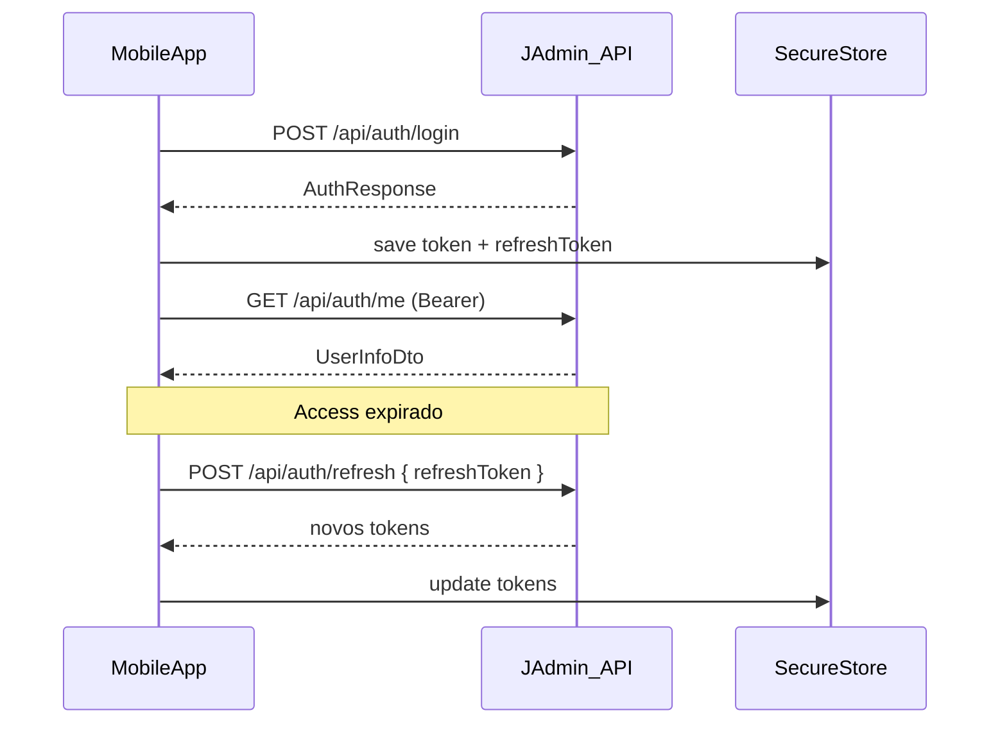
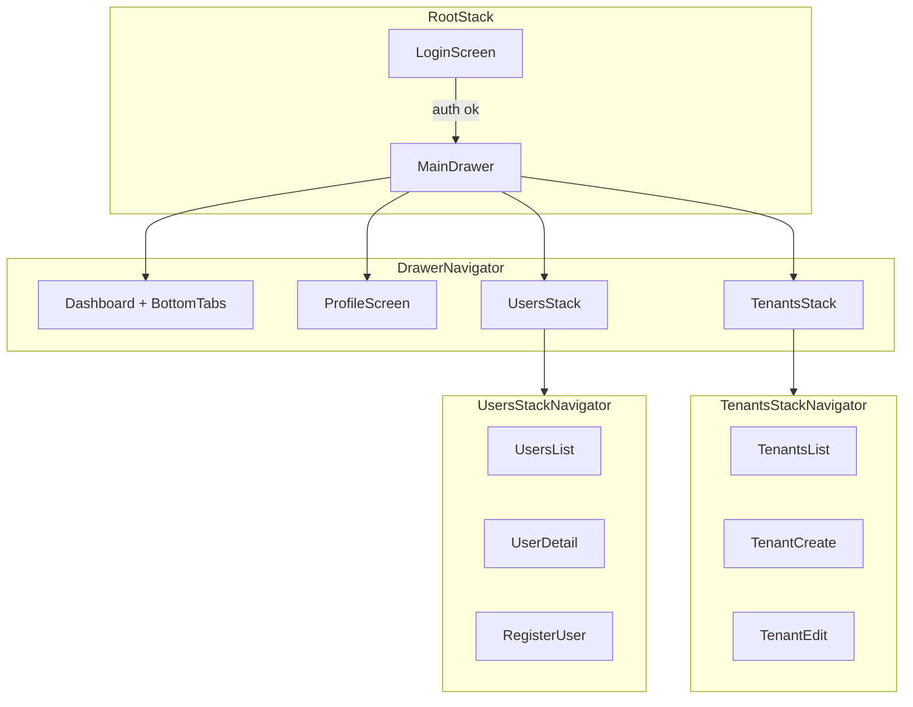

# 03 — App mobile JAdmin (Expo SDK 54)

## Contexto

- **Plano 03** da sequência JAdmin — antecedentes: [01 JWT/Multitenancy](.cursor/plans/01_jwt_auth_multitenancy_99307074.plan.md) (backend), [02 Frontend React](.cursor/plans/02_frontend_react_jadmin_72bcb6f8.plan.md) (`web-client`).

- Backend já implementado em [`JAdmin/`](JAdmin/) — JWT + refresh no Redis, multitenancy por `tenantSlug` no login, roles `Admin` / `User` / `SuperAdmin` ([`JAdmin/Common/Roles.cs`](JAdmin/Common/Roles.cs)).
- Referência de padrões: [`web-client/`](web-client/) (DTOs, Role Guard, i18n, fluxo 2FA).
- App mobile em [`mobile-client/`](mobile-client/) na raiz do monorepo — **implementado e validado manualmente**; este plano descreve o scaffold do zero até o estado atual do repositório.
- Decisões confirmadas: pasta `mobile-client/`, **Expo blank + React Navigation manual** (sem Expo Router).

## Decisões de lacunas (confirmadas)

| # | Tópico | Escolha |
|---|--------|---------|
| 1 | Toolchain NativeWind/RNR | **A** — documentar arquivos completos no plano |
| 2 | Android cleartext HTTP | **A** — `app.json` → `usesCleartextTraffic: true` (dev) |
| 3 | Módulo `auth.ts` | **A** — módulo dedicado mobile, documentado |
| 4 | Feedback sessão/403/409 | **B** — `react-native-toast-message` |
| 5 | UI de boot | **A** — `ActivityIndicator` fullscreen (`AuthGate`) |
| 6 | SecureStore | **A** — chaves fixas `jadmin_access_token`, `jadmin_refresh_token` |
| 7 | Pós enable/disable 2FA | **A** — igual web: avisar no dialog, sessão atual até access expirar |
| 8 | Dashboard | **B** — email, tenant, **roles** e 2FA (como web-client) |
| 9 | Profile | **A** — card email/tenant/roles + seção 2FA |
| 10 | Abrir Drawer | **A + B** — ícone Menu no header **de todas as telas autenticadas** (exceto Login) **e** swipe habilitado |
| 11 | Teclado | **B** — `react-native-keyboard-controller` |
| 12 | Acessibilidade | **C** — forms + listas + hints completos |
| 13 | Path alias | **A** — `@/*` igual ao web-client |
| 14 | Tema | **C** — toggle dark/light com persistência `AsyncStorage` |
| 15 | i18n locale | **A** — PT-BR fixo |
| 16 | Testes | **C** — Jest + React Native Testing Library |
| 17 | Escopo Users/Tenants | **C** — paridade web: CRUD completo |
| 18 | Docs repositório | **A** — só `.env.example` + `.gitignore` (sem README nem changelog separado) |

## Ordem de execução (To-dos)

Executar na sequência abaixo. Cada item corresponde a um To-do do frontmatter; ao concluir todos, o resultado equivale ao `mobile-client/` atual.

| # | To-do | Entregável principal |
|---|-------|---------------------|
| 1 | `scaffold-expo-rnr` | Expo SDK 54, NativeWind, RNR (button…separator), `components.json`, `index.ts`, cleartext Android, `newArchEnabled` |
| 2 | `api-auth-mobile` | `tokenStorage`, `api/*`, `types`, `validators` |
| 3 | `auth-context` | `AuthContext`, `AuthGate`, `SessionListener`; logout/sessão só `clearUser` (sem `reset Login`) |
| 4 | `navigation` | `RootNavigator`, `DrawerNavigator`, stacks, `navigationRef`, `RoleGuard` |
| 5 | `navigation-headers` | `DrawerMenuButton`, `NavigationHeaderLeft`, `nav.openMenu` |
| 6 | `screens-core` | Login, Dashboard, Profile (2FA com `Linking`), Users/Tenants CRUD (Button chips / Pressable checkbox) |
| 7 | `theme-system` | `theme-vars`, `navigation-theme`, `ThemeProvider`, `App.tsx` temático |
| 8 | `i18n-a11y` | `i18n.ts`, `locales/pt/common.json`, a11y |
| 9 | `tests` | `jest.config.js`, testes unitários |
| 10 | `repo-config` | `.env.example`, `.gitignore` raiz |

> **Nota:** `theme-system` pode ser iniciado em paralelo com `navigation` após o scaffold, mas deve estar completo antes do teste manual do toggle (fluxo item 9).

## Índice

| # | Seção | Conteúdo |
|---|-------|----------|
| — | Contexto | Antecedentes, paridade com web |
| — | Decisões de lacunas | Tabela 1A–18A |
| — | Ordem de execução | To-dos scaffold → repo-config |
| — | Auth mobile vs web | Bearer, SecureStore, refresh body |
| — | Scaffolding | CLI Expo + sequência npm |
| — | Toolchain NativeWind / RNR | babel, metro, tailwind, entry |
| — | `app.json` / `app.config.js` | Cleartext, `extra.apiUrl` (versionado) |
| — | `package.json` alvo | Scripts, dependências SDK 54 |
| — | Navegação | Root, Drawer, stacks, guards |
| — | Estrutura de pastas | Árvore `mobile-client/` |
| — | Camada API | tokenStorage, client, auth, SessionListener |
| — | AuthContext | Boot, logout reativo, 2FA pós enable |
| — | Telas | Login, Dashboard, Profile, Users, Tenants |
| — | Acessibilidade E2E | Labels Maestro ↔ `accessibilityLabel` |
| — | Internacionalização | PT-BR fixo |
| — | Tema | vars(), drawer, anti-padrões |
| — | Testes | Jest (16 arquivos), Maestro → plano 04 |
| — | Providers | Árvore `App.tsx` |
| — | Alterações repo raiz | `.gitignore`, `.env.example` |
| — | Fluxo de teste manual | 11 passos |
| — | Riscos e mitigações | |
| — | Lacunas | L1–L16, status geral |

**Planos relacionados:** [01 JWT/Multitenancy](01_jwt_auth_multitenancy_99307074.plan.md) · [02 Frontend React](02_frontend_react_jadmin_72bcb6f8.plan.md) · [04 Testes e CI §3](04_testes_e_ci_monorepo_f2c649e7.plan.md)

> **Navegação no Cursor:** links `#âncora` no preview costumam falhar. Use o painel **Outline** ou `Ctrl+F` pelo título da seção.

## Diferença crítica: auth mobile vs web

O `web-client` usa cookies HttpOnly (`credentials: 'include'`). O mobile seguirá o contrato documentado no [plano 01](.cursor/plans/01_jwt_auth_multitenancy_99307074.plan.md):

| Aspecto | Web | Mobile |
|---------|-----|--------|
| Access token | Cookie `access_token` ou Bearer | `Authorization: Bearer {token}` |
| Refresh | Cookie `refresh_token` | Body `{ refreshToken }` em `POST /api/auth/refresh` |
| Persistência | Browser (HttpOnly) | [`expo-secure-store`](https://docs.expo.dev/versions/latest/sdk/securestore/) |
| CORS | Relevante | **Não aplicável** (fetch nativo) |

Após login/refresh bem-sucedido: gravar `token` e `refreshToken` do [`AuthResponse`](JAdmin/Dtos/Auth/AuthResponse.cs); no logout: revogar + apagar SecureStore.



## Scaffolding (CLI oficial)

| Passo | Comando / ação |
|-------|----------------|
| 1 | `npx create-expo-app@latest mobile-client --template blank-typescript` |
| 2 | Fixar SDK 54: `npx expo install expo@~54.0.0` + `npx expo install --fix` |
| 3 | NativeWind 4.2.1 + Tailwind (guia RNR) — **obrigatório `nativewind@^4.2.1`** para portais no SDK 54 |
| 4 | `npx expo install react-native-reanimated@~4.1.2 react-native-worklets react-native-gesture-handler react-native-screens react-native-safe-area-context react-native-svg` |
| 5 | React Navigation: `@react-navigation/native`, `native-stack`, `drawer`, `bottom-tabs` + `expo install` dos peers |
| 6 | Componentes RNR via CLI: `npx @react-native-reusables/cli@latest add button input label card text avatar separator` — **Badge** em `RoleBadge.tsx`; confirmações em `ConfirmDialog.tsx` (`Modal` nativo, não RNR Dialog) |
| 7 | App libs: `@tanstack/react-query`, `react-i18next`, `i18next`, `expo-secure-store`, `zod`, `lucide-react-native`, `react-native-toast-message`, `react-native-keyboard-controller`, `@react-native-async-storage/async-storage` — opcional: `react-hook-form`, `@hookform/resolvers` (presentes no lockfile, não usados nas telas atuais) |
| 8 | Testes: `jest`, `jest-expo`, `@testing-library/react-native` (devDependencies) |

**SDK 54 — pontos de atenção RNR:**
- Incluir `<PortalHost />` no root ([`src/App.tsx`](mobile-client/src/App.tsx)) — usado pelo ecossistema RNR; confirmações do app usam `ConfirmDialog` (`Modal` nativo).
- Versões: `nativewind@^4.2.1` (projeto em `^4.2.5`), `react-native-reanimated@~4.1.x`.
- Rodar `npx @react-native-reusables/cli@latest doctor` após setup.

## Toolchain NativeWind / RNR (decisão 1A)

Arquivos obrigatórios além do scaffold Expo — conteúdo essencial a criar na implementação:

### `babel.config.js`

```js
module.exports = function (api) {
  api.cache(true)
  return {
    presets: [
      ['babel-preset-expo', { jsxImportSource: 'nativewind' }],
      'nativewind/babel',
    ],
    plugins: ['react-native-reanimated/plugin'], // deve ser o último plugin
  }
}
```

### `metro.config.js`

```js
const { getDefaultConfig } = require('expo/metro-config')
const { withNativeWind } = require('nativewind/metro')

const config = getDefaultConfig(__dirname)
module.exports = withNativeWind(config, { input: './global.css', inlineRem: 16 })
```

### `global.css`

- `@tailwind base; @tailwind components; @tailwind utilities;`
- Variáveis CSS do tema RNR (light/dark) — copiar do template RNR / `components.json`

### `tailwind.config.js`

- `content`: `['./index.ts', './src/**/*.{ts,tsx}']`
- `presets: [require('nativewind/preset')]`
- `plugins: [require('tailwindcss-animate')]`

### `nativewind-env.d.ts`

```ts
/// <reference types="nativewind/types" />
```

### `src/lib/utils.ts`

- Função `cn(...inputs)` com `clsx` + `tailwind-merge` (exigida pelos componentes RNR)

### Entry (`index.ts`)

Ordem obrigatória dos imports antes de `registerRootComponent`:

```ts
import 'react-native-gesture-handler'
import 'react-native-reanimated'
import './global.css'
import { registerRootComponent } from 'expo'
import App from '@/App'

registerRootComponent(App)
```

### `components.json`

Aliases para o CLI RNR (`components`, `ui`, `lib`, `hooks`, `utils`) — necessário para `npx @react-native-reusables/cli doctor`.

### `tsconfig.json` (decisão 13A)

```json
{
  "extends": "expo/tsconfig.base",
  "compilerOptions": {
    "strict": true,
    "baseUrl": ".",
    "paths": { "@/*": ["src/*"] }
  },
  "include": ["**/*.ts", "**/*.tsx", "nativewind-env.d.ts"]
}
```

### `app.json` (decisão 2A)

Arquivo canônico: [`mobile-client/app.json`](mobile-client/app.json). Além de `usesCleartextTraffic: true` (dev), o projeto inclui:

- `newArchEnabled: true` (SDK 54)
- `plugins: ["expo-secure-store"]`
- assets (`icon`, splash, adaptive icons Android, favicon web)
- `userInterfaceStyle: "automatic"`

Trecho mínimo obrigatório para dev HTTP:

```json
{
  "expo": {
    "android": {
      "usesCleartextTraffic": true
    },
    "plugins": ["expo-secure-store"]
  }
}
```

> Em produção com HTTPS na API, remover ou condicionar `usesCleartextTraffic` via `app.config.js` + `EXPO_PUBLIC_*`.

### `app.config.js` (URL da API em builds nativos / E2E)

Arquivo canônico: [`mobile-client/app.config.js`](mobile-client/app.config.js) — **deve estar versionado no repo** (CI/E2E embutem `EXPO_PUBLIC_API_URL` no APK). Estende `app.json` e expõe a URL da API em `extra.apiUrl`:

```js
const appJson = require('./app.json')

module.exports = {
  expo: {
    ...appJson.expo,
    extra: {
      apiUrl: process.env.EXPO_PUBLIC_API_URL ?? 'http://localhost:8080',
    },
  },
}
```

| Cenário | `EXPO_PUBLIC_API_URL` |
|---------|------------------------|
| Dev iOS simulator / mesma máquina | `http://localhost:8080` |
| **Emulador Android / CI Maestro** | `http://10.0.2.2:8080` (host = máquina host vista pelo emulador) |
| Dispositivo físico | `http://<IP-LAN>:8080` |

Para E2E no emulador: criar `.env` com `10.0.2.2` **antes** de `expo prebuild` + `assembleDebug`. **Não** usar `localhost` no APK de emulador — login falha silenciosamente e Maestro timeout em `Abrir menu`.

## `package.json` alvo

Arquivo canônico: [`mobile-client/package.json`](mobile-client/package.json). O scaffold via CLI gera uma base mínima; após os passos da seção anterior, o arquivo deve convergir para o formato abaixo. Versões com prefixo `~` nos pacotes `expo-*` e peers do React Native devem ser **revalidadas** com `npx expo install --fix` (fonte de verdade do SDK 54).

### Scripts

| Script | Comando | Uso |
|--------|---------|-----|
| `start` | `expo start` | Dev server (Expo Go / dev client) |
| `android` | `expo start --android` | Abrir no emulador Android |
| `ios` | `expo start --ios` | Abrir no simulador iOS |
| `web` | `expo start --web` | Preview web (opcional, não é alvo do MVP) |

### Dependências planejadas (por grupo)

| Grupo | Pacotes | Finalidade |
|-------|---------|------------|
| **Expo core** | `expo`, `expo-status-bar`, `expo-constants`, `expo-secure-store` | Runtime, status bar, env, tokens JWT |
| **React** | `react`, `react-native` | SDK 54 → RN 0.81 + React 19.1 |
| **Navegação** | `@react-navigation/native`, `native-stack`, `drawer`, `bottom-tabs` | Stack (Login) + Drawer + Bottom Tabs |
| **Navegação peers** | `react-native-screens`, `safe-area-context`, `gesture-handler`, `reanimated`, `worklets` | Obrigatórios para React Navigation e animações |
| **UI (RNR)** | `nativewind`, `tailwindcss`, `tailwindcss-animate`, `tailwind-merge`, `clsx`, `class-variance-authority`, `lucide-react-native`, `react-native-svg`, `react-native-css-interop` | NativeWind + utilitários shadcn/RNR |
| **RNR primitives** | `@rn-primitives/portal` (usado em `App.tsx`); `@rn-primitives/dialog`, `alert-dialog`, `select`, `switch` no `package.json` mas **não importados** em `src/` — dialogs via `ConfirmDialog` (`Modal`); selects via `Button` chips; `isActive` via `Pressable` checkbox | PortalHost; confirmações customizadas |
| **Estado / validação** | `@tanstack/react-query`, `zod` | Cache API; schemas em `validators.ts` (testados). Formulários usam `useState` — `react-hook-form` e `@hookform/resolvers` estão no `package.json` mas **não importados** em `src/` |
| **i18n** | `i18next`, `react-i18next` | PT-BR fixo (decisão 15A) |
| **UX** | `react-native-toast-message`, `react-native-keyboard-controller` | Toast (4B), teclado (11B) |
| **Tema** | `@react-native-async-storage/async-storage` | Persistência dark/light (14C) |

Pacotes **não** incluídos: `expo-router`, `next-themes`, `sonner` (web).

### Arquivo completo (referência)

Espelha [`mobile-client/package.json`](mobile-client/package.json) — versões alinhadas ao SDK 54 via `npx expo install --fix`:

```json
{
  "name": "mobile-client",
  "version": "1.0.0",
  "main": "index.ts",
  "private": true,
  "scripts": {
    "start": "expo start",
    "android": "expo start --android",
    "ios": "expo start --ios",
    "web": "expo start --web",
    "test": "jest"
  },
  "dependencies": {
    "@hookform/resolvers": "^5.4.0",
    "@react-native-async-storage/async-storage": "2.2.0",
    "@react-navigation/bottom-tabs": "^7.18.2",
    "@react-navigation/drawer": "^7.12.2",
    "@react-navigation/native": "^7.3.3",
    "@react-navigation/native-stack": "^7.17.5",
    "@rn-primitives/alert-dialog": "^1.4.0",
    "@rn-primitives/dialog": "^1.4.0",
    "@rn-primitives/portal": "^1.4.0",
    "@rn-primitives/select": "^1.4.0",
    "@rn-primitives/slot": "^1.4.0",
    "@rn-primitives/switch": "^1.4.0",
    "@rn-primitives/types": "^1.4.0",
    "@tanstack/react-query": "^5.101.0",
    "class-variance-authority": "^0.7.1",
    "clsx": "^2.1.1",
    "expo": "~54.0.0",
    "expo-constants": "~18.0.13",
    "expo-secure-store": "~15.0.8",
    "expo-status-bar": "~3.0.9",
    "i18next": "^26.3.1",
    "lucide-react-native": "^1.20.0",
    "nativewind": "^4.2.5",
    "react": "19.1.0",
    "react-hook-form": "^7.79.0",
    "react-i18next": "^17.0.8",
    "react-native": "0.81.5",
    "react-native-css-interop": "^0.2.5",
    "react-native-gesture-handler": "~2.28.0",
    "react-native-keyboard-controller": "1.18.5",
    "react-native-reanimated": "~4.1.1",
    "react-native-safe-area-context": "~5.6.0",
    "react-native-screens": "~4.16.0",
    "react-native-svg": "15.12.1",
    "react-native-toast-message": "^2.3.3",
    "react-native-worklets": "0.5.1",
    "tailwind-merge": "^3.6.0",
    "tailwindcss": "^3.4.19",
    "tailwindcss-animate": "^1.0.7",
    "zod": "^4.4.3"
  },
  "devDependencies": {
    "@testing-library/react-native": "^14.0.0",
    "@types/jest": "29.5.14",
    "@types/react": "~19.1.10",
    "babel-preset-expo": "~54.0.10",
    "jest": "~29.7.0",
    "jest-expo": "~54.0.17",
    "typescript": "~5.9.2"
  }
}
```

### Notas de manutenção

1. **`npx expo install --fix`** — após qualquer alteração manual, alinha `expo-*` e peers (`reanimated`, `screens`, `svg`, etc.) às versões exatas suportadas pelo SDK 54 instalado. Preferir `npx expo install <pacote>` em vez de `npm install` para pacotes com peer do Expo.
2. **`tailwindcss` / `tailwindcss-animate`** — em `dependencies` (não `devDependencies`), como no projeto atual.
3. **`@rn-primitives/dialog`, `alert-dialog`, `select`, `switch`** — presentes no lockfile mas **sem import em `src/`**; apenas `@rn-primitives/portal` é usado. Podem ser removidos em limpeza futura; o plano documenta o estado atual do `package.json`.
4. **`react-hook-form` / `@hookform/resolvers`** — no `package.json` mas **sem import em `src/`**; telas usam `useState` + validação inline ou schemas `zod` em `validators.ts` (testados).
5. **`nativewind@^4.2.1`** (projeto em `^4.2.5`) — não rebaixar para 4.1.x; portais quebram no SDK 54 com versões antigas.
6. **`zod@^4`** — alinhar com [`web-client/package.json`](web-client/package.json) para reutilizar schemas de validação (senha, TOTP, slug).
7. **`babel-preset-expo`** — versão `~54.x` alinhada ao SDK 54 (não `~13.x`).
8. **`package-lock.json`** — gerado por `npm install` na pasta `mobile-client/`; commitar junto com o `package.json` para builds reproduzíveis (mesmo padrão do `web-client`).

### Sequência de instalação que produz este arquivo

```bash
# 1. Scaffold
npx create-expo-app@latest mobile-client --template blank-typescript
cd mobile-client

# 2. Fixar SDK 54
npx expo install expo@~54.0.0
npx expo install --fix

# 3. Expo modules do app
npx expo install expo-secure-store expo-constants expo-status-bar

# 4. Navegação + peers (expo install garante versões compatíveis)
npx expo install react-native-screens react-native-safe-area-context \
  react-native-gesture-handler react-native-reanimated react-native-worklets react-native-svg

npm install @react-navigation/native @react-navigation/native-stack \
  @react-navigation/drawer @react-navigation/bottom-tabs

# 5. NativeWind + Tailwind (seguir guia RNR)
npm install nativewind@^4.2.1 tailwindcss@^3.4.17 tailwindcss-animate \
  tailwind-merge clsx class-variance-authority lucide-react-native react-native-css-interop

# 6. App libs + UX
npm install @tanstack/react-query react-i18next i18next zod \
  react-native-toast-message react-native-keyboard-controller

npx expo install @react-native-async-storage/async-storage

# 7. RNR primitives base + componentes via CLI
npm install @rn-primitives/portal @rn-primitives/slot @rn-primitives/types

npx @react-native-reusables/cli@latest add button input label card text avatar separator

# 8. Testes (decisão 16C)
npx expo install jest-expo jest @testing-library/react-native @types/jest babel-preset-expo --dev

# 9. Validar
npx @react-native-reusables/cli@latest doctor
npx expo install --fix
```

## Navegação



**Hierarquia de arquivos** em [`mobile-client/src/navigation/`](mobile-client/src/navigation/):

- `RootNavigator.tsx` — `createNativeStackNavigator` com **telas condicionais** ao `status` do `AuthContext`:
  - `authenticated` → só `Main` (Drawer); `unauthenticated` → só `Login`
  - **Não** chamar `navigation.reset` / `replace('Login')` no logout ou sessão expirada — a rota `Login` não existe no stack enquanto autenticado; `clearUser()` / `setUser(null)` troca o `status` e o navigator remonta a tela correta
  - Login bem-sucedido: `setUser(response.user)` (sem `navigate('Main')`) — mesmo padrão reativo
- `DrawerNavigator.tsx` — rotas `Dashboard`, `Profile`, `UsersStack`, `TenantsStack`
  - `drawerContent` customizado: itens filtrados por role com `accessibilityLabel={item.label}` (`Usuários`, `Tenants`, …) + **Sair** (`auth.logout` + `clearTokens` + `clearUser` + `queryClient.clear`, sem `reset`; `accessibilityLabel={t('nav.logout')}`) + **toggle tema** (14C) com label i18n
  - **Botão Menu em todo header autenticado** (exceto Login): [`DrawerMenuButton`](mobile-client/src/components/DrawerMenuButton.tsx) (`accessibilityLabel={t('nav.openMenu')}` — assert pós-login Maestro); `NavigationHeaderLeft` (voltar + menu) nos stacks Users/Tenants (decisão **10A** estendida)
  - `swipeEnabled: true` no drawer (decisão **10B**)
- `DashboardTabs.tsx` — Bottom Tabs aninhado em `Dashboard`; **uma tab** `Home` → `DashboardContentScreen` (ícone `Avatar`, `tabBarAccessibilityLabel: 'Perfil resumo'`) — decisão **8B** / lacuna **L13**
- `UsersStackNavigator.tsx` — `UsersList` | `UserDetail` (`id`) | `RegisterUser` (decisão **17C**)
- `TenantsStackNavigator.tsx` — `TenantsList` | `TenantCreate` | `TenantEdit` (`id`) (decisão **17C**)

**Guards** (espelhando [`web-client/src/routes/`](web-client/src/routes/)):

| Tela / stack | Roles |
|--------------|-------|
| Dashboard, Profile | qualquer autenticado |
| UsersStack (todas as telas) | `Admin`, `SuperAdmin` |
| TenantsStack (todas as telas) | `SuperAdmin` |

- `AuthGate`: `status === 'loading'` → `ActivityIndicator` fullscreen + texto `app.loading` + `accessibilityRole="progressbar"` (decisão **5A**)
- `RootNavigator`: `unauthenticated` → só `Login`
- `RoleGuard`: role insuficiente → `navigationRef.navigate('Main', { screen: 'Dashboard' })` + toast `errors.accessDenied` (4B); **`useIsFocused()`** + `redirectedRef` — navigate só na tela focada; usa [`navigationRef`](mobile-client/src/navigation/navigationRef.ts) em vez de `useNavigation()` (evita `LinkingContext` em remounts)
- Drawer: ocultar `UsersStack` / `TenantsStack` se `!hasAnyRole(...)`

## Estrutura de pastas

```
mobile-client/
├── app.json                     # usesCleartextTraffic, newArchEnabled, expo-secure-store plugin
├── app.config.js                # extra.apiUrl ← EXPO_PUBLIC_API_URL (build-time; E2E emulador)
├── .maestro/                    # flows Maestro E2E (login, drawer-navigation, logout)
├── assets/                      # icon, splash, adaptive icons (scaffold Expo)
├── babel.config.js
├── metro.config.js
├── jest.config.js
├── jest.setup.ts
├── index.ts                     # gesture-handler → reanimated → global.css → registerRootComponent
├── nativewind-env.d.ts
├── tsconfig.json                # extends expo/tsconfig.base; paths @/* (13A)
├── .env.example
├── tailwind.config.js           # darkMode: 'class'
├── global.css
├── components.json
└── src/
    ├── App.tsx                  # providers + NavigationContainer ref + ThemedOverlays
    ├── i18n.ts
    ├── locales/pt/common.json
    ├── api/
    │   ├── client.ts
    │   ├── client.test.ts
    │   ├── auth.ts              # dedicado mobile (3A); setTokens no refresh
    │   ├── users.ts
    │   └── tenants.ts
    ├── types/
    │   ├── api.ts
    │   ├── auth.ts
    │   ├── users.ts
    │   └── tenants.ts
    ├── storage/
    │   ├── tokenStorage.ts      # jadmin_access_token, jadmin_refresh_token (6A)
    │   └── tokenStorage.test.ts
    ├── contexts/
    │   └── AuthContext.tsx
    ├── providers/
    │   └── ThemeProvider.tsx    # ThemeProvider + useThemedSurface + ThemedSurface (14C)
    ├── hooks/
    │   ├── useAuth.ts
    │   └── useRole.ts
    ├── navigation/
    │   ├── RootNavigator.tsx
    │   ├── DrawerNavigator.tsx
    │   ├── DashboardTabs.tsx
    │   ├── UsersStackNavigator.tsx
    │   ├── TenantsStackNavigator.tsx
    │   ├── SessionListener.tsx  # setApiHandlers + Toast (4B)
    │   ├── navigationRef.ts     # createNavigationContainerRef (RoleGuard + guards)
    │   ├── RoleGuard.test.tsx
    │   └── types.ts
    ├── components/
    │   ├── ui/                  # button, input, label, card, text, avatar, separator (RNR CLI)
    │   ├── AuthGate.tsx         # ActivityIndicator + label loading (5A)
    │   ├── DrawerMenuButton.tsx # Menu → openDrawer (10A)
    │   ├── NavigationHeaderLeft.tsx # Voltar + Menu em stacks
    │   ├── RoleGuard.tsx
    │   ├── RoleBadge.tsx        # Badge + RoleBadges (custom, não ui/badge RNR)
    │   ├── TwoFactorSetup.tsx   # Linking authenticatorUri → TOTP → footer (Ativar) → QR → sharedKey
    │   ├── Pagination.tsx
    │   └── ConfirmDialog.tsx    # Modal nativo; KeyboardAwareScrollView; children (disable 2FA); confirmDisabled
    ├── screens/
    │   ├── LoginScreen.tsx
    │   ├── DashboardContentScreen.tsx
    │   ├── ProfileScreen.tsx
    │   ├── users/
    │   │   ├── UsersListScreen.tsx
    │   │   ├── UserDetailScreen.tsx
    │   │   └── RegisterUserScreen.tsx
    │   └── tenants/
    │       ├── TenantsListScreen.tsx
    │       ├── TenantCreateScreen.tsx
    │       └── TenantEditScreen.tsx
    └── lib/
        ├── utils.ts
        ├── theme-vars.ts          # vars() light/dark (14C)
        ├── navigation-theme.ts    # React Navigation + ícones (14C)
        ├── validators.ts
        ├── validators.test.ts
        ├── query.ts               # findUserInCache, query keys (espelho web)
        └── twoFactor.ts           # toQrCodeDataUrl
```

## Camada API

### `src/storage/tokenStorage.ts` (decisão 6A)

| Chave SecureStore | Conteúdo |
|-------------------|----------|
| `jadmin_access_token` | JWT access |
| `jadmin_refresh_token` | Refresh opaco |

Funções: `getAccessToken`, `getRefreshToken`, `setTokens`, `clearTokens`.

### `src/api/auth.ts` (decisão 3A) — diferente do web

O web usa cookies; o mobile **sempre** envia `refreshToken` no body:

```typescript
export async function refresh(): Promise<AuthResponse> {
  const refreshToken = await getRefreshToken()
  const response = await api<AuthResponse>('/api/auth/refresh', {
    method: 'POST',
    body: JSON.stringify({ refreshToken }),
  })
  await setTokens(response.token, response.refreshToken)
  return response
}

export function logout(): Promise<void> {
  return getRefreshToken().then((refreshToken) =>
    api<void>('/api/auth/logout', {
      method: 'POST',
      body: JSON.stringify({ refreshToken }),
    }),
  )
}
```

Demais funções espelham [`web-client/src/api/auth.ts`](web-client/src/api/auth.ts): `login`, `getMe`, `setupTwoFactor`, `enableTwoFactor`, `disableTwoFactor`, `register`.

### `src/api/client.ts`

Adaptar [`web-client/src/api/client.ts`](web-client/src/api/client.ts):

1. `API_URL = process.env.EXPO_PUBLIC_API_URL ?? Constants.expoConfig?.extra?.apiUrl ?? 'http://localhost:8080'` — fallback via [`app.config.js`](mobile-client/app.config.js) `extra.apiUrl` quando a env não está disponível em runtime (APK de CI/E2E)
2. `rawFetch`: `Authorization: Bearer ${await getAccessToken()}` quando token existir
3. Refresh via `auth.refresh()` (body, não cookie)
4. Sucesso refresh: `setTokens` com novo par; falha: `clearTokens()` + `onSessionExpired`
5. Fila de refresh concorrente, `TwoFactorRequiredError`, `parseApiError`
6. Login 401 com `requiresTwoFactor` **não** dispara interceptor de refresh

### `SessionListener` (decisão 4B)

Equivalente a [`web-client/src/routes/index.tsx`](web-client/src/routes/index.tsx) `SessionExpiredListener`:

| Evento | Comportamento |
|--------|---------------|
| `onSessionExpired` | `clearUser()` + `Toast.show` `errors.sessionExpired` — **sem** `navigation.reset`/`replace('Login')` (ver `RootNavigator` reativo) |
| `onForbidden` | Toast com `detail`; `navigation.goBack()` se possível |
| `onConflict` | Toast com `detail` |

Montar `<Toast />` de `react-native-toast-message` em `src/App.tsx`.

**`.env.example`:**

```env
# Dev local (iOS simulator / mesma máquina)
EXPO_PUBLIC_API_URL=http://localhost:8080

# Android emulator: http://10.0.2.2:8080
# Dispositivo físico: http://<IP-da-máquina>:8080
```

Subir API via `docker compose up api db redis` ou `dotnet run` antes de testar o app.

## AuthContext

Espelhar [`web-client/src/contexts/AuthContext.tsx`](web-client/src/contexts/AuthContext.tsx):

- **Boot:** se tokens existem → `GET /api/auth/me`; se 401 → refresh → retry; falha → `clearUser` + unauthenticated
- **Login:** `setUser(response.user)` + salvar tokens; `resetSessionExpired()`
- **Logout** (drawer): `auth.logout()` + `clearTokens()` + `clearUser()` + `queryClient.clear()` — navegação via `status` → `unauthenticated` no `RootNavigator` (sem `reset` para `Login`)
- Sem `BroadcastChannel` (não há multi-aba no mobile)

### Pós enable/disable 2FA (decisão 7A)

- `ConfirmDialog` avisa que **outras sessões** serão encerradas (igual web)
- **Não** forçar logout imediato — access JWT atual segue válido até expirar; refresh já revogado no backend
- Próximo `401` no refresh dispara fluxo `onSessionExpired` normalmente

## Telas

### LoginScreen
- `react-native-keyboard-controller` no layout (decisão **11B**)
- Campos: `tenantSlug`, `email`, `password`; 2FA condicional
- Acessibilidade completa (decisão **12C**): `accessibilityLabel`, `accessibilityHint`, `accessibilityRole` nos inputs/botões
- Sucesso: salvar tokens + `setUser(response.user)` — **sem** `navigation.replace('Main')` (`RootNavigator` reativo)

### DashboardContentScreen (tab `Home` no `DashboardTabs`) — decisão **8B**
- Acessível via tab **Home** (ícone `Avatar`, `tabBarAccessibilityLabel: 'Perfil resumo'`)
- Card: **email**, **tenantName**, **roles** (`RoleBadge`), status **2FA**

### ProfileScreen — decisão **9A**
- Card: email, tenant, roles
- Layout: `KeyboardAwareScrollView` com `keyboardShouldPersistTaps="handled"`; `contentContainerStyle.paddingBottom = insets.bottom + 32`; `bottomOffset={insets.bottom}`; `ConfirmDialog` fora do scroll
- **Ativar 2FA** não fica no rodapé do formulário: prop `footer` em `TwoFactorSetup` renderiza o botão **logo após o campo TOTP**, antes do QR/chave manual (evita zona morta inferior da tela)
- Fluxo 2FA (ver [`TwoFactorSetup.tsx`](mobile-client/src/components/TwoFactorSetup.tsx)):
  1. `POST /api/auth/2fa/setup` → `TwoFactorSetup`:
     - `Linking.openURL(authenticatorUri)` → campo TOTP → **footer: Ativar 2FA** → QR → `sharedKey`
     - **Ativar 2FA**: `Keyboard.dismiss()` + `ConfirmDialog`
  2. `ConfirmDialog` enable: aviso + confirmar → `enableTwoFactor`
  3. **Desativar 2FA** (igual web): `ConfirmDialog` com `children` (senha + OTP); `confirmDisabled` até válido; `KeyboardAwareScrollView` no modal (`keyboardShouldPersistTaps`, `bottomOffset` safe area) para não cobrir o campo OTP com o teclado
- Invalidar `['me']` após enable/disable
- i18n: `profile.openAuthenticator`, `openAuthenticatorHint`, `openAuthenticatorError`, `twoFactorCodeHint`
- Acessibilidade: `accessibilityLabel`/`Hint` no botão, QR e input do código

### Users (decisão **17C** — paridade web)

Espelhar [`web-client/src/pages/users/`](web-client/src/pages/users/):

| Tela | Comportamento |
|------|---------------|
| `UsersListScreen` | `FlatList` paginada; filtro tenant (SuperAdmin); navegar para detalhe com `user` no param/state; botão registrar com `accessibilityLabel={t('users.register')}` (`Registrar usuário`) — assert Maestro pós-navegação drawer |
| `UserDetailScreen` | Roles via `GET /users/:id/roles`; add/remove role via **Button chips**; move-to-system (SuperAdmin); fallback cache `findUserInCache` |
| `RegisterUserScreen` | Admin: role `User` fixa; SuperAdmin: tenant + role via **Button chips** (`variant` outline/default); sucesso → `UserDetail` |

### Tenants (decisão **17C** — paridade web)

Espelhar [`web-client/src/pages/tenants/`](web-client/src/pages/tenants/):

| Tela | Comportamento |
|------|---------------|
| `TenantsListScreen` | Lista paginada; badge sistema; navegar para editar; botão criar com `accessibilityLabel={t('tenants.create')}` (`Novo tenant`) — assert Maestro pós-navegação drawer |
| `TenantCreateScreen` | `name`, `slug` (validação zod) |
| `TenantEditScreen` | `name`, `isActive` via **Pressable** checkbox (`accessibilityRole="checkbox"`); desativar via `DELETE`; bloquear `isActive` se `isSystemTenant` |

Listas: `accessibilityRole="list"` / items com label composto (email + tenant) — decisão **12C**.

## Acessibilidade para E2E (Maestro)

Labels estáveis em `accessibilityLabel` (i18n PT-BR) permitem selectors Maestro via **`label:`** no YAML (plano [04 — sec. 3 E2E Maestro](04_testes_e_ci_monorepo_f2c649e7.plan.md)). Maestro **não** aceita a chave `accessibilityLabel` no YAML.

| `accessibilityLabel` (app) | Chave i18n | Componente |
|----------------------------|------------|------------|
| `E-mail`, `Senha`, `Entrar` | `auth.email`, `auth.password`, `auth.login` | [`LoginScreen`](mobile-client/src/screens/LoginScreen.tsx) inputs/botão |
| `Tenant (slug)` | `auth.tenantSlug` | Login — default `system`; flows omitam o campo |
| `Abrir menu` | `nav.openMenu` | [`DrawerMenuButton`](mobile-client/src/components/DrawerMenuButton.tsx) |
| `Usuários`, `Tenants`, `Sair` | `nav.users`, `nav.tenants`, `nav.logout` | [`DrawerNavigator`](mobile-client/src/navigation/DrawerNavigator.tsx) |
| `Registrar usuário` | `users.register` | [`UsersListScreen`](mobile-client/src/screens/users/UsersListScreen.tsx) FAB/header action |
| `Novo tenant` | `tenants.create` | [`TenantsListScreen`](mobile-client/src/screens/tenants/TenantsListScreen.tsx) |

**Não** confiar no título do stack header (`Usuários` / `Tenants`) para asserts Maestro — React Navigation header titles costumam ser invisíveis ao Maestro; usar os CTAs das listas acima com `extendedWaitUntil`.

## Internacionalização (decisão 15A)

- Locale **PT-BR fixo** — sem `expo-localization` no MVP
- Config em `src/i18n.ts` — namespace `common`, `escapeValue: false`
- Base: copiar [`web-client/src/locales/pt/common.json`](web-client/src/locales/pt/common.json) e acrescentar chaves mobile:
  - `nav.openMenu` — “Abrir menu” (`DrawerMenuButton` / `NavigationHeaderLeft`)
  - `nav.themeLight` / `nav.themeDark` — labels do toggle (tema **ativo**)
  - `profile.openAuthenticator` / `openAuthenticatorHint` / `openAuthenticatorError` — botão deep link 2FA mobile
- Erros API: `detail` do ProblemDetails; fallback `errors.generic`

## Tema (decisão 14C)

Arquitetura final — aplicar **desde o início**; evita retrabalho com `LinkingContext` e cores invertidas.

### Componentes e responsabilidades

| Artefato | Função |
|----------|--------|
| [`src/lib/theme-vars.ts`](mobile-client/src/lib/theme-vars.ts) | `lightThemeVars` / `darkThemeVars` via `vars()` NativeWind; `themeVarsFor(theme)` |
| [`src/lib/navigation-theme.ts`](mobile-client/src/lib/navigation-theme.ts) | `navigationThemeFor()` para `NavigationContainer`; `iconColorFor()` para ícones Lucide |
| [`src/providers/ThemeProvider.tsx`](mobile-client/src/providers/ThemeProvider.tsx) | `useState<Theme>` + persistência `jadmin_theme` em `AsyncStorage` (carga única no mount); wrapper `style={themeVarsFor(theme)}` |
| `useThemedSurface()` / `ThemedSurface` | `{ style, className }` com `vars()` — **obrigatório** em portais nativos (drawer, overlays) |
| [`src/App.tsx`](mobile-client/src/App.tsx) | `AppContent` em `View flex-1`; `NavigationContainer` dentro de wrapper `flex-1`; `ThemedOverlays` com `absoluteFillObject` + `pointerEvents="box-none"` **sem** `bg-background`/`useThemedSurface` (fundo opaco cobre a navegação → tela preta) |
| [`src/navigation/navigationRef.ts`](mobile-client/src/navigation/navigationRef.ts) | `createNavigationContainerRef` — navegação imperativa sem `useNavigation()` em guards |
| [`src/components/RoleGuard.tsx`](mobile-client/src/components/RoleGuard.tsx) | `useIsFocused()` + `redirectedRef`; redireciona via `navigationRef` só na tela focada |

### Toggle no drawer

- Label indica o tema **ativo**: `nav.themeDark` (“Modo escuro”) + ícone lua quando escuro; `nav.themeLight` (“Modo claro”) + ícone sol quando claro
- Ícones com `color={iconColorFor(theme)}`
- `DrawerContentScrollView`: `style={drawerSurface.style}` e `className={drawerSurface.className}` de `useThemedSurface()` (mesclar `props.style` se existir)

### Anti-padrões (não usar)

| Abordagem | Problema |
|-----------|----------|
| `<View className="dark">` envolvendo `NavigationContainer` / `RootNavigator` | Remount do drawer → `ERROR: Couldn't find a LinkingContext context.` |
| `ThemeShell` com `className="dark"` em volta do navigator | Mesmo erro de `LinkingContext` no toggle |
| Só `useColorScheme().setColorScheme()` do NativeWind | Altera `Appearance` mas **não** aplica classe `dark` exigida por `darkMode: 'class'` e `hsl(var(--*))` |
| `useEffect` com `setColorScheme` + AsyncStorage em loop | Label do botão alterna sozinha; UI permanece clara |
| `memo` em `NavigationRoot` / árvore de navegação | Telas não re-renderizam; `vars()` do pai não atualiza estilos compilados dos filhos → cores invertidas |
| `ThemedOverlays` com `bg-background` + `absoluteFill` | Camada opaca sobre toda a tela → navegação invisível (tela preta); usar overlay **transparente** |
| Drawer só com `className="dark"` sem `style={themeVarsFor(theme)}` | Portal nativo: fundo branco fixo, texto invertido, tokens `hsl(var(--*))` indefinidos |
| `RoleGuard` com `useNavigation()` em stacks em background | Hook instável após remount global; usar `navigationRef` + `useIsFocused()` |

**Referências:** [NativeWind — dark mode](https://www.nativewind.dev/docs/core-concepts/dark-mode) · [React Navigation — ref](https://reactnavigation.org/docs/navigating-without-navigation-prop/)

## Testes (decisão 16C)

### Execução local

Stack API: `docker compose --env-file .env.test up -d db redis api` (ou `docker compose up api db redis`) na raiz do repo.

```bash
cd mobile-client
npm ci
npm run test              # jest --detectOpenHandles (~16 suites, ~30 casos)
npm run typecheck         # tsc --noEmit
npm run build:check       # expo export (validação CI)
maestro test .maestro/login.yaml .maestro/drawer-navigation.yaml .maestro/logout.yaml
# E2E Maestro: ver [plano 04 §3](.cursor/plans/04_testes_e_ci_monorepo_f2c649e7.plan.md)
```

CI (`mobile-test`, `mobile-e2e`): [plano 04 §3 e §5](.cursor/plans/04_testes_e_ci_monorepo_f2c649e7.plan.md). Labels E2E no app: [Acessibilidade para E2E (Maestro)](#acessibilidade-para-e2e-maestro).

### `jest.config.js`

```js
module.exports = {
  preset: 'jest-expo',
  setupFiles: ['<rootDir>/jest.act-environment.js'],
  setupFilesAfterEnv: ['<rootDir>/jest.setup.ts'],
  moduleNameMapper: {
    '^@/(.*)$': '<rootDir>/src/$1',
  },
  transformIgnorePatterns: [
    'node_modules/(?!((jest-)?react-native|@react-native(-community)?)|expo(nent)?|@expo(nent)?/.*|@expo-google-fonts/.*|react-navigation|@react-navigation/.*|@rn-primitives/.*|nativewind|react-native-css-interop)',
  ],
}
```

### Infra de teste

- [`jest.act-environment.js`](mobile-client/jest.act-environment.js): `IS_REACT_ACT_ENVIRONMENT = true` em `setupFiles` (antes do React) — evita warnings de `act()` no React 19.
- [`jest.setup.ts`](mobile-client/jest.setup.ts): mocks globais (`react-native-reanimated`, `expo-secure-store`, `react-native-keyboard-controller`) + `clearTestQueryClients()` no `afterEach`.
- [`createTestQueryClient`](mobile-client/src/test/createQueryClient.ts): `gcTime: 0` — evita timer de GC do TanStack Query (open handles).
- Testes de tela: `userEvent` (RNTL 14) + `waitFor` — **não** `fireEvent` + `act()` manual.

### `typecheck` (`tsc --noEmit`)

Mocks tipados: [`mockUserInfo`](mobile-client/src/test/mockUserInfo.ts), [`mockUseAuth`](mobile-client/src/test/mockUseAuth.ts). Convenções: `UserInfoDto` sem `tenantSlug`; `ApiError(status, code)`; `PagedResult` com `hasPrevious`/`hasNext`.

### Casos cobertos (16 arquivos)

| Arquivo | Cobertura |
|---------|-----------|
| `api/client.test.ts` | Interceptor 401→refresh→retry; refresh falha→session expired; login 401 com `requiresTwoFactor` não dispara refresh |
| `storage/tokenStorage.test.ts` | set/get/clear chaves `jadmin_access_token` / `jadmin_refresh_token` |
| `lib/validators.test.ts` | Schemas zod (password, slug, TOTP) |
| `lib/query.test.ts` | `findUserInCache`, query keys |
| `lib/twoFactor.test.ts` | `toQrCodeDataUrl` |
| `lib/utils.test.ts` | `cn()` |
| `navigation/RoleGuard.test.tsx` | Role insuficiente redireciona via `navigationRef` quando focado; **não** redireciona quando `!isFocused` |
| `navigation/RootNavigator.test.tsx` | `authenticated` → Main; `unauthenticated` → Login |
| `navigation/SessionListener.test.tsx` | `onSessionExpired` / `onForbidden` |
| `contexts/AuthContext.test.tsx` | boot com tokens, refresh, `clearUser` |
| `components/AuthGate.test.tsx` | loading vs children |
| `components/ConfirmDialog.test.tsx` | confirm/cancel |
| `components/ConfirmDialog.disabled.test.tsx` | `confirmDisabled` |
| `components/TwoFactorSetup.test.tsx` | `Linking.openURL`, footer |
| `screens/LoginScreen.submit.test.tsx` | submit login |
| `screens/LoginScreen.2fa.test.tsx` | campo 2FA condicional |

**Fora do escopo MVP:** RNTL de `UsersListScreen`, `TenantsListScreen`, `ProfileScreen`, `DashboardContentScreen`.

## Providers (`src/App.tsx`)

```
GestureHandlerRootView
  KeyboardProvider
    SafeAreaProvider
      QueryClientProvider
        ThemeProvider                   # View style=themeVarsFor(theme)
          AuthProvider
            AppContent                  # useTheme() → re-render controlado
              ThemedStatusBar
              NavigationRoot            # theme={navigationThemeFor(theme)}
                NavigationContainer
                  ThemedNavigationTree  # useTheme() → telas atualizam tokens
              ThemedOverlays            # absoluteFill transparente + box-none; PortalHost + Toast (sem bg-background)
```

## Alterações no repositório raiz (decisão 18A)

[`/.gitignore`](.gitignore) — adicionar:

```
mobile-client/node_modules/
mobile-client/.expo/
mobile-client/dist/
mobile-client/.env
```

[`mobile-client/.env.example`](mobile-client/.env.example) — `EXPO_PUBLIC_API_URL` com comentários iOS/Android/dispositivo.

**Sem README** no MVP (nem raiz nem `mobile-client/`).

**Backend:** nenhuma alteração de código C# obrigatória; a API já suporta Bearer + refresh no body.

## Fluxo de teste manual

1. `docker compose up -d db redis api`
2. `cd mobile-client && npm install && npx expo start`
3. `EXPO_PUBLIC_API_URL` conforme plataforma
4. Login SuperAdmin → Dashboard com email, tenant, roles, 2FA; **ícone Menu** no header do Painel, Perfil, Users e Tenants (Login sem menu)
5. Profile → ativar 2FA (fluxo completo) → com 2FA ativo: **Desativar** → preencher senha + OTP **no dialog** → confirmar → logout → login sem TOTP
6. Users: listar, registrar, detalhe, add/remove role, move-to-system
7. Tenants: listar, criar, editar, desativar (tenant sistema protegido)
8. Role User: drawer sem Users/Tenants; guard bloqueia navegação programática
9. Toggle tema: label “Modo escuro” com tema escuro ativo, “Modo claro” com tema claro ativo; fundo/texto do drawer e screens coerentes; sem `LinkingContext`
10. Sessão expirada → toast + tela Login (via `clearUser`, sem `reset`)
11. `npm run test`

## Riscos e mitigações

| Risco | Mitigação |
|-------|-----------|
| PortalHost no SDK 54 | `nativewind@^4.2.1`, `reanimated@~4.1.x`, `PortalHost` no root; dialogs via `ConfirmDialog` |
| Toggle tema quebra navegação | Sem `memo` na navegação; sem `className="dark"` em volta de navigators; `RoleGuard` com `useIsFocused()` |
| Logout/sessão: `RESET` Login não tratado | `RootNavigator` condicional — só `clearUser()`/`setUser(null)`; nunca `reset`/`replace('Login')` enquanto `Main` montado |
| Cores invertidas / drawer branco | `useThemedSurface()` com `vars()` no drawer; `useTheme()` em `ThemedNavigationTree`; `navigationThemeFor()` no container |
| Botão 2FA na zona morta inferior | `footer` em `TwoFactorSetup` (Ativar após código, antes do QR); `paddingBottom` com safe area |
| ConfirmDialog sem ação / invisível | Dialogs fora do scroll; `useThemedSurface()` no card; backdrop `StyleSheet` |
| Teclado cobre OTP no dialog disable | `ConfirmDialog` com `KeyboardAwareScrollView` + `bottomOffset` (decisão **11B**) |
| API inacessível no Android | `usesCleartextTraffic` (2A) + `10.0.2.2:8080` no `.env` / `app.config.js` extra.apiUrl para builds E2E |
| IP dinâmico em dispositivo físico | `EXPO_PUBLIC_API_URL` com IP da LAN |
| Escopo CRUD amplo (17C) | Stacks aninhados Users/Tenants; reutilizar lógica/types do web-client |
| Refresh revogado após 2FA | Comportamento 7A documentado; toast em sessão expirada |
| SecureStore limite 2048 bytes (Android) | Tokens típicos cabem; monitorar se claims crescerem |

## Lacunas

Registro do que **permanece fora, pendente ou aceito como dívida** após as decisões de lacunas (seção acima).

### Aceitas no MVP (decisão explícita)

| # | Lacuna | Decisão / impacto |
|---|--------|-------------------|
| L1 | **README** ausente | Decisão **18A** — só `.env.example` + `.gitignore`; onboarding via plano 03 e comentários no `.env.example` |
| L2 | **Locale único PT-BR** | Decisão **15A** — sem `expo-localization` nem EN |
| L3 | **CI de testes** | `unit.yml` → `mobile-test`; `e2e.yml` → `mobile-e2e` — ver [plano 04](04_testes_e_ci_monorepo_f2c649e7.plan.md) |
| L4 | **Sincronização multi-sessão** | Sem `BroadcastChannel`; logout em um device não propaga a outros |
| L5 | **`GET /api/auth/2fa/status`** | Não consumido — status via `UserInfoDto.twoFactorEnabled` em `/me` (igual web) |

### Pendentes pós-MVP (detalhe fino)

| # | Lacuna | Impacto | Ação sugerida |
|---|--------|---------|---------------|
| L8 | **`app.config.ts` condicional** | Cleartext 2A é só dev | `usesCleartextTraffic: process.env.APP_ENV !== 'production'` ou equivalente |
| L9 | **Versões exatas `package.json`** | Drift entre plano e SDK instalado | Sempre finalizar com `npx expo install --fix` |
| L10 | **ESLint / Prettier mobile** | Qualidade de código | Opcional no MVP; Prettier já listado para Tailwind |
| L16 | **Usuário `User` para testes de Role Guard** | Seed cria só SuperAdmin | Criar usuário via API/web antes de testar drawer restrito |

### Resolvidas na implementação (referência — não são passos separados)

| # | Item | Onde no plano |
|---|------|---------------|
| — | `global.css` + `theme-vars.ts` + `useThemedSurface()` | [Tema (14C)](#tema-decisão-14c) |
| — | `jest.config.js` + `jest.setup.ts` + `moduleNameMapper` | [Testes (16C)](#testes-decisão-16c) |
| — | `navigationRef` + `RoleGuard` com `useIsFocused` | [Navegação](#navegação) · [Tema](#tema-decisão-14c) |
| — | `DrawerMenuButton` + `NavigationHeaderLeft` | [Navegação](#navegação) |
| — | `components.json` + `metro` `inlineRem: 16` | [Toolchain](#toolchain-nativewind--rnr-decisão-1a) |
| — | Toggle tema: label do modo **ativo** | [Tema (14C)](#tema-decisão-14c) |
| — | `ConfirmDialog` custom (`Modal`) em vez de RNR Dialog/AlertDialog | [Estrutura de pastas](#estrutura-de-pastas) · [Telas](#telas) |
| — | CRUD: Button chips (role/tenant) e Pressable checkbox (`isActive`) | [Users/Tenants](#users-decisão-17c--paridade-web) |
| — | `newArchEnabled: true` em `app.json` | [app.json](#appjson-decisão-2a) |
| — | Formulários com `useState` (não `react-hook-form`); `validators.ts` + testes | [Testes](#testes-decisão-16c) |

### Arquitetura / manutenção (fase 2+)

| # | Lacuna | Impacto | Ação sugerida |
|---|--------|---------|---------------|
| L12 | **Pacote compartilhado de types** (`@jadmin/types`) | DTOs duplicados em `web-client` e `mobile-client` | Extrair monorepo workspace em evolução futura |
| L13 | **Bottom Tabs — tab única `Home`** | Por design (ícone Avatar, a11y `Perfil resumo`); novas tabs futuras | Estrutura `DashboardTabs` já preparada |
| L14 | **New Architecture** | `newArchEnabled: true` já em `app.json` | Manter conforme `expo doctor` |
| L15 | **SecureStore > 2048 bytes** (Android) | Improvável com JWT atual | Monitorar; fallback `AsyncStorage` só se necessário |

### Fora do escopo (mobile e/ou plataforma)

| # | Área | Ausente |
|---|------|---------|
| L17 | Deploy | EAS Build, App Store, Play Store, `expo-updates` OTA |
| L18 | Infra | Serviço `mobile` no `docker-compose.yml` |
| L19 | Auth | Biometria, refresh binding por device/IP |
| L20 | UX | Deep linking, push notifications, modo offline além do cache TanStack Query |
| L21 | Backend herdado | Itens pendentes do [plano 01](.cursor/plans/01_jwt_auth_multitenancy_99307074.plan.md) (rate limit, lockout, etc.) — afetam mobile indiretamente |

### Status geral

| Categoria | Quantidade | Bloqueia implementação? |
|-----------|------------|-------------------------|
| Aceitas no MVP | 5 | Não |
| Pendentes pós-MVP | 4 | Não |
| Fase 2+ / fora escopo | 9 | Não |

**Veredicto:** plano 03 está alinhado ao `mobile-client/` atual (validado manualmente). Executar os To-dos na [ordem de execução](#ordem-de-execução-to-dos) reproduz o projeto existente.
