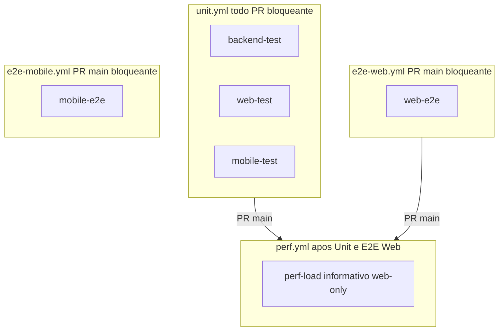
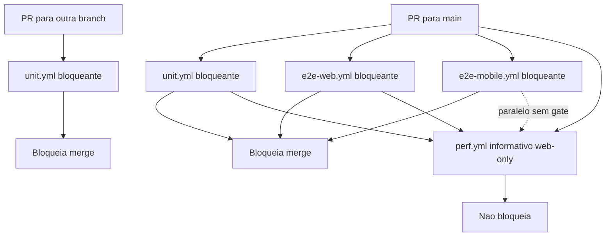

# 04 — Testes e CI monorepo

## Contexto

- **Plano 04** da sequência JAdmin — antecedentes: [01 JWT/Multitenancy](.cursor/plans/01_jwt_auth_multitenancy_99307074.plan.md) (backend), [02 Frontend React](.cursor/plans/02_frontend_react_jadmin_72bcb6f8.plan.md) (`web-client`), [03 Expo Mobile](.cursor/plans/03_expo_mobile_jadmin_5ae39932.plan.md) (`mobile-client`). **Continuação perf/CI:** [05 Perf após E2E Web](05_perf_após_e2e_web_29b4b2d0.plan.md).
- Backend em [`JAdmin/`](JAdmin/) com **scaffold** de teste (`Tests/*.csproj`) — **0** arquivos `*Tests.cs`; web e mobile com suítes Vitest/Jest **implementadas**; CI em [`.github/workflows/`](.github/workflows/).
- Web já dockerizado ([`web-client/Dockerfile`](web-client/Dockerfile) + nginx same-origin em [`docker-compose.yml`](docker-compose.yml)) — a esteira deve validar **build da imagem** e usar o stack Docker no E2E Playwright.
- Decisões confirmadas: … **quatro workflows** (`unit.yml`, `e2e-web.yml`, `e2e-mobile.yml`, `perf.yml`); `perf-load` = **carga web only** (k6 cookie jar + nginx, Playwright smoke, Lighthouse); gate **Unit + E2E Web** (mobile E2E não aguardado). Ver [plano 05 Perf CI](05_perf_após_e2e_web_29b4b2d0.plan.md).
- **`main` protegida:** alterações entram **somente via PR** (sem `push` direto). A CI não precisa de gatilhos `push` → `main` nem de revalidação pós-merge.
- **Decisões confirmadas:** `GET /health` + healthchecks; testes em `JAdmin/Tests/`; `perf.yml` gate **Unit + E2E Web** (mobile não aguardado); E2E 2FA TOTP fixo + `otplib`; [`.env.test`](.env.test); quatro workflows entregues (`unit.yml`, `e2e-web.yml`, `e2e-mobile.yml`, `perf.yml`) + [`JAdmin/Tests/load/`](JAdmin/Tests/load/) — ver [plano 05](05_perf_após_e2e_web_29b4b2d0.plan.md).

## Ordem de execução (To-dos)

Executar na sequência abaixo. Cada item corresponde a um To-do do frontmatter.

| # | To-do | Entregável principal |
|---|-------|---------------------|
| 1 | `backend-unit` | Scaffold `JAdmin.UnitTests` (.csproj + pacotes) |
| 2 | `backend-integration` | Scaffold `JAdmin.IntegrationTests` (.csproj + pacotes) |
| 3 | `backend-sln` | `JAdmin.slnx` + `public partial class Program` + `/health` |
| 4 | `web-unit-rtl` | Vitest + RTL — guards, AuthContext, LoginPage, componentes |
| 5 | `web-playwright` | `e2e/` + specs (incl. 2FA com TOTP fixo); **sem** workflow ainda |
| 6 | `mobile-jest` | Jest + RNTL — `renderWithProviders`, telas e fluxos auth |
| 7 | `mobile-maestro` | `.maestro/` flows + sec. 3 (E2E Maestro) |
| 8 | `ci-pipeline` | **`unit.yml` + `e2e-web.yml` + `e2e-mobile.yml` + `perf.yml`** + `/health` + `.env.test` + guia local (§5) |

> **Perf/carga (plano 05):** entregue — split E2E, [`JAdmin/Tests/load/`](JAdmin/Tests/load/), `perf.yml` web-only + `workflow_dispatch`.

> **Nota:** `unit.yml` em **todo** PR (**bloqueante**); `e2e-web.yml` + `e2e-mobile.yml` + `perf.yml` só em PR→`main`; `perf-load` aguarda **Unit + E2E Web** no mesmo SHA (**informativo**; mobile E2E em paralelo, sem gate). Ordem: `unit` ∥ `e2e-web` ∥ `e2e-mobile` ∥ `perf` (gate com poll) → `perf-load`.

## Índice

| # | Seção | Conteúdo |
|---|-------|----------|
| — | Contexto | Antecedentes, decisões CI |
| — | Ordem de execução | To-dos 1–8 (+ continuação plano 05) |
| — | Estado entregue | Inventário repo (contagens reais) |
| **1** | Backend — scaffold | `.csproj` entregue; `*Tests.cs` extensão futura |
| **2** | Web-client | Vitest 11 + Playwright 4 specs |
| **3** | Mobile-client | Jest 16 + Maestro 3 flows |
| **4** | Perf/carga | k6 web MVP, Lighthouse, smoke Playwright, `perf.yml` web-only |
| **5** | Esteira CI | 4 workflows: `unit`, `e2e-web`, `e2e-mobile`, `perf` |
| ↳ | §5 Guia execução local | Docker, backend, web, mobile, credenciais E2E |
| ↳ | §5 Branch protection | Required checks por tipo de PR |
| **6** | Ordem de implementação | Sequência 1–8 entregue (incl. perf plano 05) |
| **7** | Fora de escopo imediato | xUnit casos, k6, Detox, iOS CI |
| **8** | Lacunas e decisões | ESLint, Vitest isolate, mocks mobile |
| ↳ | §8 Riscos conhecidos | Maestro, Playwright, Lighthouse flaky |
| — | Resultado entregue | Tabela final por módulo |

**Planos relacionados:** [01 Backend](01_jwt_auth_multitenancy_99307074.plan.md) · [02 Web](02_frontend_react_jadmin_72bcb6f8.plan.md) · [03 Mobile](03_expo_mobile_jadmin_5ae39932.plan.md) · [05 Perf CI](05_perf_após_e2e_web_29b4b2d0.plan.md)

> **Navegação no Cursor:** links `#âncora` no preview costumam falhar. Use o painel **Outline** ou `Ctrl+F` pelo título da seção (ex.: `## 3. Mobile-client`, `Guia de execução local`).

## Estado entregue (referência ao repositório)

| Módulo | Testes / artefatos | CI |
|--------|-------------------|-----|
| [`JAdmin/`](JAdmin/) | Scaffold: `Tests/JAdmin.UnitTests/` + `IntegrationTests/` (só `.csproj`); **`Program` partial**; `GET /health`; Dockerfile com `curl` | `unit.yml` → `backend-test` (`dotnet test` — 0 casos) |
| [`web-client/`](web-client/) | **11** Vitest; **4** Playwright; `web-client/load/` | `unit.yml`; `e2e-web.yml` → `web-e2e` |
| [`mobile-client/`](mobile-client/) | **16** Jest; **3** Maestro; `app.config.js` | `unit.yml`; `e2e-mobile.yml` → `mobile-e2e` |
| Perf/carga | `web-client/load/` + [`JAdmin/Tests/load/`](JAdmin/Tests/load/) (k6 web, Lighthouse) | `perf.yml` → gate Unit+E2E Web → `perf-load` (web-only) |

Workflows: [`unit.yml`](.github/workflows/unit.yml), [`e2e-web.yml`](.github/workflows/e2e-web.yml) + [`e2e-mobile.yml`](.github/workflows/e2e-mobile.yml) (substituem `e2e.yml`), [`perf.yml`](.github/workflows/perf.yml). Env: [`.env.test`](.env.test).



---

## 1. Backend — scaffold de teste (MVP entregue)

> **Escopo do repo atual:** apenas projetos vazios + pré-requisitos CI. A árvore de `*Tests.cs` abaixo é **extensão futura** — não é necessária para reproduzir o monorepo como está.

### Entregue

```
JAdmin/
├── Tests/
│   ├── JAdmin.UnitTests/JAdmin.UnitTests.csproj    # xUnit, FluentAssertions, NSubstitute, EF InMemory
│   └── JAdmin.IntegrationTests/JAdmin.IntegrationTests.csproj  # WebApplicationFactory, Testcontainers
├── JAdmin.slnx                                     # inclui os dois projetos de teste
└── Program.cs                                      # MapGet /health + public partial class Program;
```

[`dotnet test`](JAdmin/JAdmin.slnx) no CI passa com **zero** testes até implementar os arquivos da extensão.

### Extensão futura — estrutura alvo (não versionada ainda)

```
JAdmin/Tests/
├── JAdmin.UnitTests/
│   ├── Validators/AuthValidatorsTests.cs
│   ├── Common/ResultExtensionsTests.cs
│   ├── Services/TokenServiceTests.cs
│   ├── Services/TwoFactorServiceTests.cs
│   ├── Services/AuthServiceTests.cs
│   ├── Services/UserRoleServiceTests.cs
│   ├── Services/TenantManagementServiceTests.cs
│   └── Multitenancy/MultitenancyMiddlewareTests.cs
└── JAdmin.IntegrationTests/
    ├── Fixtures/JAdminWebApplicationFactory.cs
    ├── Fixtures/IntegrationTestCollection.cs
    ├── Auth/LoginFlowTests.cs
    ├── Auth/RefreshLogoutTests.cs
    ├── Auth/TwoFactorFlowTests.cs
    ├── Users/UsersApiTests.cs
    └── Tenants/TenantsApiTests.cs
```

CI: `dotnet test JAdmin/JAdmin.slnx` (ou `working-directory: JAdmin`).

### Health endpoint (pré-requisito CI/E2E/perf)

Adicionar em [`JAdmin/Program.cs`](JAdmin/Program.cs) antes de `app.Run()`:

```csharp
app.MapGet("/health", () => Results.Ok(new { status = "healthy" }));
```

Atualizar [`docker-compose.yml`](docker-compose.yml):

| Serviço | Alteração |
|---------|-----------|
| `api` | `healthcheck`: `curl -f http://localhost:8080/health` |
| `web` | `depends_on.api.condition: service_healthy` |

**Imagem da API:** a imagem base [`mcr.microsoft.com/dotnet/aspnet`](JAdmin/Dockerfile) **não inclui** `curl` nem `wget`. O endpoint `/health` pode responder no host (`http://localhost:8080/health`) enquanto o healthcheck do Compose falha com `curl: not found`. Corrigir instalando `curl` na fase `final` do Dockerfile (como `root`, antes de `USER $APP_UID`):

```dockerfile
FROM base AS final
USER root
RUN apt-get update \
    && apt-get install -y --no-install-recommends curl \
    && rm -rf /var/lib/apt/lists/*
USER $APP_UID
```

Após alterar o Dockerfile: `docker compose up -d --build api` e confirmar `docker compose ps` → `api` **healthy** antes do `web` subir.

E2E/perf aguardam healthchecks formais — sem `sleep` arbitrário.

### Pacotes

**Unit:** `xunit`, `Microsoft.NET.Test.Sdk`, `FluentAssertions`, `NSubstitute`, `Microsoft.EntityFrameworkCore.InMemory` (só onde não depender de query filters PostgreSQL).

**Integration:** `Microsoft.AspNetCore.Mvc.Testing`, `Testcontainers.PostgreSql`, `Testcontainers.Redis`, `FluentAssertions`.

### Pré-requisito para `WebApplicationFactory`

[`JAdmin/Program.cs`](JAdmin/Program.cs) usa top-level statements — adicionar ao final:

```csharp
public partial class Program { }
```

### `JAdminWebApplicationFactory`

- Subir **PostgreSQL 18** e **Redis 8** via Testcontainers (espelha [`docker-compose.yml`](docker-compose.yml)).
- Sobrescrever `ConnectionStrings` e `Jwt:Secret` (32+ chars) via `ConfigureAppConfiguration`.
- `Seed__Enabled=true` com credenciais fixas de teste (`superadmin@localhost` / `SuperAdmin@123!`) para fluxos HTTP.
- `IAsyncLifetime`: start containers → migrate → seed → dispose.

### Cobertura unitária (prioridade)

| Alvo | Casos principais |
|------|------------------|
| [`Validators/AuthValidators.cs`](JAdmin/Validators/AuthValidators.cs) | login/register/tenant slug/TOTP/disable 2FA — happy + inválidos |
| [`Common/ResultExtensions.cs`](JAdmin/Common/ResultExtensions.cs) | mapeamento `ServiceResult` → status HTTP |
| [`Services/Impl/TokenService.cs`](JAdmin/Services/Impl/TokenService.cs) | claims `tenant_id`, roles no JWT |
| [`Services/Impl/TwoFactorService.cs`](JAdmin/Services/Impl/TwoFactorService.cs) | setup, enable/disable, TOTP válido/inválido |
| [`Services/Impl/AuthService.cs`](JAdmin/Services/Impl/AuthService.cs) | login (credenciais, tenant inativo, lockout, gate 2FA), register (Admin vs SuperAdmin), refresh, logout — mocks em `UserManager` / `IRefreshTokenService` |
| [`Services/Impl/UserRoleService.cs`](JAdmin/Services/Impl/UserRoleService.cs) | add/remove role, regras SuperAdmin, revogação refresh |
| [`Services/Impl/TenantManagementService.cs`](JAdmin/Services/Impl/TenantManagementService.cs) | CRUD, slug duplicado, proteção tenant sistema |
| [`Multitenancy/MultitenancyMiddleware.cs`](JAdmin/Multitenancy/MultitenancyMiddleware.cs) | 403 sem `tenant_id`; bypass SuperAdmin |

### Cobertura integração (HTTP real)

| Fluxo | Endpoints |
|-------|-----------|
| Login | `POST /api/auth/login` → `GET /api/auth/me` com Bearer |
| Refresh mobile | `POST /api/auth/refresh` body `{ refreshToken }` |
| Refresh web | cookie `refresh_token` |
| Logout | revoga refresh; próximo refresh 401 |
| 2FA | setup → enable → login exige TOTP → disable |
| Multitenancy | User sem tenant → 403 em rota protegida |
| Users | list/register/roles (Admin + SuperAdmin) |
| Tenants | CRUD SuperAdmin; tenant sistema imutável |

> **Extensão futura (§1):** ~80–100 casos backend quando os `*Tests.cs` forem implementados.

---

## 2. Web-client — expandir Vitest + RTL + Playwright

### Infra compartilhada

- [`web-client/src/test/renderWithProviders.tsx`](web-client/src/test/renderWithProviders.tsx): `QueryClientProvider`, `MemoryRouter`, `AuthContext` mockável, i18n.
- [`web-client/src/test/mockUserInfo.ts`](web-client/src/test/mockUserInfo.ts): factory de `UserInfoDto` para RTL — `tenantName` + `twoFactorEnabled` (não `tenantSlug`; slug só em `LoginRequest`).
- Script `test:coverage`: `vitest run --coverage` (já tem `@vitest/coverage-v8`); CI usa o mesmo script (`CI=true` no runner).
- **Vitest no CI:** `pool: 'forks'`, `maxWorkers: 1`, `fileParallelism: false`, **`isolate: true` (padrão)** em [`vite.config.ts`](web-client/vite.config.ts) — `isolate: false` poluía mocks de `@/api/auth` entre arquivos (`AuthContext` após `LoginPage`). [`AuthContext.test.tsx`](web-client/src/contexts/AuthContext.test.tsx) usa `vi.hoisted` para mocks estáveis. Workflow: `NODE_OPTIONS=--max-old-space-size=6144`.
- Thresholds iniciais **não bloqueantes** (report only); revisar após baseline. Saída em `web-client/coverage/` — ignorada pelo Git ([`.gitignore`](.gitignore)) e pelo ESLint ([`eslint.config.js`](web-client/eslint.config.js) `globalIgnores`).

### Unitários + RTL (entregue — 11 arquivos)

| Arquivo | Foco |
|---------|------|
| `api/client.test.ts` | Interceptor 401→refresh→retry; session expired |
| `lib/validators.test.ts` | Schemas zod (password, slug, TOTP, email) |
| `lib/auth.test.ts` | `sanitizeRedirect`; `BroadcastChannel` logout |
| `lib/query.test.ts` | `findUserInCache` |
| `lib/twoFactor.test.ts` | `toQrCodeDataUrl` |
| `routes/ProtectedRoute.test.tsx` | loading → redirect; autenticado renderiza children |
| `routes/RoleRoute.test.tsx` | role insuficiente → toast + redirect |
| `contexts/AuthContext.test.tsx` | boot, refresh 401, `vi.hoisted` mocks |
| `pages/LoginPage.test.tsx` | submit, 2FA condicional |
| `components/TwoFactorSetup.test.tsx` | QR/chave, input TOTP |
| `components/ConfirmDialog.test.tsx` | open/confirm/cancel |

**Não implementado no repo:** Vitest de `UsersListPage`, `TenantsListPage`, `ProfilePage` ou módulos `api/users.ts` / `api/tenants.ts` (fora do escopo MVP).

### E2E — Playwright

- Instalar `@playwright/test` em [`web-client/`](web-client/).
- **Local (dev):** `playwright.config.ts` com `webServer: npm run dev` e `baseURL: http://localhost:5173` (proxy Vite → API).
- **CI (dockerizado):** `baseURL: http://localhost:${WEB_PORT:-80}` — stack completo via `docker compose up -d db redis api web` (mesmo origin nginx → `/api`, cookies HttpOnly válidos). **Não** usar `vite preview` no E2E de CI.
- Fluxos em [`web-client/e2e/`](web-client/e2e/):
  - [`helpers/forms.ts`](web-client/e2e/helpers/forms.ts) — `pickSelectByLabel` / `pickSelectByIndex` via `[data-slot="select-trigger"]` (não `getByRole('combobox').first()` — input e-mail também expõe combobox no Chromium)
  - [`helpers/routes.ts`](web-client/e2e/helpers/routes.ts) — `guidPath()` para URLs de detalhe (evita falso positivo em `/users/register`, `/tenants/new`)
  - [`helpers/auth.ts`](web-client/e2e/helpers/auth.ts) — `loginAsSuperAdmin()` (detecta 2FA); `disableTwoFactorOnProfile()` via `goto('/profile')`
  - [`helpers/navigation.ts`](web-client/e2e/helpers/navigation.ts) — `clickNavLink()` escopo `getByRole('navigation')` (evita strict mode com quick links do dashboard)
  - [`helpers/reset-2fa.ts`](web-client/e2e/helpers/reset-2fa.ts) + [`global-setup.ts`](web-client/e2e/global-setup.ts) — reset SQL do superadmin no CI (retries / estado compartilhado)
  - `auth.spec.ts` — login SuperAdmin, dashboard visível, logout
  - `users.spec.ts` — registrar usuário; tenant **System** pré-selecionado + label visível em [`RegisterUserPage`](web-client/src/pages/users/RegisterUserPage.tsx) (Base UI não resolve nome do item quando `setValue` programático); e-mail E2E `*@localhost` exige [`emailSchema`](web-client/src/lib/validators.ts) (Zod `.email()` puro rejeita `@localhost` → submit bloqueado); pós-registro assert `getByRole('heading', /detalhe do usuário/i)` — [`UserDetailPage`](web-client/src/pages/users/UserDetailPage.tsx) expõe `<h1>` (não usar só `CardTitle`)
  - `tenants.spec.ts` — criar tenant + editar nome; assert `guidPath('tenants')` após create
  - `z-profile-2fa.spec.ts` — setup/enable 2FA (secret da API) + desativa ao final; prefixo `z-` para rodar por último
- `playwright.config.ts`: `fullyParallel: false`, `globalSetup`, `timeout: 60_000`

**E2E 2FA:** o spec usa secret gerado pelo endpoint de setup (UI) + [`otplib`](https://github.com/yeojz/otplib). Após enable, **desativa 2FA** no mesmo teste (`disableTwoFactorOnProfile`) para o superadmin voltar ao estado seed — specs `users`/`tenants` compartilham o mesmo DB no CI. `E2E_2FA_SECRET` em [`.env.test`](.env.test) fica disponível para `loginAsSuperAdmin` quando 2FA já estiver ativo (recovery). Requisitos de código web: [plano 02 — Playwright E2E](02_frontend_react_jadmin_72bcb6f8.plan.md).

Credenciais: variáveis `E2E_SUPERADMIN_EMAIL` / `E2E_SUPERADMIN_PASSWORD` alinhadas ao seed da API.

---

## 3. Mobile-client — expandir Jest + RNTL + Maestro

### Infra compartilhada

- [`mobile-client/src/test/createQueryClient.ts`](mobile-client/src/test/createQueryClient.ts): `QueryClient` com `gcTime: 0`; registry + `clearTestQueryClients()` (limpa query/mutation cache) no `afterEach` de [`jest.setup.ts`](mobile-client/jest.setup.ts).
- [`mobile-client/jest.act-environment.js`](mobile-client/jest.act-environment.js): `IS_REACT_ACT_ENVIRONMENT = true` em `setupFiles` (antes do React/test-renderer).
- [`mobile-client/jest.setup.ts`](mobile-client/jest.setup.ts): mocks de `react-native-reanimated`, `expo-secure-store`, `react-native-keyboard-controller`.
- [`mobile-client/src/test/mockUserInfo.ts`](mobile-client/src/test/mockUserInfo.ts): factory de `UserInfoDto` (sem `tenantSlug`; slug só em `LoginRequest`).
- [`mobile-client/src/test/mockUseAuth.ts`](mobile-client/src/test/mockUseAuth.ts): `mockUseAuthReturn()` com `boot: jest.fn<() => Promise<void>>()` — evita erros de `tsc --noEmit` em mocks de `useAuth`.
- [`mobile-client/src/test/renderWithProviders.tsx`](mobile-client/src/test/renderWithProviders.tsx): espelha árvore de [`App.tsx`](mobile-client/src/App.tsx) (sem duplicar lógica de negócio).
- Scripts: `test` → `jest --detectOpenHandles` (local e CI — sinaliza timers/listeners abertos após os testes); `typecheck`, `build:check` no mesmo [`package.json`](mobile-client/package.json).

### Unitários (novos)

| Arquivo | Foco |
|---------|------|
| `lib/query.test.ts` | `findUserInCache`, query keys; `createTestQueryClient()` + `clearTestQueryClients()` em `afterEach` (evita open handle do TanStack Query) |
| `lib/twoFactor.test.ts` | `toQrCodeDataUrl` |
| `lib/utils.test.ts` | `cn()` |
| `storage/tokenStorage.test.ts` | já existe |

### Integração RNTL

| Arquivo | Foco |
|---------|------|
| `contexts/AuthContext.test.tsx` | boot com tokens, refresh, `clearUser` |
| `components/AuthGate.test.tsx` | loading vs children |
| `screens/LoginScreen.submit.test.tsx` / `LoginScreen.2fa.test.tsx` | submit, 2FA condicional; `userEvent` (RNTL 14) + `waitFor` — evita warnings de `act()` |
| `components/ConfirmDialog.test.tsx` | confirm/cancel; `userEvent` entre interações assíncronas |
| `components/TwoFactorSetup.test.tsx` | botão `Linking.openURL`, footer |
| `navigation/SessionListener.test.tsx` | handlers `onSessionExpired` / `onForbidden` |
| `navigation/RootNavigator.test.tsx` | `authenticated` → Main; `unauthenticated` → Login |
| `navigation/RoleGuard.test.tsx` | redirect via `navigationRef` + `useIsFocused` |
| `api/client.test.ts` | refresh, session expired, 2FA no login |
| `lib/validators.test.ts` | schemas zod |
| `components/ConfirmDialog.disabled.test.tsx` | `confirmDisabled` |

**Não implementado no repo:** RNTL de `UsersListScreen`, `TenantsListScreen`, `ProfileScreen`, `DashboardContentScreen` ou `api/users.ts` / `api/tenants.ts`.

Estimativa entregue: **16** arquivos Jest (auth, nav, LoginScreen, libs, componentes compartilhados).

### E2E — Maestro (preferido sobre Detox para Expo SDK 54)

**Por que Maestro:** Detox exige `expo prebuild`, binário nativo e manutenção alta; Maestro funciona com YAML contra APK/dev build e integra melhor com Expo. **Detox** permanece alternativa documentada (fora do escopo inicial da esteira por custo de setup).

#### Pré-requisitos locais

- Stack Docker: `docker compose --env-file .env.test up -d db redis api`
- Emulador Android ou dispositivo com APK debug (`com.jadmin.mobile`)
- [Maestro CLI](https://maestro.mobile.dev/) instalado

#### Formato dos flows YAML

Cada arquivo declara `appId: com.jadmin.mobile` (APK debug de `expo prebuild`). **Não** usar `host.exp.exponent` salvo teste via Expo Go.

```yaml
appId: com.jadmin.mobile
---
- launchApp
```

**Não** adicionar `config.yaml` com nomes soltos (`login`, `drawer-navigation`) — Maestro trata como glob e falha com *Flow inclusion pattern(s) did not match*. Preferir paths explícitos no CLI ou `flows: ["*"]` se precisar de config.

Nos flows, usar **`label:`** para casar com `accessibilityLabel` do React Native (**não** a chave `accessibilityLabel` no YAML — Maestro rejeita). Detalhes dos labels no app: plano [03 — Acessibilidade para E2E](03_expo_mobile_jadmin_5ae39932.plan.md#acessibilidade-para-e2e-maestro).

| Maestro `label` / `text` | Uso no flow |
|--------------------------|-------------|
| `E-mail`, `Senha`, `Entrar` | Login — **`label`**, não texto visível do `Label` |
| *(omitir tenant)* | Slug default `system` no app; CI `SEED_TENANT_SLUG=system` |
| `Abrir menu` | **Assert pós-login** (header drawer); preferir a texto de boas-vindas |
| `Usuários`, `Tenants`, `Sair` | Itens do drawer |
| `Registrar usuário`, `Novo tenant` | **Assert pós-navegação** nas listas (título do stack header é unreliable) |

**Evitar:** `text: "Tenant"` (label visível é **"Tenant (slug)"**); assert `text: "Usuários"` / `"Tenants"` após drawer — usar `extendedWaitUntil` + `label: "Registrar usuário"` / `"Novo tenant"`. Timeout em `Abrir menu` → APK provavelmente com URL errada (`localhost` em vez de `10.0.2.2`).

#### Flows

| Arquivo | Descrição |
|---------|-----------|
| [`login.yaml`](mobile-client/.maestro/login.yaml) | Tenant slug, email, senha → dashboard |
| [`drawer-navigation.yaml`](mobile-client/.maestro/drawer-navigation.yaml) | Drawer → Users / Tenants; assert CTAs das listas |
| [`logout.yaml`](mobile-client/.maestro/logout.yaml) | Logout → tela login |

#### Execução local

APK no emulador Android deve embutir `EXPO_PUBLIC_API_URL=http://10.0.2.2:8080` (`app.config.js` → `extra.apiUrl` + `.env` no build). `10.0.2.2` = host da máquina vista pelo emulador — **não** usar `localhost` no APK para E2E.

```bash
cd mobile-client
npm ci
echo "EXPO_PUBLIC_API_URL=http://10.0.2.2:8080" > .env
EXPO_PUBLIC_API_URL=http://10.0.2.2:8080 npx expo prebuild --platform android --no-install
cd android && ./gradlew assembleDebug
adb install -r app/build/outputs/apk/debug/app-debug.apk
```

```bash
export SEED_TENANT_SLUG=system
export SEED_SUPERADMIN_EMAIL=superadmin@localhost
export SEED_SUPERADMIN_PASSWORD=SuperAdmin@123!
# da raiz do repo:
maestro test mobile-client/.maestro/login.yaml mobile-client/.maestro/drawer-navigation.yaml mobile-client/.maestro/logout.yaml
# ou de mobile-client/:
maestro test .maestro/login.yaml .maestro/drawer-navigation.yaml .maestro/logout.yaml
```

#### Job CI ([`e2e-mobile.yml`](.github/workflows/e2e-mobile.yml) `mobile-e2e`)

1. **Free disk space** — remover SDK pré-instalado (`/usr/local/lib/android`), .NET, imagens Docker, swapfile (`ubuntu-latest` ~14 GB; Gradle + emulador + Maestro estouram sem cleanup).
2. **Android SDK em user space** — `ANDROID_SDK_ROOT` / `ANDROID_HOME` = `~/.android/sdk` (gravável). Não confiar em `/usr/local/lib/android` após cleanup (`EACCES` com `setup-android`).
3. **`android-actions/setup-android@v4`** — compatível Node 24 (v3 deprecia Node 20).
4. **KVM** no `ubuntu-latest` (udev `99-kvm4all.rules`) — emulador `device offline` sem isso.
5. Compose `db` + `redis` + `api`; aguardar healthchecks antes do Maestro.
6. **Maestro CLI** — versão fixa (`MAESTRO_VERSION`), cache `~/.maestro`, instalação **antes** do Gradle (`write error (disk full?)` se instalar depois de `assembleDebug`).
7. Build debug APK (`expo prebuild` + `assembleDebug`) **antes** do emulador; `echo EXPO_PUBLIC_API_URL=http://10.0.2.2:8080 > .env` + [`app.config.js`](mobile-client/app.config.js).
8. Trim intermediates Gradle (manter só `app-debug.apk`) antes da imagem do emulador.
9. [`reactivecircus/android-emulator-runner`](https://github.com/ReactiveCircus/android-emulator-runner): API **30**, `google_apis`, `pixel_3a`, `emulator-boot-timeout: 1200` (**segundos** — **não** `emulator-boot-timeout-in-minutes`).
10. `adb install` + `maestro test mobile-client/.maestro/*.yaml` com **paths da raiz do repo**.
11. `MAESTRO_CLI_NO_ANALYTICS=true`; credenciais seed com aspas simples no script do emulador; login: `extendedWaitUntil` + `label: "Abrir menu"`.

**Script do emulador:** `android-emulator-runner` executa **cada linha do script em shell separado** — não colocar `cd mobile-client` numa linha e `maestro test .maestro/...` na seguinte (cwd volta à raiz → *Flow path does not exist*).

**Infra E2E (obrigatória):** `docker compose up -d --build db redis api` com `depends_on` + healthchecks — login/register usa PostgreSQL; refresh/logout usa Redis. `SEED_ENABLED=true`. **Não** sobe `web` (mobile usa Bearer, não cookies nginx).

#### Troubleshooting Maestro / CI

| Sintoma | Causa / fix |
|---------|-------------|
| Timeout em `Abrir menu` após login | APK sem `http://10.0.2.2:8080`; verificar `app.config.js` + `.env` no build; `curl http://127.0.0.1:8080/health` no runner |
| *Unrecognized field "accessibilityLabel"* | Usar `label:` no YAML |
| *Flow inclusion pattern(s) did not match* | Sem `config.yaml` com nomes soltos; paths explícitos no CLI |
| *Flow files must contain a config section…* | `appId: com.jadmin.mobile` acima de `---` em todo flow |
| Setup Android SDK `EACCES` em `/usr/local/lib/android` | `ANDROID_SDK_ROOT=~/.android/sdk` + `setup-android@v4` |
| `disk full` na instalação Maestro | Free-disk + Maestro **antes** do Gradle |
| `adb: device offline` / hang no boot | Re-run via `workflow_dispatch` — boot sensível à carga do runner |

---

## 4. Testes de performance e carga

> **Repo atual:** smoke Playwright em [`web-client/load/`](web-client/load/); scripts k6 + Lighthouse em [`JAdmin/Tests/load/`](JAdmin/Tests/load/); [`perf.yml`](.github/workflows/perf.yml) gate **Unit + E2E Web**, carga web-only; E2E split em [`e2e-web.yml`](.github/workflows/e2e-web.yml) + [`e2e-mobile.yml`](.github/workflows/e2e-mobile.yml). Detalhe de implementação: [plano 05](05_perf_após_e2e_web_29b4b2d0.plan.md).

### Entregue

```
web-client/load/
├── playwright.load.config.ts   # workers: 3, baseURL nginx
└── under-load.spec.ts          # login + listar users (smoke sob carga; clickNavLink como e2e)

JAdmin/Tests/load/
├── README.md
├── k6/
│   ├── lib/                    # config, auth (CookieJar), helpers
│   └── web/session-mixed.js    # ~10 VUs, 1m; login → users + me
└── lighthouse/lighthouserc.json  # performance ≥ 0.7 (warn)
```

Scripts npm: `perf:under-load` (Playwright); `perf:lighthouse` → `JAdmin/Tests/load/lighthouse/lighthouserc.json`.

**Escopo CI `perf-load` (web-only):** apenas `k6/web/*` + `lib/` via nginx. **Fora do CI:** `k6/scenarios/mixed.js`, Bearer, `:8080` direta.

### Extensão futura — k6 API/mobile (não versionados)

> **Nota CI:** no job `perf-load` web-only, roda **somente** `k6/web/session-mixed.js` (+ `lib/`). Scripts API/mobile abaixo são referência para execução local futura — **não** entram no workflow CI.

### Por que k6 e não milhares de Playwright

| Abordagem | Problema | Decisão |
|-----------|----------|---------|
| 1000+ browsers Playwright em paralelo | ~1–2 GB RAM por instância Chromium, flaky, minutos de startup, inviável no `ubuntu-latest` | **Não adotar** |
| k6 com 50–200 VUs HTTP | Mesmos endpoints que o SPA chama; cookie jar espelha login web; Bearer espelha mobile | **Adotar** |
| 2–5 workers Playwright durante k6 | Valida que a UI continua utilizável sob carga (não mede throughput) | **Smoke opcional** no `perf-load` |

### Ferramentas

| Camada | Ferramenta | Motivo |
|--------|------------|--------|
| Web — carga HTTP | k6 + **cookie jar** via nginx | `K6_WEB_BASE_URL=http://localhost` — login, cookies HttpOnly, `/api/*` same-origin |
| Web — performance | [Lighthouse CI](https://github.com/GoogleChrome/lighthouse-ci) | LCP, TTI, bundle — smoke no `dist` servido pelo nginx |
| Web — resiliência UI sob carga | Playwright (`load/` smoke) | 2–5 workers, **não** milhares; roda em paralelo com k6 no mesmo job |
| API/mobile (local futuro) | k6 Bearer em `:8080` | **Fora do CI web-only** — extensão opcional |

Alternativa .NET: NBomber — **não** adotar no MVP para evitar segunda stack; k6 cobre web (cookies) e mobile (Bearer) na mesma suíte.

### Estrutura

```
JAdmin/Tests/load/
    ├── README.md
    └── k6/
        ├── lib/
        │   ├── config.js         # BASE_URL, credenciais seed, VUs/duration
        │   ├── auth.js           # login web (cookies) e mobile (Bearer)
        │   └── helpers.js        # checks, headers, cookie jar
        ├── auth-login.js         # rampa: POST /api/auth/login
        ├── auth-refresh.js       # concorrência refresh (web cookie + mobile body)
        ├── users-list.js         # GET /api/users paginado (token Admin)
        ├── tenants-list.js       # GET /api/tenants (SuperAdmin)
        ├── web/                  # carga simulando sessões browser (via nginx)
        │   ├── session-login.js      # VUs: GET /login → POST /api/auth/login → cookie jar
        │   ├── session-browse.js     # VUs autenticados: /api/users, /api/auth/me, paginação
        │   └── session-mixed.js      # mix navegação web (40% list users, 30% login, 20% refresh, 10% me)
        └── scenarios/
            └── mixed.js          # mix API direta (mobile + admin)
```

[`web-client/load/`](web-client/load/) — smoke Playwright sob carga (poucos workers):

```
web-client/
└── load/
    ├── playwright.load.config.ts   # workers: 3, timeout alto, baseURL nginx
    └── under-load.spec.ts          # login + users; clickNavLink (sidebar, como e2e)
```

### Cenários e métricas

| Script | Carga | O que mede |
|--------|-------|------------|
| `auth-login.js` | 10→50 VUs, 2 min | Latência login, taxa 401/429, lockout sob falhas repetidas |
| `auth-refresh.js` | 20 VUs paralelos | Rotação refresh Redis, fila 401 no client |
| `users-list.js` | 30 VUs sustentados | EF query filters + paginação `PagedResult` |
| `tenants-list.js` | 10 VUs | SuperAdmin cross-tenant |
| `mixed.js` | 50 VUs, 5 min | Comportamento combinado próximo de uso real |
| `web/session-login.js` | 20→100 VUs, 3 min | Ramp de logins web via nginx (cookie jar) — **substituto** de N browsers |
| `web/session-browse.js` | 50 VUs sustentados | Sessões autenticadas repetindo padrão SPA (list + me) |
| `web/session-mixed.js` | 100 VUs, 5 min | Mix completo “usuário web” (login + navegação + refresh) |

### k6 — sessão web (simula browser sem Chromium)

Implementar em [`JAdmin/Tests/load/k6/lib/auth.js`](JAdmin/Tests/load/k6/lib/auth.js):

```javascript
import http from 'k6/http';
import { check } from 'k6';

const jar = new http.CookieJar();

export function loginWeb(baseUrl, tenantSlug, email, password) {
  const res = http.post(
    `${baseUrl}/api/auth/login`,
    JSON.stringify({ email, password, tenantSlug }),
    {
      jar,
      headers: { 'Content-Type': 'application/json' },
      tags: { name: 'login' },
    },
  );
  check(res, { 'login 200': (r) => r.status === 200 });
  return jar;
}

export function getUsersWeb(baseUrl, jar) {
  return http.get(`${baseUrl}/api/users?page=1&pageSize=20`, { jar, tags: { name: 'users' } });
}
```

- `K6_BASE_URL=http://localhost` (porta 80, serviço `web` no compose) — **obrigatório** nos scripts `web/*`.
- Credenciais e `tenantSlug` iguais ao [`.env.test`](.env.test) (`SEED_*`).
- Thresholds nos scripts `web/session-mixed.js`: `p(95)<1200` (nginx + API sob carga); ajustar após baseline.

### Playwright sob carga (smoke, não massivo)

**Objetivo:** confirmar que 2–5 usuários reais no browser ainda conseguem login e listar dados enquanto k6 dispara 50–100 VUs — **não** medir capacidade com Playwright.

| Item | Valor |
|------|-------|
| Workers | `3` (`playwright.load.config.ts`) |
| Spec | `under-load.spec.ts` — login SuperAdmin, `clickNavLink('Usuários')`, assert heading users |
| Orquestração local | terminal 1: `k6 run JAdmin/Tests/load/k6/web/session-mixed.js`; terminal 2: `npm run perf:under-load` |
| CI (`perf-load`) | background: `k6 run web/session-mixed.js`; foreground: `npx playwright test -c load/playwright.load.config.ts` |

Script em [`web-client/package.json`](web-client/package.json): `"perf:under-load": "playwright test -c load/playwright.load.config.ts"`.

Falha do smoke Playwright **não** bloqueia merge (mesmo job informativo); reportar como artefato separado (`playwright-load-report`).

**Thresholds iniciais** (ajustar após baseline em runner CI):

```javascript
export const options = {
  thresholds: {
    http_req_failed: ['rate<0.01'],           // < 1% erros
    http_req_duration: ['p(95)<800'],         // p95 < 800 ms (API local/docker)
    'http_req_duration{name:login}': ['p(95)<500'],
  },
}
```

Thresholds violados marcam o job `perf-load` como falho no GitHub (alerta + artefato), mas **não** bloqueiam merge — job fora dos required checks.

### Performance web (Lighthouse)

- Rodar contra `http://localhost` com stack `docker compose up web api db redis` (página login + dashboard autenticado via script de storage state ou rota pública).
- Config [`JAdmin/Tests/load/lighthouse/lighthouserc.json`](JAdmin/Tests/load/lighthouse/lighthouserc.json):
  - `performance` score ≥ 0.7 (baseline; subir depois)
  - assertions em `first-contentful-paint`, `interactive` — não bloquear MVP se flaky; report como artefato
- Script raiz: `npm run perf:lighthouse` em `web-client/` ou comando no workflow `perf-load`.

### Execução local

```bash
# Stack (carregar .env.test)
docker compose --env-file .env.test up -d db redis api web
set -a && source .env.test && set +a

# Cenário único
k6 run JAdmin/Tests/load/k6/auth-login.js

# Mix completo (API direta)
k6 run JAdmin/Tests/load/k6/scenarios/mixed.js

# Carga simulando browser (nginx + cookies)
k6 run JAdmin/Tests/load/k6/web/session-mixed.js

# Smoke UI sob carga (outro terminal, com k6 rodando)
cd web-client && npm run perf:under-load
```

Para same-origin web (cookies): `K6_BASE_URL=http://localhost` com nginx (`web` no compose) nos scripts que usam `credentials`.

### CI — job `perf-load` (web-only)

Arquivo: [`.github/workflows/perf.yml`](.github/workflows/perf.yml) — dispara em **`pull_request` → `main`** (check visível no PR); job `verify-unit-and-web-e2e` faz poll na API (`unit.yml`, `e2e-web.yml`) até ambos = `success` no `head_sha` (**E2E Mobile** não entra no gate).

| Gatilho | Quando | Bloqueia merge? |
|---------|--------|-----------------|
| `pull_request` → `main` | Paralelo a Unit/E2E Web; gate com poll até os dois `success` no mesmo SHA | **Não** |
| `workflow_dispatch` | Debug manual — `perf-load` sem gate | **Não** |

**Sequência em PR→`main`:** `unit.yml`, `e2e-web.yml`, `e2e-mobile.yml` e `perf.yml` disparam juntos. `verify-unit-and-web-e2e` aguarda Unit **e** E2E Web; só então roda `perf-load`. Mobile E2E corre em paralelo sem bloquear perf.

| Passo | Ação |
|-------|------|
| 1 | `docker compose up -d --build db redis api web` + healthchecks |
| 2 | `SEED_ENABLED=true` |
| 3 | Instalar k6 (`grafana/setup-k6-action`) |
| 4 | `k6 run` apenas `web/session-mixed.js` — **sem** `scenarios/mixed.js` |
| 5 | Playwright smoke `under-load.spec.ts` (3 workers) durante k6 em background — **sem** `\|\| true` |
| 6 | Lighthouse CI — `lighthouserc.json`; step com `continue-on-error: true` |
| 7 | Upload artefatos (`k6-summary`, Lighthouse HTML, `playwright-load-report`) |
| 8 | `docker compose down -v` |

Detalhes YAML: [plano 05](05_perf_após_e2e_web_29b4b2d0.plan.md).

### Mobile e carga

- Cenário `auth-refresh.js` inclui variante **Bearer** (`Authorization` + body refresh) igual [`mobile-client/src/api/auth.ts`](mobile-client/src/api/auth.ts).
- Não simular milhares de apps Expo — a API é o alvo comum; paralelismo mobile = VUs k6 Bearer, não dispositivos.

Estimativa entregue: smoke Playwright load + k6 web MVP + Lighthouse + `perf.yml` web-only (gate Unit+E2E Web via poll, `workflow_dispatch` debug).

---

## 5. Esteira CI — GitHub Actions

### Por que quatro workflows (e não um `ci.yml` único)

| Benefício | Detalhe |
|-----------|---------|
| **Feedback rápido em PR** | `unit.yml` termina em ~5–12 min; dev não espera Playwright, emulador Android nem k6 |
| **Custo e flakiness isolados** | `perf-load` falha sem bloquear merge (não é required check) |
| **Gatilhos por criticidade** | `unit` em todo PR (bloqueante); E2E Web + E2E Mobile só PR→`main` (bloqueantes); `perf-load` **após** Unit+E2E Web (informativo) |
| **Ordem em PR→`main`** | `unit` ∥ `e2e-web` ∥ `e2e-mobile` ∥ `perf` — gate poll Unit+E2E Web no mesmo `head_sha` |
| **paths-filter por camada** | **Fora do MVP** — todos os jobs de `unit`/`e2e` rodam sempre (decisão confirmada) |
| **Permissões futuras** | Perf/E2E podem usar runners maiores ou secrets distintos |

**Trade-off aceito:** `needs:` **não cruza workflows** — jobs em workflows distintos não encadeiam nativamente. Mitigações:

1. **`e2e-web.yml` / `e2e-mobile.yml` em PR→`main`:** E2E roda **antes do merge** e é **required check** junto com `unit`.
2. **`perf.yml` via `pull_request` → `main`:** dispara com Unit/E2E Web no mesmo PR; `verify-unit-and-web-e2e` faz poll na API (`unit.yml` + `e2e-web.yml`) no `head_sha` — **perf-load só após ambos `success`** (mobile não aguardado).
3. **Branch protection:** em **todo** PR, required = 3 jobs de `unit.yml`. Em PR→`main`, required adicional = `web-e2e`, `mobile-e2e`; **excluir** `perf-load`.

**Nomenclatura `unit.yml`:** inclui testes **rápidos** — não só xUnit/Vitest puros, mas também `JAdmin.IntegrationTests` (Testcontainers), RTL/RNTL e `docker build`. O critério é **sem browser/emulador/k6**, não “apenas unitários estritos”.

### Política de checks bloqueantes (branch protection)

Configurar em **GitHub → Settings → Branches → Branch protection rules**.

| Destino do PR / evento | Workflows que rodam | Required checks (bloqueiam merge) |
|------------------------|---------------------|-------------------------------------|
| **Qualquer PR** | `unit.yml` | `backend-test`, `web-test`, `mobile-test` — **sempre bloqueantes** |
| **PR → `main`** | `unit.yml` ∥ `e2e-web.yml` ∥ `e2e-mobile.yml` ∥ `perf.yml` | + `web-e2e`, `mobile-e2e` bloqueantes; `perf-load` informativo (gate poll Unit+E2E Web) |
| **PR → outra branch** | `unit.yml` apenas | `e2e-*` e `perf` **não** disparam |

**`unit.yml`:** dispara em `pull_request` com **qualquer** branch de destino; os 3 jobs devem constar como required check em **todas** as regras de branch protection (incl. `main` e `feature/*`).

**`perf-load`:** dispara **após** Unit+E2E Web com sucesso; sempre **informativo** — artefatos k6/Lighthouse; **nunca** required check.



### Arquivos de workflow

| Arquivo | Jobs | Gatilhos |
|---------|------|----------|
| [`.github/workflows/unit.yml`](.github/workflows/unit.yml) | `backend-test`, `web-test`, `mobile-test` | `pull_request` (todas as bases) |
| [`.github/workflows/e2e-web.yml`](.github/workflows/e2e-web.yml) | `web-e2e` | `pull_request` → `main`, `workflow_dispatch` |
| [`.github/workflows/e2e-mobile.yml`](.github/workflows/e2e-mobile.yml) | `mobile-e2e` | `pull_request` → `main`, `workflow_dispatch` |
| [`.github/workflows/perf.yml`](.github/workflows/perf.yml) | `verify-unit-and-web-e2e`, `perf-load` | `pull_request` → `main`; `workflow_dispatch` (debug) — **não bloqueante** |

**`name` fixo nos workflows:** `unit.yml` → `name: Unit`; `e2e-web.yml` → `name: E2E Web`; `e2e-mobile.yml` → `name: E2E Mobile`; `perf.yml` → `name: Performance`.

#### `unit.yml`

```yaml
name: Unit

on:
  pull_request:   # qualquer branch de destino (main via PR apenas)

jobs:
  backend-test:   # dotnet test + docker build api
  web-test:       # lint + vitest + build + docker build web
  mobile-test:    # jest + typecheck + expo export
```

#### `e2e-web.yml` / `e2e-mobile.yml`

```yaml
# e2e-web.yml
name: E2E Web
on:
  pull_request:
    branches: [main]
  workflow_dispatch:
jobs:
  web-e2e:        # compose db+redis+api+web + Playwright

# e2e-mobile.yml
name: E2E Mobile
on:
  pull_request:
    branches: [main]
  workflow_dispatch:
jobs:
  mobile-e2e:     # compose db+redis+api + emulator + Maestro
```

#### `perf.yml`

```yaml
name: Performance

on:
  pull_request:
    branches: [main]
  workflow_dispatch:   # debug: perf-load sem gate Unit+E2E Web

concurrency:
  group: perf-${{ github.event.pull_request.head.sha || github.sha }}
  cancel-in-progress: true

permissions:
  actions: read
  contents: read

jobs:
  verify-unit-and-web-e2e:
    if: github.event_name == 'pull_request'
    runs-on: ubuntu-latest
    outputs:
      should_run: ${{ steps.check.outputs.should_run }}
      head_sha: ${{ github.event.pull_request.head.sha }}
    steps:
      - id: check
        uses: actions/github-script@v7
        # Poll unit.yml + e2e-web.yml no head_sha até ambos success (timeout 90 min)

  perf-load:
    needs: verify-unit-and-web-e2e
    if: workflow_dispatch OU verify should_run==true
    # checkout ref: pull_request.head.sha ou github.sha (dispatch)
```

### Detalhes por job

| Job | Runner | Passos chave |
|-----|--------|--------------|
| `backend-test` | `ubuntu-latest` | `setup-dotnet` 10.x → `dotnet test JAdmin/JAdmin.slnx` (unit + integration; Docker para Testcontainers) → **`docker build -f JAdmin/Dockerfile -t jadmin-api:ci JAdmin`** |
| `web-test` | `ubuntu-latest` | Node 22, `working-directory: web-client`, `npm ci`, `npm run lint`, **`npm run test:coverage`** (`pool: forks`, `isolate: true`, `NODE_OPTIONS=--max-old-space-size=6144`), `npm run build` → **`docker build -f Dockerfile --build-arg VITE_API_URL= -t jadmin-web:ci .`** |
| `mobile-test` | `ubuntu-latest` | Node 22, `working-directory: mobile-client`, `npm ci`, `npm run test`, `npm run typecheck`, `npm run build:check` (scripts em [`package.json`](mobile-client/package.json)) |
| `web-e2e` | `ubuntu-latest` | `SEED_ENABLED=true` → `docker compose up -d --build db redis api web` → Playwright → `docker compose down -v` (**workflow `e2e-web.yml`**) |
| `mobile-e2e` | `ubuntu-latest` | KVM udev → `docker compose up db redis api` → build APK (`setup-android` + Gradle) → emulator API 30 + Maestro → `docker compose down -v` |
| `perf-load` | `ubuntu-latest` | k6 `web/session-mixed.js` + smoke Playwright + Lighthouse — ver §4 e [plano 05](05_perf_após_e2e_web_29b4b2d0.plan.md) |

### Docker nos jobs de teste (backend + web)

**Princípio:** `docker build` no **mesmo job** que os testes do módulo — sem job `web-docker-build` separado. Garante que código que passa nos testes também gera imagem publicável.

#### `backend-test` — API

| Passo | Comando / artefato |
|-------|-------------------|
| Testes | `dotnet test JAdmin/JAdmin.slnx` (Testcontainers usa Docker do runner) |
| Imagem | [`JAdmin/Dockerfile`](JAdmin/Dockerfile) → `docker build -t jadmin-api:ci JAdmin` |
| Ordem | testes **antes** do build da imagem (falha rápida em lógica) |

#### `web-test` — SPA nginx

Espelha [Integração Docker / deploy](.cursor/plans/02_frontend_react_jadmin_72bcb6f8.plan.md) do plano 02:

| Passo | Comando / artefato |
|-------|-------------------|
| Testes | `npm run lint`, **`npm run test:coverage`**, `npm run build` (`tsc -b` inclui `*.test.tsx` — mocks via [`mockUserInfo`](web-client/src/test/mockUserInfo.ts)) |
| Imagem | [`web-client/Dockerfile`](web-client/Dockerfile) com `VITE_API_URL=` (same-origin) |
| Artefatos auxiliares | [`web-client/nginx.conf`](web-client/nginx.conf), [`docker-compose.yml`](docker-compose.yml) serviço `web` |

Ordem no job: lint → vitest → `npm run build` → `docker build` (o Dockerfile repete `npm ci`+build — valida reprodutibilidade do build containerizado).

#### `mobile-test` — bundle Expo (sem Docker)

Mobile **não** tem `Dockerfile` no MVP; o “build check” equivale ao `npm run build` do web:

| Passo | Comando | O que valida |
|-------|---------|--------------|
| Testes | `npm run test` | Jest + RNTL; `--detectOpenHandles` no script |
| Tipos | `npm run typecheck` | `tsc --noEmit` |
| Bundle | `npm run build:check` | `expo export` → `.expo-export-ci/` (descartável) |

O `assembleDebug` / Gradle fica no **`mobile-e2e`** (Maestro precisa do APK). Separar evita duplicar o build nativo pesado em todo PR.

**Job `web-e2e`** usa o stack dockerizado completo (`db` + `redis` + `api` + `web`), não `npm run dev`:
- Playwright aponta para `http://localhost` (porta 80 do serviço `web`).
- Login E2E valida cookies + proxy nginx — cenário real de deploy.
- `docker compose down -v` no `if: always()` do job.

**Job `mobile-e2e`** usa **`db` + `redis` + `api`** (sem `web`):

| Serviço | Por quê |
|---------|---------|
| `db` (Postgres 18) | EF Core migrations, Identity, tenants, usuários do login Maestro |
| `redis` | Refresh tokens opacos — login/refresh/logout falham sem Redis |
| `api` | Endpoints `/api/auth/*`, users, tenants consumidos pelo app mobile |

Mesmas variáveis de seed/JWT do `web-e2e`; diferença é só a ausência do nginx (`web`) e a URL da API apontando para `10.0.2.2:8080` no build do APK.

### Otimizações

- **`paths-filter`:** fora do MVP (decisão) — evita conflito com required checks em jobs skipped.
- **`unit.yml`:** todo `pull_request`; **sempre** bloqueante; **sem** `concurrency` no MVP.
- **PR → `main`:** `unit` + `e2e-web` + `e2e-mobile` obrigatórios (paralelos); `perf-load` após Unit+E2E Web com sucesso.
- **PR → outra branch:** só `unit` obrigatório; `e2e-*` e `perf` não disparam.
- **Forks:** mesmos workflows que PRs internos (decisão); secrets de repo devem cobrir `JWT_SECRET` etc.
- **`workflow_dispatch` em `e2e-web.yml` / `e2e-mobile.yml`:** mantido para debug manual e re-run após review (decisão).
- Cache: `actions/setup-node` com `cache: npm`; `actions/cache` para Gradle no `e2e-mobile.yml`.

### Dockerfile backend

O `docker build` em `backend-test` **substitui** um job separado de build de imagem. Opcionalmente, espelhar `dotnet test` no [`JAdmin/Dockerfile`](JAdmin/Dockerfile) como stage de teste — reforço local, não obrigatório se CI já roda testes antes do build.

### Variáveis de ambiente — [`.env.test`](.env.test) (decisão)

Arquivo na **raiz do repo** (commitado; sem secrets reais de produção). Usado por `docker compose --env-file .env.test`, k6, Playwright e Maestro local/CI.

| Chave | Exemplo | Consumidores |
|-------|---------|----------------|
| `JWT_SECRET` | `super-secret-key-min-32-chars-for-hs256` | compose, Testcontainers |
| `SEED_ENABLED` | `true` | E2E, perf |
| `SEED_TENANT_SLUG` | `system` | k6, E2E |
| `SEED_SUPERADMIN_EMAIL` | `superadmin@localhost` | Playwright, Maestro, k6 |
| `SEED_SUPERADMIN_PASSWORD` | `SuperAdmin@123!` | idem |
| `E2E_2FA_SECRET` | `JBSWY3DPEHPK3PXP` | recovery em `loginAsSuperAdmin` se 2FA ainda ativo |
| `K6_BASE_URL` | `http://localhost:8080` ou `http://localhost` | k6 API vs web/nginx |
| `PLAYWRIGHT_BASE_URL` | `http://localhost` | web-e2e, perf smoke |
| `EXPO_PUBLIC_API_URL` | `http://10.0.2.2:8080` | mobile-e2e APK |

Espelhar chaves em [`.env.example`](.env.example) com comentário “copiar para `.env.test`”. Workflows CI: `docker compose --env-file .env.test` e `env` no job.

### Guia de execução local (monorepo)

`main` aceita alterações **somente via PR**. Configure branch protection conforme [Política de checks bloqueantes](#política-de-checks-bloqueantes-branch-protection).

#### Visão geral dos workflows

| Workflow | Trigger | Bloqueante? |
|----------|---------|-------------|
| `unit.yml` (`Unit`) | Todo PR | Sim — `backend-test`, `web-test`, `mobile-test` |
| `e2e-web.yml` (`E2E Web`) | PR → `main`, `workflow_dispatch` | Sim — `web-e2e` |
| `e2e-mobile.yml` (`E2E Mobile`) | PR → `main`, `workflow_dispatch` | Sim — `mobile-e2e` |
| `perf.yml` (`Performance`) | `pull_request` → `main` (gate poll); `workflow_dispatch` (debug) | Não — informativo (web-only) |

#### Setup local

Copiar [`.env.test`](.env.test) (commitado; sem secrets de produção):

```bash
docker compose --env-file .env.test up -d db redis api web
```

#### Backend

```bash
cd JAdmin
dotnet test JAdmin.slnx
```

Testes de integração usam Testcontainers (Docker obrigatório).

#### Web-client

Comandos, Vitest, Playwright e requisitos de código E2E: [plano 02 — Testes (Vitest + Playwright)](02_frontend_react_jadmin_72bcb6f8.plan.md).

#### Mobile-client

Comandos, Jest/RNTL, typecheck e Maestro local: [plano 03 — Testes (16C)](03_expo_mobile_jadmin_5ae39932.plan.md). Labels E2E: [plano 03 — Acessibilidade para E2E](03_expo_mobile_jadmin_5ae39932.plan.md#acessibilidade-para-e2e-maestro).

#### Performance / carga

Ver §4 e [`JAdmin/Tests/load/README.md`](JAdmin/Tests/load/README.md); detalhe em [plano 05](05_perf_após_e2e_web_29b4b2d0.plan.md).

#### Credenciais E2E (referência rápida)

| Variável | Default |
|----------|---------|
| `SEED_SUPERADMIN_EMAIL` | `superadmin@localhost` |
| `SEED_SUPERADMIN_PASSWORD` | `SuperAdmin@123!` |
| `SEED_TENANT_SLUG` | `system` |
| `E2E_2FA_SECRET` | `JBSWY3DPEHPK3PXP` (recovery login se 2FA ainda ativo; spec profile usa secret gerado pela API) |

### Variáveis adicionais CI

| Var | Uso |
|-----|-----|
| `VITE_API_URL` | vazio no `docker build` web (same-origin) |
| `K6_VUS` / `K6_DURATION` | override opcional no `workflow_dispatch` futuro |

---

## 6. Ordem de implementação

1. **Backend scaffold** — `.csproj` Unit + Integration; `partial class Program`; `/health` + healthchecks compose
2. **Web RTL + Vitest** — 11 arquivos (guards, AuthContext, LoginPage, libs, componentes)
3. **Mobile RNTL + Jest** — 16 arquivos (auth, nav, LoginScreen, libs)
4. **Web Playwright** — 4 specs E2E + helpers + `global-setup`
5. **Mobile Maestro** — 3 flows YAML + `app.config.js` + labels a11y
6. **CI** — `unit.yml` + `e2e-web.yml` + `e2e-mobile.yml` + `perf.yml` + [`.env.test`](.env.test) + guia local (§5)
7. **Perf/carga** — [plano 05](05_perf_após_e2e_web_29b4b2d0.plan.md) (k6 web, Lighthouse, gate Unit+E2E Web)

---

## 7. Fora de escopo imediato

- **Casos xUnit / Testcontainers** (`*Tests.cs` em `JAdmin/Tests/`) — scaffold entregue; implementação na extensão §1
- **k6 API/mobile scripts** (`auth-login.js`, `scenarios/mixed.js`, etc.) — extensão local futura; CI usa só `k6/web/session-mixed.js`
- Detox (alternativa documentada na sec. 3 — Maestro é o default)
- E2E iOS no CI (custo macOS runner — rodar localmente)
- [`dorny/paths-filter`](https://github.com/dorny/paths-filter) (otimização pós-MVP)
- `concurrency: cancel-in-progress` nos workflows (pós-MVP)
- k6 Cloud / Grafana Cloud provisioning
- `perf-load` em `schedule` / `push` (além do `workflow_dispatch` debug já entregue)
- Threshold de cobertura bloqueante no CI
- Atualizar planos 01/02/03 (a menos que solicitado)

---

## 8. Lacunas e decisões

| Lacuna | Decisão confirmada |
|--------|-------------------|
| API sem `/health` | `MapGet("/health")` + healthcheck `api` + `web` `depends_on` healthy |
| Healthcheck `api` unhealthy com `/health` OK no browser | Imagem `aspnet` sem `curl` — instalar no [`JAdmin/Dockerfile`](JAdmin/Dockerfile); validar com `docker inspect` → log sem `curl: not found` |
| Ordem perf vs unit/e2e | `perf.yml` com `pull_request` → `main`; gate `verify-unit-and-web-e2e` faz poll em `unit.yml` + `e2e-web.yml` no `head_sha` |
| Solution vs `Tests/` | Projetos em **`JAdmin/Tests/`**; `JAdmin.slnx` atualizado |
| E2E 2FA flaky | Secret TOTP fixo em `.env.test` + **otplib** no spec |
| paths-filter vs branch protection | **Sem paths-filter** no MVP |
| Env vars duplicadas | **`.env.test`** na raiz para compose, k6, E2E |
| To-do `ci-pipeline` | Quatro workflows + load scripts entregues ([plano 05](05_perf_após_e2e_web_29b4b2d0.plan.md)) |
| Documentação | Este plano (§1–§5); web → [plano 02](02_frontend_react_jadmin_72bcb6f8.plan.md); mobile → [plano 03](03_expo_mobile_jadmin_5ae39932.plan.md); perf/CI → [plano 05](05_perf_após_e2e_web_29b4b2d0.plan.md) |
| Cobertura CI | `npm run test:coverage` (web), `npm run test` (mobile — Jest sem `--coverage` no script), `XPlat Code Coverage` (backend); pastas ignoradas no [`.gitignore`](.gitignore) (`web-client/coverage/`, `mobile-client/coverage/`, `**/TestResults/`); **sem** `upload-artifact` em [`unit.yml`](.github/workflows/unit.yml); não bloqueia merge |
| Concorrência de runs | **Sem** `concurrency` no MVP |
| PRs de fork | **Mesmos workflows** que PRs internos |
| Debug E2E | Manter **`workflow_dispatch`** em `e2e-web.yml` / `e2e-mobile.yml` |
| ESLint `web-test` (React 19) | [`eslint.config.js`](web-client/eslint.config.js): `globalIgnores` inclui `coverage/` (artefato Vitest local/CI); override em `src/components/ui/**` (`react-refresh/only-export-components` off — shadcn inalterado); `useAuthContext` em [`hooks/useAuth.ts`](web-client/src/hooks/useAuth.ts); bootstrap em [`lib/auth-session.ts`](web-client/src/lib/auth-session.ts); formulários com `Controller` (não `form.watch()`) |
| `tsc -b` no `web-test` | Mocks RTL via [`mockUserInfo`](web-client/src/test/mockUserInfo.ts); `UserInfoDto` sem `tenantSlug`; `ApiError(status, code)`; `AuthContext.test.tsx` — status via regex (`/^authenticated$/`), não `{ exact: true }` (tipos `@testing-library/jest-dom`) |
| `tsc --noEmit` no `mobile-test` | [`mockUserInfo`](mobile-client/src/test/mockUserInfo.ts) + [`mockUseAuth`](mobile-client/src/test/mockUseAuth.ts); `PagedResult` com `hasPrevious`/`hasNext`; `ApiError(status, code)` |
| Scripts mobile CI | `test` (`jest --detectOpenHandles`), `typecheck`, `build:check` em [`mobile-client/package.json`](mobile-client/package.json); [`unit.yml`](.github/workflows/unit.yml) `mobile-test` executa os três em sequência |
| Vitest worker crash / loop no `web-test` | CI: `pool: 'forks'`, **`isolate: true`**, `maxWorkers: 1`; não usar `isolate: false` (poluição de mocks); `ProtectedRoute.test.tsx` — `Routes` + `/login` separada; `BroadcastChannel` em [`setup.ts`](web-client/src/test/setup.ts); `AuthContext.test.tsx` — `vi.hoisted` em `@/api/auth`; `NODE_OPTIONS=--max-old-space-size=6144` |

### Riscos conhecidos

| Risco | Mitigação |
|-------|-----------|
| Emulador Android + Maestro flaky (~25–40 min) | KVM udev; API 30 + APK pré-build; `workflow_dispatch` re-run; `com.jadmin.mobile`; sec. 3 Troubleshooting |
| `mobile-e2e` disk full (Maestro install) | Free disk no início do job; Maestro **antes** do Gradle; cache `~/.maestro`; trim intermediates antes do emulador |
| `mobile-e2e` Android SDK EACCES | SDK em `~/.android/sdk` via `ANDROID_SDK_ROOT`; `setup-android@v4` (não v3 / Node 20) |
| `mobile-e2e` emulator input | `emulator-boot-timeout` em segundos (ex. `1200`); `emulator-boot-timeout-in-minutes` é inválido no `android-emulator-runner@v2` |
| `mobile-e2e` Maestro path not found | Paths repo-root no CI (`mobile-client/.maestro/login.yaml`); linhas do script do emulador são shells separados — nunca dividir `cd` e `maestro test` |
| Maestro YAML inválido / paths | `appId` + `---`; `label:` não `accessibilityLabel`; sec. 3 |
| Maestro login timeout / drawer assert | APK `10.0.2.2:8080`; assert `Abrir menu` e CTAs das listas, não header title; sec. 3 |
| `perf-load` não aparece no PR | Usar `pull_request` → `main` (não `workflow_run` — não associa check ao PR) |
| `perf-load` ~15–20 min após unit+e2e | Gate poll ~30s; informativo — não bloqueia merge |
| Docker no runner (Testcontainers + compose) | Jobs separados; perf não mistura com Testcontainers |
| Testcontainers on CI | Docker disponível em `ubuntu-latest` |
| Jest open handles / `act()` (mobile) | `jest --detectOpenHandles`; [`createTestQueryClient`](mobile-client/src/test/createQueryClient.ts) + cleanup global; [`jest.act-environment.js`](mobile-client/jest.act-environment.js); `userEvent` + `waitFor` — [plano 03](03_expo_mobile_jadmin_5ae39932.plan.md) |
| Playwright E2E ordem / 2FA / estado compartilhado | `fullyParallel: false`; `clickNavLink`; `guidPath()`; `global-setup` + `reset-2fa`; spec `z-profile-2fa` desativa 2FA ao final — [plano 02](02_frontend_react_jadmin_72bcb6f8.plan.md) |
| Register E2E — e-mail `@localhost` | [`emailSchema`](web-client/src/lib/validators.ts) aceita `@localhost` — [plano 02](02_frontend_react_jadmin_72bcb6f8.plan.md) |
| Playwright `users.spec` heading | [`UserDetailPage`](web-client/src/pages/users/UserDetailPage.tsx) usa `<h1>` — [plano 02](02_frontend_react_jadmin_72bcb6f8.plan.md) |
| `perf-load` skipped | Gate aguarda Unit **e** E2E Web; falha se algum falhar ou timeout 90 min; `workflow_dispatch` só para debug |
| Lighthouse flaky | Step `continue-on-error: true`; assertions `warn` em `lighthouserc.json` |

## Resultado entregue (repo atual)

| Módulo | Unit | Integração | E2E | Perf/carga | CI job |
|--------|------|------------|-----|------------|--------|
| Backend | **0** casos (scaffold `.csproj`) | — | — | — | `unit.yml` → `backend-test` |
| Web | **11** arquivos Vitest | RTL auth/routes/login | **4** specs Playwright | smoke `load/` + k6 web + Lighthouse | `unit.yml`, `e2e-web.yml`, `perf.yml` |
| Mobile | **16** arquivos Jest | RNTL auth/nav/login | **3** flows Maestro | — | `unit.yml`, `e2e-mobile.yml` |

**Total no repo:** 27 arquivos de teste automatizado + 4 specs Playwright E2E + 3 flows Maestro + 1 smoke Playwright load + k6 web MVP + Lighthouse CI. **Extensão futura:** casos backend xUnit, telas users/tenants Vitest/RNTL, scripts k6 API/mobile adicionais.
