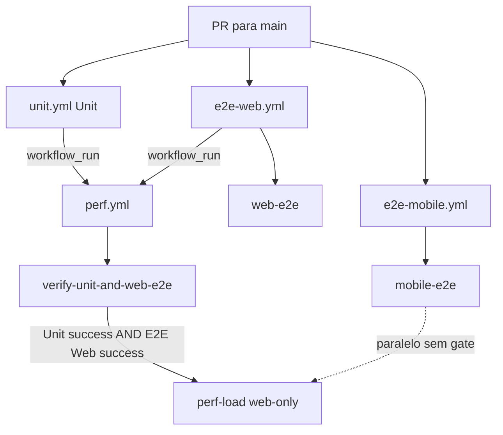

# 05 — Perf após Unit + E2E Web (carga web-only)

## Contexto

- **Plano 05** da sequência JAdmin — continua [04 Testes e CI monorepo](04_testes_e_ci_monorepo_f2c649e7.plan.md) (to-do `perf-load` **deste plano**).
- Antecedentes: [01 Backend](01_jwt_auth_multitenancy_99307074.plan.md) · [02 Web](02_frontend_react_jadmin_72bcb6f8.plan.md) · [03 Mobile](03_expo_mobile_jadmin_5ae39932.plan.md) · [04 Testes/CI](04_testes_e_ci_monorepo_f2c649e7.plan.md).
- **Escopo:** split E2E web/mobile, gate `perf.yml` (Unit + E2E Web), carga web-only (k6 cookie jar, Playwright smoke, Lighthouse), artefatos em `JAdmin/Tests/load/`.

## Índice

| # | Seção | Conteúdo |
|---|-------|----------|
| — | Contexto | Sequência JAdmin, antecedentes |
| — | Ordem de execução | To-do `perf-load` + subtarefas |
| — | Situação atual | Estado do repo vs. alvo |
| — | Comportamento desejado | 4 workflows, gate, diagrama |
| **1** | Alterações | Workflows, `perf.yml`, scripts load |
| **2** | PR único | Entregáveis e ordem |
| — | O que não muda | Branch protection, jobs informativos |
| — | Riscos / Verificação | Checklists local e CI |
| — | Resultados obtidos | Baseline CI `perf-load` (k6, Playwright, Lighthouse) |

**Planos relacionados:** [01 Backend](01_jwt_auth_multitenancy_99307074.plan.md) · [02 Web](02_frontend_react_jadmin_72bcb6f8.plan.md) · [03 Mobile](03_expo_mobile_jadmin_5ae39932.plan.md) · [04 Testes/CI](04_testes_e_ci_monorepo_f2c649e7.plan.md)

> **Navegação no Cursor:** use o painel **Outline** ou `Ctrl+F` pelo título da seção.

## Ordem de execução (To-dos)

To-do **`perf-load`** (PR único) decomposto nas subtarefas abaixo — executar no mesmo PR.

| To-do | Entregável |
|-------|------------|
| `perf-load` | PR único: k6 + lighthouserc + split E2E + perf.yml web-only + sync plano 04 |
| `k6-web-mvp` | `JAdmin/Tests/load/` — k6 `session-mixed.js` + `lib/` + README |
| `lighthouse-mvp` | `lighthouserc.json` |
| `split-e2e` | `e2e-web.yml` + `e2e-mobile.yml`; remover `e2e.yml` |
| `update-perf` | `perf.yml` redesenhado |
| `align-plan-04` | Plano 04 sincronizado ao código |

## Situação atual

| Item | Repo hoje | Alvo deste plano |
|------|-----------|------------------|
| E2E | [`e2e.yml`](.github/workflows/e2e.yml) unificado (web + mobile) | `e2e-web.yml` + `e2e-mobile.yml`; remover `e2e.yml` |
| `perf.yml` | Gate `Unit`+`E2E`; k6 web **e** `scenarios/mixed.js` (`:8080`); smoke/Lighthouse com `\|\| true` | Gate `Unit`+`E2E Web`; só k6 web; smoke falha visível; Lighthouse com config |
| Load scripts | [`JAdmin/Tests/load/`](JAdmin/Tests/load/) **ausente** — step k6 falha | MVP k6 + `lighthouserc.json` + README |
| Plano 04 | Descreve 4 workflows; parte do texto ainda reflete estado anterior | Sincronizar no mesmo PR |

[`perf.yml`](.github/workflows/perf.yml) dispara com `workflow_run` em **Unit** e **E2E**; `verify-both-succeeded` exige ambos no mesmo `head_sha`. O step k6 referencia `session-mixed.js` (inexistente) e ainda roda `scenarios/mixed.js` (API/Bearer — fora do escopo web-only).

## Comportamento desejado

| Workflow | Gatilho | Relação com perf |
|----------|---------|------------------|
| `unit.yml` (`Unit`) | Todo PR | **Obrigatório** `success` antes de `perf-load` |
| **E2E Web** | PR → `main` | **Obrigatório** `success` antes de `perf-load` |
| **E2E Mobile** | PR → `main` | **Não aguardado** — corre em paralelo |
| **Performance** | `workflow_run` (Unit ou E2E Web) + `workflow_dispatch` | Gate `verify-unit-and-web-e2e`; informativo |

**Carga (`perf-load`):** somente tráfego **web** — nginx (`http://localhost` + cookie jar), smoke Playwright, Lighthouse. **Sem** k6 Bearer, **sem** `scenarios/mixed.js`, **sem** simulação mobile.



## Alterações

### 1. Dividir [`e2e.yml`](.github/workflows/e2e.yml)

**Criar** [`.github/workflows/e2e-web.yml`](.github/workflows/e2e-web.yml):

```yaml
name: E2E Web

on:
  pull_request:
    branches: [main]
  workflow_dispatch:

jobs:
  web-e2e:
    # copiar linhas 9–52 do e2e.yml atual (sem alteração de steps)
```

**Criar** [`.github/workflows/e2e-mobile.yml`](.github/workflows/e2e-mobile.yml):

```yaml
name: E2E Mobile

on:
  pull_request:
    branches: [main]
  workflow_dispatch:

jobs:
  mobile-e2e:
    # copiar linhas 54–169 do e2e.yml atual (sem alteração de steps)
```

**Remover** [`.github/workflows/e2e.yml`](.github/workflows/e2e.yml).

- Job names `web-e2e` / `mobile-e2e` inalterados → branch protection sem mudança.
- `workflow_run` em perf usa o **`name:`** do workflow: `E2E Web` (não `E2E`).

### 2. Atualizar [`perf.yml`](.github/workflows/perf.yml)

#### Gatilho, gate e debug manual

```yaml
name: Performance

on:
  workflow_run:
    workflows: [Unit, E2E Web]
    types: [completed]
    branches: [main]
  workflow_dispatch:   # debug: perf-load direto, sem gate Unit+E2E Web

permissions:
  actions: read
  contents: read

jobs:
  verify-unit-and-web-e2e:
    if: ${{ github.event_name == 'workflow_run' && github.event.workflow_run.conclusion == 'success' }}
    runs-on: ubuntu-latest
    outputs:
      should_run: ${{ steps.check.outputs.should_run }}
      head_sha: ${{ github.event.workflow_run.head_sha }}
    steps:
      - id: check
        uses: actions/github-script@v7
        with:
          script: |
            const headSha = context.payload.workflow_run.head_sha
            const owner = context.repo.owner
            const repo = context.repo.repo
            const workflows = ['Unit', 'E2E Web']
            const results = []
            for (const name of workflows) {
              const { data } = await github.rest.actions.listWorkflowRuns({
                owner, repo, workflow_id: name, head_sha: headSha, per_page: 5,
              })
              const run = data.workflow_runs.find((r) => r.head_sha === headSha)
              results.push(run?.conclusion === 'success')
            }
            const shouldRun = results.every(Boolean)
            core.setOutput('should_run', shouldRun ? 'true' : 'false')

  perf-load:
    name: perf-load
    needs: verify-unit-and-web-e2e
    if: |
      always() && (
        (github.event_name == 'workflow_dispatch') ||
        (needs.verify-unit-and-web-e2e.outputs.should_run == 'true')
      )
    runs-on: ubuntu-latest
    steps:
      - uses: actions/checkout@v4
        with:
          ref: ${{ github.event_name == 'workflow_dispatch' && github.sha || needs.verify-unit-and-web-e2e.outputs.head_sha }}
      # ... steps abaixo
```

- Dispara quando **Unit** ou **E2E Web** termina; `perf-load` só roda após **ambos** `success` no mesmo commit (via `workflow_run`).
- **`workflow_dispatch`:** dispara `perf-load` **sem gate** — apenas debug manual; documentar no [`JAdmin/Tests/load/README.md`](JAdmin/Tests/load/README.md).
- Renomear job `verify-both-succeeded` → `verify-unit-and-web-e2e`.

#### Steps de carga — apenas clientes web

Stack: `docker compose ... db redis api web`.

```yaml
# REMOVER:
# k6 run JAdmin/Tests/load/k6/scenarios/mixed.js
# K6_BASE_URL: http://localhost:8080
# npm run perf:under-load || true
# npm run perf:lighthouse || true

- name: Run k6 web sessions
  env:
    K6_WEB_BASE_URL: http://localhost
    SEED_TENANT_SLUG: system
    SEED_SUPERADMIN_EMAIL: superadmin@localhost
    SEED_SUPERADMIN_PASSWORD: SuperAdmin@123!
  run: |
    mkdir -p results
    k6 run JAdmin/Tests/load/k6/web/session-mixed.js --out json=results/k6-web.json &
    echo $! > results/k6.pid

- name: Playwright smoke under load
  working-directory: web-client
  run: npm run perf:under-load   # sem || true — job informativo, não required

- name: Lighthouse CI
  working-directory: web-client
  run: npm run perf:lighthouse   # sem || true no shell
  continue-on-error: true        # assertions warn no lighthouserc; artefato sempre útil
```

- **Playwright** e **Lighthouse** usam `PLAYWRIGHT_BASE_URL=http://localhost` (já no job).
- Após smoke, encerrar k6 em background: `kill $(cat ../results/k6.pid)`.

### 3. Criar [`JAdmin/Tests/load/`](JAdmin/Tests/load/)

Estrutura MVP (CI web-only — somente `k6/web/*` + `lib/`):

```
JAdmin/Tests/load/
├── README.md              # execução local, env, workflow_dispatch
├── k6/
│   ├── lib/
│   │   ├── config.js      # K6_WEB_BASE_URL, SEED_*, VUs/duration
│   │   ├── auth.js        # loginWeb() — POST /api/auth/login + CookieJar
│   │   └── helpers.js
│   └── web/
│       └── session-mixed.js   # ~10 VUs, 1–2 min; login → users + /api/auth/me
└── lighthouse/
    └── lighthouserc.json
```

**k6 — `session-mixed.js`:**

```javascript
// k6/lib/auth.js — POST http://localhost/api/auth/login + CookieJar
// k6/web/session-mixed.js — 10 VUs, 1m; login → GET /api/users + GET /api/auth/me
// Env: K6_WEB_BASE_URL, SEED_* (perf.yml)
// Thresholds: http_req_failed rate<0.01; http_req_duration p(95)<1200
```

**Lighthouse — `lighthouserc.json`:**

```json
{
  "ci": {
    "collect": {
      "url": ["http://localhost/login"],
      "numberOfRuns": 1
    },
    "assert": {
      "assertions": {
        "categories:performance": ["warn", { "minScore": 0.7 }]
      }
    },
    "upload": { "target": "filesystem", "outputDir": "./lighthouse-results" }
  }
}
```

[`web-client/package.json`](web-client/package.json) já referencia `@lhci/cli` e `perf:lighthouse` → path acima.

**Fora do CI (extensão futura):** `k6/scenarios/mixed.js`, Bearer, carga `:8080` direta.

### 4. Sincronizar [plano 04](04_testes_e_ci_monorepo_f2c649e7.plan.md)

No **mesmo PR:** atualizar §4 (perf/carga), §5 (esteira CI), índice, riscos, to-do `perf-load` e tabela “Estado entregue” para refletir os 4 workflows e scripts load entregues.

## PR único — entregáveis e ordem

1. `JAdmin/Tests/load/` (README + k6 + Lighthouse)
2. `e2e-web.yml` + `e2e-mobile.yml`; remover `e2e.yml`
3. `perf.yml` redesenhado (gate, web-only, `workflow_dispatch`)
4. Plano 04 alinhado ao código

## O que não muda

- `perf-load` **informativo** (não required check).
- [`unit.yml`](.github/workflows/unit.yml) e steps E2E (Playwright / Maestro) — inalterados.
- Branch protection: `web-e2e`, `mobile-e2e`, jobs de `unit.yml`.

## Riscos / notas

- **`workflow_run` + PRs:** `branches: [main]`; se perf não disparar em PR, testar sem filtro `branches`.
- **Ordem de conclusão:** se Unit terminar depois de E2E Web, o segundo `workflow_run` libera `perf-load`.
- **Lighthouse flaky:** `continue-on-error` no step + assertions `warn` no JSON — job informativo estável.
- **`workflow_dispatch`:** sem gate — uso exclusivo para debug; não substituir validação em PR.

## Verificação

**Antes do PR (local):**

1. `docker compose --env-file .env.test up -d db redis api web` + health ok
2. `k6 run JAdmin/Tests/load/k6/web/session-mixed.js` passa
3. `cd web-client && npm run perf:under-load` passa (com k6 em background)
4. `npm run perf:lighthouse` gera `lighthouse-results/`
5. Validar YAML (`actionlint`) ou push em branch de teste

**Após merge (CI):**

1. PR → `main`: **Unit**, **E2E Web**, **E2E Mobile** em paralelo
2. **Performance** só roda `perf-load` quando Unit **e** E2E Web = `success`
3. Logs k6 **não** invocam `scenarios/mixed.js` nem refresh Bearer
4. Stack inclui `web`; Playwright/Lighthouse usam `http://localhost`
5. Se Unit ou E2E Web falhar, `perf-load` skipped
6. `workflow_dispatch` em **Performance** dispara `perf-load` sem gate (debug)

## Resultados obtidos

Baseline do job **`perf-load`** em CI (GitHub Actions, runner `ubuntu-latest`, stack `docker compose` com `web` + nginx em `http://localhost`). Artefato: `perf-results` → `web-client/lighthouse-results/localhost-login-2026_06_21_21_39_05.report.json`.

### Contexto da medição

| Campo | Valor |
|-------|-------|
| URL | `http://localhost/login` |
| Data (UTC) | 2026-06-21 21:39:05 |
| Lighthouse | 12.6.1 (LHCI via `npm run perf:lighthouse`) |
| Dispositivo simulado | Mobile — Moto G Power (2022), Android 11 |
| Assertion CI | `categories:performance` ≥ 0,7 (**warn**) — step com `continue-on-error: true` |

### Scores por categoria (Lighthouse)

| Categoria | Score | CI |
|-----------|-------|-----|
| **Performance** | **0,72 (72)** | Passa com **warn** (≥ 0,7) |
| Accessibility | 0,95 | Informativo |
| Best Practices | 0,96 | Informativo |
| SEO | 0,82 | Informativo |

### Core Web Vitals e métricas (Performance)

| Métrica | Valor | Score | Leitura |
|---------|-------|-------|---------|
| FCP | 2,4 s | 0,72 | Primeiro conteúdo visível — aceitável |
| LCP | 2,8 s | 0,82 | Elemento LCP: texto *"Informe suas credenciais para continuar"* (`card-description`) |
| Speed Index | 2,4 s | 0,98 | Preenchimento visual rápido |
| TTI (Interactive) | 3,6 s | 0,92 | Interatividade ok |
| **TBT** | **930 ms** | **0,30** | Principal limitador — JS bloqueia main thread |
| CLS | 0 | 1,00 | Sem layout shift |
| Max Potential FID | 470 ms | 0,10 | Latência de input potencial alta |

**Transferência total:** 263 KiB · **DOM:** 29 elementos.

### Principais achados

**Performance (score 72):**

- **JavaScript não usado (~152 KiB)** — bundle Vite/React acima do necessário para a tela de login.
- **Main-thread work (~2,7 s)** — parse, compile e execução de JS.
- **TBT elevado (930 ms)** — consequência do volume de JS; puxa o score para baixo apesar de LCP/FCP razoáveis.

**Best Practices — erros de console (esperados em `/login`):**

- `401` em `GET /api/auth/me` e `POST /api/auth/refresh` — boot de sessão sem cookie; comportamento normal na página de login, mas Lighthouse marca como erro de console.

**Accessibility (95):**

- Contraste insuficiente em texto `text-muted-foreground` (descrição do card de login).

**SEO (82):**

- Sem `<meta name="description">`.
- `robots.txt` inválido (nginx local sem robots real — esperado em ambiente de teste).

### Playwright smoke (`perf:under-load`)

- Spec [`web-client/load/under-load.spec.ts`](web-client/load/under-load.spec.ts): login SuperAdmin + navegação para lista de usuários sob carga k6.
- Correção aplicada: `clickNavLink('Usuários')` ([`e2e/helpers/navigation.ts`](web-client/e2e/helpers/navigation.ts)) — evita strict mode com quick links do dashboard em `<main>`.

### k6 (`session-mixed.js`)

- Cenário web-only: ~10 VUs, 1 min, cookie jar via nginx; thresholds `http_req_failed < 1%`, `p(95) < 1200 ms`.
- Executado em background durante o smoke Playwright no mesmo job.

### Conclusão do baseline

| Camada | Status | Nota |
|--------|--------|------|
| k6 web | OK no CI | Carga HTTP via nginx estável sob gate Unit + E2E Web |
| Playwright smoke | OK após `clickNavLink` | UI utilizável com k6 em background |
| Lighthouse | **0,72** — warn | Baseline registrado; melhorias futuras: code-splitting, reduzir JS inicial, tratar 401 de boot na `/login` |

> **Referência:** relatório completo no artefato `perf-results` do workflow **Performance**; reexecutar localmente com stack up: `cd web-client && npm run perf:lighthouse`.
